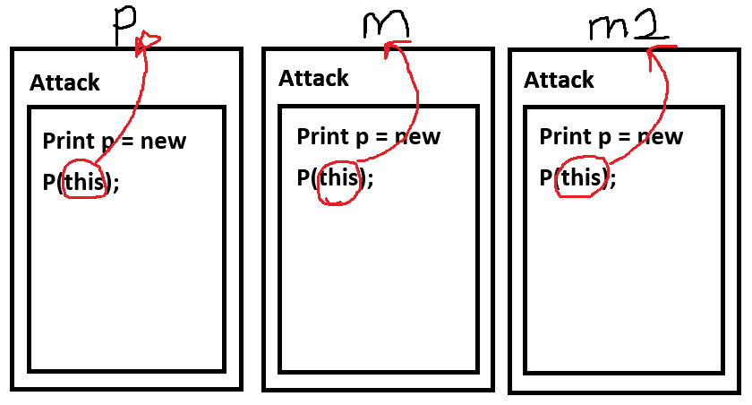

# [C26_This](../CsharpStudy_List.md)

```csharp
Class Character(){
	void Attack()
	{
		Print p = new Print(this); //Print의 매개변수 타입도 Character이기 때문에 this 가능
	}
}

Class Print
{
	Character Character;
	public Print(Character character)
	{
		this.character = character;
	}
}

Character p = new Character();
Character m = new Character();
Character m2 = new Character();
p.Print();
m.Print();
m2.Print();
```

- `this` 키워드 : 현재 메서드가 실행되고 있는 바로 그 객체 자신
    - `Character` 클래스의 `Attack()` 메서드 내부에서 `new Print(this)` 를 호출하면, 실행 중인 `Character` 인스턴스 본인이 `Print` 클래스 생성자로 넘어가게 됨
    - 이를 통해 `Print` 객체는 나를 직접 참조할 수 있게 되어, 내 정보(상태)를 가져오거나 출력할 수 있게 됨.

</img>