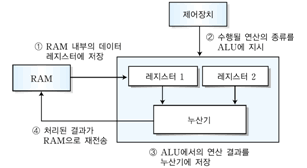

# Accumulator

</img>

| **구분** | **주요 내용** |
| --- | --- |
| **정의** | 연산 장치(ALU)에 직접 연결되어 연산 데이터 및 결과를 임시 보관하는 레지스터 |
| **주요 기능** | • 입력 피연산자 보관<br>• 연산 결과 임시 저장 및 데이터 누적<br>• RAM 접근 최소화를 통한 처리 속도 향상 |
| **핵심 특징** | • ALU와 물리적으로 가장 인접하여 극도의 고속 작동<br>• 1-주소 명령어 구조의 기본 레지스터로 활용<br>• 현대 x86 레지스터 중 `EAX/RAX`가 이 역할을 계승 |
| **상호작용 유닛** | • ALU: 데이터 전달 및 연산 결과 수신<br>• CU: 연산 및 데이터 이동 제어 신호 수신<br>• MBR: 주기억장치로부터 인출된 피연산자 수신<br>• 상태 레지스터: 연산 결과 플래그(Zero, Carry 등) 전달 |

## 정의

- CPU 내부의 연산 장치(ALU)에 직접 연결되어 있는 특수 목적 임시 기억 레지스터
- 연산할 피연산자(Operand) 중 하나를 임시로 저장하고, 연산이 끝난 후 그 최종 결과값을 다시 저장하는 장소로 사용
- 연산 결과가 계속해서 누적되어 저장되는 공간

## 기능

- **연산 입력 데이터 유지** : ALU가 연산을 시작할 때 필요한 첫 번째 입력 데이터를 보관.
- **연산 결과값 중간 저장** : 연산 직후 출력되는 결과 데이터를 주메모리(RAM)로 바로 보내지 않고 임시로 보관.
- **연속 연산 처리(누적)** : 여러 단계에 걸친 연속 연산(예: $A + B + C + D$)을 수행할 때, 중간 연산 결과값을 계속해서 갱신하며 누적 계산을 가능하게 함.
- **메모리 접근 횟수 감소** : 모든 연산 결과를 주기억장치(RAM)에 매번 쓰지 않고 누산기 내부에서 처리함으로써 시스템 버스병목 현상을 줄이고 처리 속도를 극대화.

## 특징

- **ALU와의 직접적·물리적 연결** : CPU 구성 요소 중 연산 장치와 가장 가까운 위치에 있어 데이터 전송 지연(Latency)이 매우 적다.
- **단일 명령어 구조(1-주소 명령어 방식)의 핵심** : 초창기 또는 RISC/CISC 구조의 특정 명령어 집합(ISA)에서는 누산기를 기본(Implicit) 목적지로 지정하여 명령어 길이를 줄임.
    - 예: `ADD X` 명령어는 내부적으로 `Accumulator = Accumulator + Memory[X]`를 의미.
- **휘발성 및 한정된 용량** : 레지스터의 일종이므로 전원이 꺼지면 데이터가 사라지며, CPU 비트 수(예: 32비트, 64비트)에 맞는 레지스터 크기를 가짐.
- **현대 CPU에서의 확장** : 최신 x86/x64 아키텍처에서는 다목적 범용 레지스터(General Purpose Register)들이 추가되어 누산기 전용 레지스터의 역할이 다변화되었으나, 여전히 `EAX` / `RAX` 레지스터가 산술 연산 및 반환값 저장 등의 누산기 역할.

## 상호작용

```csharp
[주기억장치 / MBR] ---> (데이터 입력)
														|
														v
[누산기 (AC)]  <======>  [ ALU ]  <--- [데이터 버퍼 / MBR]
			|                     |
			|                     v
			+--------------> [상태 레지스터 (Status Register)]
```

1. **제어장치(CU)의 명령 해석** : 제어장치가 `ADD B` 명령어를 해독하고, 필요한 데이터 전송 제어 신호를 각 유닛에 보냄.
2. **첫 번째 피연산자 준비** : 누산기(AC)에 기존 데이터(예: $A$)가 들어있는 상태.
3. **두 번째 피연산자 인출** : 메모리 버퍼 레지스터(MBR)를 통해 메모리에서 불러온 데이터 $B$가 ALU의 한쪽 입력으로 들어감.
4. **ALU 연산 실행** : ALU는 누산기(AC)에 저장된 $A$와 MBR의 데이터 $B$를 가져와 덧셈 연산($A + B$)을 수행.
5. **결과 저장 및 상태 갱신** :
    1. ALU의 연산 결과($A + B$)가 누산기(AC)로 다시 피드백되어 덮어씌워짐.
    2. 연산 결과에 따라 오버플로, 0 여부, 음수 여부 등의 상태 플래그가 상태 레지스터(Status Register / Flags)에 반영됨.