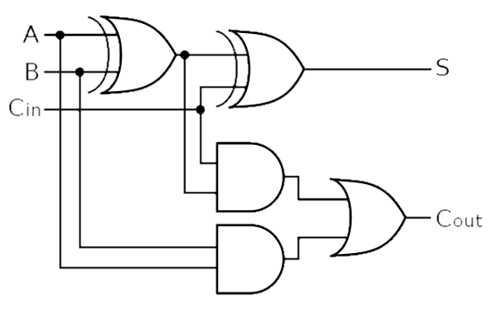

# Adder

</img>

## 상호작용

### 1. 제어 유닛 (Control Unit, CU)

- **연산 지시 및 제어 신호 수신  :** 제어 유닛은 명령어 레지스터(IR)에 들어온 명령어를 해석하여 가산기에게 어떤 작업을 수행할지 지시. (예: "이번에는 단순 덧셈이 아니라, 주소 계산을 위한 덧셈을 해라" 등)
- **플래그(Flag) 관리 :** 가산기가 연산을 수행한 결과에 따라 발생하는 상태 정보(예: 결과가 0인지, 음수인지, 오버플로우가 발생했는지 등)는 상태 레지스터(Status Register / Flag Register)로 보내짐. 제어 유닛은 이 플래그를 참조하여 다음 명령어의 분기(Branch/Jump) 여부를 결정.

### 2. 레지스터 파일 (Register File)

- **피연산자(Operand) 입력 :** 레지스터에 저장되어 있던 데이터(예: 변수 A와 변수 B의 값)가 데이터 버스를 통해 가산기의 입력단으로 전달됨.
- **결과 저장 :** 가산기에서 연산이 끝난 최종 결과값은 다시 레지스터 파일로 보내져 특정 레지스터에 저장됨.

### 3. 프로그램 카운터 (Program Counter, PC)(주소/명령어 인출)

- **다음 명령어 주소 계산 :** CPU가 다음 순서로 실행할 명령어의 위치를 파악할 때 가산기가 핵심적인 역할.
    - 일반적인 경우 : 현재 PC 값에 **'4'**(32비트 시스템 기준 명령어 크기) 또는 **'2'**(16비트 등)를 더해 다음 명령어 주소를 만듦. 이 고정된 덧셈을 수행하는 전용 하드웨어(Incrementer)가 PC 근처에 존재.
    - 분기 명령어의 경우 : `JUMP`나 `BRANCH` 명령어가 실행될 때, 현재 PC 값에 상대 주소(Offset)를 더하여 이동해야 할 최종 목적지 주소를 계산.

### 4. 메모리 관리 유닛 (MMU) 및 캐시/주 메모리 (Cache / Main Memory)

- **유효 주소(Effective Address) 계산  :** 메모리에서 데이터를 읽거나 쓸 때, 베이스 주소(Base Address)와 인덱스 주소(Index/Offset)를 더하는 주소 지정 방식(Addressing Mode)에서 가산기가 사용됨.
- 이 계산된 주소는 주소 버스(Address Bus)를 통해 MMU나 캐시 메모리로 전달되어 실제 데이터를 찾아오는 데 쓰임.

### 5. 부동소수점 유닛 (FPU)

- **실수 연산 지원 :** 정수뿐만 아니라 소수점 연산을 담당하는 FPU 내부에도 특수한 형태의 가산기가 존재.
- 지수부(Exponent)의 크기를 맞추기 위한 뺄셈/덧셈이나, 가수부(Mantissa)의 덧셈을 처리할 때 FPU 내의 전용 가산기들이 상호작용하여 부동소수점 연산을 완성.