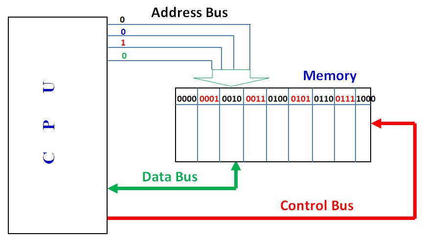

# Address Bus

</img>

| **구분** | **주요 내용** |
| --- | --- |
| **정의** | 메모리나 I/O 장치의 특정 위치(주소)를 지정하기 위한 신호 선의 집합 |
| **주요 기능** | 데이터가 읽히거나 쓰일 정확한 위치(번지) 지정 |
| **핵심 특징** | 단방향 통신 (CPU $\rightarrow$ 메모리/I/O), 버스 비트 수에 따라 최대 메모리 접근 용량 결정 |
| **상호작용** | CPU가 주소 버스로 위치를 지정하면, 제어 버스의 명령에 따라 데이터 버스를 통해 정보가 교환됨 |

## 정의

- 컴퓨터 시스템 내부에서 CPU나 DMA(Direct Memory Access) 제어기가 메인 메모리(RAM)나 입출력(I/O) 장치의 특정 위치(주소)를 지정하기 위해 사용하는 신호 라인들의 집합
- 목적지의 번지 수를 전달하는 역할

## 기능

- **메모리 및 I/O 장치 지정 :** CPU가 데이터를 읽거나 쓰고자 할 때, 해당 데이터가 저장되어 있거나 저장될 메모리 공간의 주소를 지정.
- **단방향 통신 (Unidirectional) :** 주소 버스는 오직 CPU(마스터)에서 메모리나 I/O 장치(슬레이브)로만 신호를 전달합니다. 즉, 주소 정보는 항상 CPU가 생성하여 외부로 내보내는 방향으로만 흐른다.

## 특징

- **단방향성 (Unidirectional) :** 신호가 한쪽 방향으로만 이동.
- **비트 수와 용량 결정 (Capacity & Bit Width) :**
    - 주소 버스의 비트 수는 컴퓨터가 직접 접근할 수 있는 최대 메모리 용량(Addressing Capacity)을 결정.
    - 만약 주소 버스가 $n$비트라면, 최대 $2^n$개의 메모리 주소를 지정 가능. (예: 32비트 주소 버스는 $2^{32} = 4\text{GB}$, 64비트 주소 버스는 이론상 $2^{64}$바이트의 메모리를 지원)
- **독립성 :** 데이터 버스의 비트 폭(32비트, 64비트 등)과 주소 버스의 비트 폭은 서로 다를 수 있다.

## 상호작용

- **CPU와 메모리(RAM) 간의 상호작용 :**
CPU가 메모리 특정 번지(예: `0x00001000`)에 있는 데이터를 읽고 싶을 때, CPU는 주소 버스를 통해 해당 주소 값을 메모리로 보냄. 동시에 제어 버스를 통해 '읽기(Read)' 신호를 보냄. 메모리는 주소 버스를 통해 전달받은 번지의 내용을 찾아 데이터 버스를 통해 CPU로 전달.
- **제어 버스 및 데이터 버스 협력 :**
주소 버스 단독으로는 동작하지 않고 항상 제어 버스(읽기/쓰기 신호) 및 데이터 버스(실제 데이터 이동)와 함께 조율되어 작동.