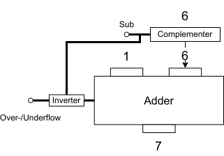

# Complementer

</img>

| **구분** | **주요 내용** |
| --- | --- |
| **정의** | CPU ALU 내부에서 데이터 비트를 반전시켜 보수(Complement) 형태로 변환하는 회로 유닛 |
| **핵심 기능** | 1의 보수 생성(비트 반전) 및 가산기와의 연동을 통한 2의 보수 연산 지원 |
| **주요 특징** | • 하드웨어 크기 및 비용 절감 (독립된 감산기 미사용)<br>• NOT/XOR 게이트 기반의 단순하고 빠른 처리<br>• 덧셈/뺄셈 제어 신호에 따른 동작 전환 |
| **상호작용** | • 제어장치: 뺄셈 실행 여부 제어 신호 수신<br>• 레지스터: 연산 대상 피연산자 데이터 수신<br>• 가산기: 반전된 데이터를 가산기로 전달 및 +1 Carry 추가 지원 |

## 정의

- 컴퓨터가 뺄셈(감산) 연산을 가산(더하기) 알고리즘으로 처리할 수 있도록, 입력된 비트 데이터를 보수(Complement) 상태로 전환하는 회로/유닛.
- 하드웨어적으로 감산기(Subtractor) 회로를 따로 크게 구현하는 대신, 이미 존재하는 가산기(Adder)와 보수기를 조합하여 덧셈 회로 하나만으로 뺄셈까지 완벽하게 처리하도록 만들어짐.

## 기능

- **비트 반전 (1의 보수 생성) :** 입력된 데이터의 모든 비트를 반전($0 \rightarrow 1$, $1 \rightarrow 0$)시킵니다. 논리 게이트인 NOT 게이트 모음으로 구성.
- **2의 보수(2's Complement) 형성 지원 :** 현대 컴퓨터의 음수 표현 표준인 2의 보수를 만들기 위해, 1의 보수로 반전된 값에 올림수(Carry) **+**1을 추가하도록 가산기로 전달.

> **$A - B$ 연산의 내부 처리 과정**
> 
> 1. 입력 $B$가 보수기를 거쳐 $\sim B$ (1의 보수)로 전환됨
> 2. 가산기에서 $A + \sim B + 1$ 연산을 수행
> 3. 그 결과가 $A - B$와 정확히 일치함

## 특징

- **하드웨어 절감 및 회로 단순화 :** 뺄셈 전용 회로를 제거할 수 있어 칩 내부의 트랜지스터 개수를 대폭 줄이고 면적을 절약.
- **단순한 논리 구조 :** 기본적으로 NOT 게이트(또는 제어형 반전을 위한 XOR 게이트) 배열로 구현되므로 전력 소비가 적고 연산 속도가 매우 빠름.
- **제어 신호에 따른 유연성 :** 덧셈 명령 수행 시에는 입력값을 그대로 통과(Pass-through)시키고, 뺄셈 명령 수행 시에만 보수화를 진행.

## 상호작용

```
[제어장치 (Control Unit)]
        │ (제어 신호: Subtraction / Pass)
        ▼
 [레지스터 (Register B)] ──► [ 보 수 기 ] ──► [ 가 산 기 (Adder) ] ◄── [레지스터 (Register A)]
                                                  │
                                                  ▼
                                            [ 결과 레지스터 / Flag ]
```

1. **제어장치 (Control Unit)와의 작용 :** 제어장치가 현재 명령어가 뺄셈임을 감지하면, 보수기에 제어 신호(Control Signal)를 보내 입력값을 반전시키도록 명령.
2. **레지스터 (Register)와의 작용 :** 연산에 사용할 피연산자(Operand) 데이터를 범용 레지스터(예: MB, MBR 등)로부터 전달받는다.
3. **가산기 (Adder)와의 작용 :** 보수기에서 반전된 데이터는 즉시 가산기의 입력 데이터 라인으로 전달됨. 동시에 가산기의 하위 올림수 입력($C_{in}$)에 `1`이 입력되어 완벽한 2의 보수 덧셈을 완결.
4. **플래그 레지스터 (Flag Register)에 영향 :** 보수 연산을 거쳐 가산기에서 나온 결과값은 최종적으로 부호 플래그(SF), 오버플로 플래그(OF), 캐리 플래그(CF) 등을 업데이트하는 데 영향을 줌.