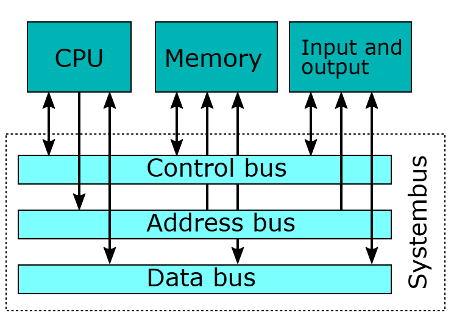

# Data Bus

</img>

| **구분** | **내용** |
| --- | --- |
| **정의** | CPU, 메모리, I/O 장치 간에 실제 데이터와 명령어를 실어나르는 전송 통로 |
| **전송 방향** | 양방향 (Bidirectional) (읽기 및 쓰기 동작 모두 수행) |
| **핵심 역할** | 연산 데이터, 파일 데이터, 실행 명령어의 물리적 이동 |
| **성능 결정 요소** | 버스의 폭(Bit 수) - 한 번에 보낼 수 있는 데이터량 결정 (32bit, 64bit 등) |
| **상호작용 방식** | 주소 버스(위치 지정) + 제어 버스(읽기/쓰기 명령)와 동시 협업 |

## 정의

- 시스템 내 부품들이 상호 작용할 때 필요한 데이터(연산 결과, 명령어, 파일 데이터 등)가 이동하는 물리적인 전기 선들의 집합
- 컴퓨터의 중앙처리장치(CPU), 주기억장치(RAM), 입출력장치(I/O) 등 각 장치 간에 실제 데이터를 주고받는 전송 통로

## 기능

- **데이터 전송 :** CPU와 메모리, 또는 CPU와 주변장치 간의 원시 데이터(Raw Data) 및 연산 결과 이동
- **명령어 전달 :** 메모리에서 읽어온 프로그램 실행 명령어를 CPU의 명령 레지스터로 이동
- **입출력 데이터 교환 :** 키보드, 마우스, 디스크 드라이브 등의 입출력장치와 시스템 메모리 간의 데이터 송수신

## 특징

- **양방향성 (Bidirectional) :** 데이터 버스는 읽기(Read)와 쓰기(Write) 동작이 모두 필요하므로 양방향으로 데이터를 전송.
- **대역폭과 폭(Bus Width) :** 데이터 버스의 선(Line) 개수가 한 번에 전송할 수 있는 비트(Bit) 수를 결정.
- **시스템 성능에 직결 :** 데이터 버스의 폭이 넓고 클록 주파수(Clock Frequency)가 높을수록 초당 전송할 수 있는 데이터량(대역폭)이 증가하여 컴퓨터 처리 속도가 빨라짐.

## 상호작용

- **메모리 읽기 (CPU가 RAM의 데이터를 가져올 때) :**
    - **주소 버스 :** CPU가 읽고자 하는 메모리의 주소를 지정해 주소 버스에 실어 보냄.
    - **제어 버스 :** CPU가 메모리에 '메모리 읽기(Memory Read)' 제어 신호를 보냄.
    - **데이터 버스 :** 메모리가 해당 주소의 데이터를 데이터 버스에 실어 CPU로 전송.
- **메모리 쓰기 (CPU가 RAM에 데이터를 저장할 때) :**
    - **주소 버스 :** 저장할 메모리 주소를 지정.
    - **데이터 버스 :** CPU가 저장할 데이터를 데이터 버스에 실어 메모리로 전송.
    - **제어 버스 :** CPU가 '메모리 쓰기(Memory Write)' 제어 신호를 보내 메모리에 기록을 명령.