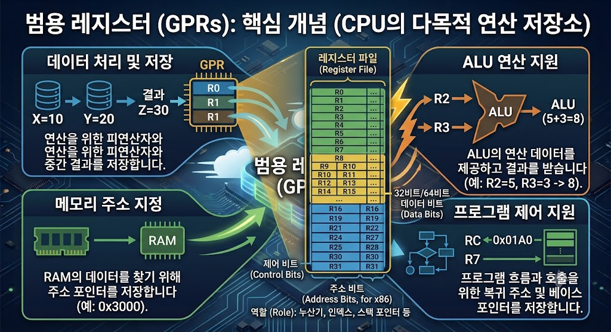

# GPR(General Purpose Register)

</img>

| **구분** | **주요 내용** |
| --- | --- |
| **정의** | 연산 및 데이터 처리를 위해 다목적으로 활용되는 CPU 내부의 초고속 레지스터 |
| **주요 역할** | • 연산 피연산자 및 결과 저장<br>• 메모리 주소(포인터) 저장 및 계산<br>• 반복문 카운터 및 데이터 중계 |
| **핵심 특징** | • 속도: SRAM 캐시/RAM보다 훨씬 빠른 최고 속도 (1클록 미만)<br>• 용량: 반도체 면적 문제로 개수가 극히 제한됨 (x86-64: 16개, ARM64: 31개)<br>• 유연성: 소프트웨어/컴파일러가 목적에 맞게 자유롭게 할당 가능 |
| **상호작용 유닛** | • ALU: GPR의 값으로 연산 후 결과를 다시 GPR에 저장<br>• RAM/캐시: Load/Store 명령을 통해 데이터 교환<br>• PC/플래그 레지스터: 연산 결과 상태를 전달하거나 주소 이동 제어 |

## 정의

- CPU 내부에 존재하는 매우 빠른 임시 기억 장치.
- 정 목적에 고정되지 않고 연산이나 데이터 처리를 위해 다용도로 사용할 수 있는 공간.
- CPU 내부 연산 장치(ALU)가 데이터를 처리하기 위해서는 메모리(RAM)에서 데이터를 가져와야 하는데, RAM은 CPU 내부 회로보다 훨씬 느림. 자주 쓰는 데이터나 중간 연산 결과를 CPU 내부에 아주 빠르게 저장해 두는 초고속 메모리 저장소 역할.

## 기능

- **산술 및 논리 연산의 입력/결과 저장 :** 덧셈, 뼛셈, AND, OR 등의 연산을 할 때 피연산자(Operand)를 담아두고, 연산이 끝난 결과를 임시로 저장.
- **메모리 주소 계산(포인터 역할) :** 데이터가 위치한 RAM의 주소를 계산하거나 주소 값 자체를 보관하여 메모리에 접근할 때 사용.
- **데이터 임시 전송 및 버퍼링:** 메모리에서 읽어온 값이나 메모리로 쓸 값을 잠시 거쳐가는 용도.
- **루프 제어 및 카운터:** 반복문(`for`, `while` 등)의 반복 횟수를 세거나 인덱스 값을 관리

## 특징

- **최고의 접근 속도 :** CPU 레지스터는 캐시 메모리(L1, L2, L3)나 RAM보다 물리적으로 CPU 코어(ALU)에 훨씬 가까이 붙어 있어 1클록 사이클 이내로 데이터를 읽고 쓸 수 있음.
- **제한된 용량과 수 :** 속도가 엄청나게 빠른 대신 반도체 면적을 많이 차지하고 비용이 비싸기 때문에 수십 개 내외(예: x86-64는 16개, ARM64는 31개)로 수가 제한.
- **아키텍처에 따른 가변성 :**
    - **x86/x86-64:** 전통적으로 역할이 완전히 범용은 아니었고 하위 호환성을 위해 `RAX`(누산기), `RBX`(베이스), `RCX`(카운터), `RDX`(데이터)처럼 범용이면서도 특정 명령어에 특화된 별칭/기능을 유지하고 있습니다.
    - **ARM/RISC-V:** 상대적으로 훨씬 대칭적이고 규격화되어 있어 `R0`~`R30`과 같이 레지스터들의 역할이 비교적 균일한 pure GPR 형태를 띱니다.

## 상호작용

```csharp
[ RAM / L1 캐시 ] ◄── (Load / Store) ──► [ GPR ] ◄── (Operand / Result) ──► [ ALU ]
																						│
																						└── (주소 전달) ──► [ MAR / MBB ]
```

- **ALU (산술논리연산장치)와의 관계**
    - ALU가 연산을 수행하려면 연산할 데이터를 가져와야 함. Control Unit의 지시에 따라 GPR 2개에 저장된 값을 ALU로 보냄.
    - ALU가 연산을 마치면 그 결과값을 다시 지정된 GPR에 기록.
- **특수 목적 레지스터(Special Purpose Register)와의 관계**
    - **PC (Program Counter):** 다음 실행할 명령어의 주소를 가리키는 PC와 달리, GPR은 실행에 필요한 데이터 값 자체를 주로 다룸. 다만 분기 명령(Jump)이나 함수 호출 시 GPR에 들어있는 주소 값을 PC로 넘겨줄 수도 있음.
    - **Flag / Status Register:** ALU에서 GPR 간의 연산이 일어난 후, 그 결과가 0인지, 음수인지, 오버플로우가 발생했는지 등의 상태 정보가 플래그 레지스터에 기록.
    - **SP (Stack Pointer) / BP (Base Pointer):** 메모리 스택 영역을 가리키는 레지스터로, 시스템에 따라 전용 특수 레지스터로 존재하거나 GPR 중 일부를 SP/BP 전용으로 약속하여 사용하기도 함.
- **메모리 및 버스 인터페이스 유닛 (BIU / Cache)**
    - `Load` 명령어로 RAM/캐시 메모리의 데이터를 GPR로 가져오고, `Store` 명령어로 GPR의 연산 결과를 RAM/캐시 메모리로 내려씀.