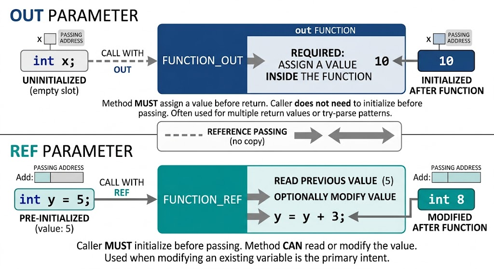

# Out

</img>

| **구분** | **out** | **ref** |
| --- | --- | --- |
| **주요 목적** | 메소드로부터 결과 값을 받아오기 위함 (출력 전용) | 기존 변수의 값을 메소드에 전달하고 수정하기 위함 (입출력) |
| **호출 전 변수 초기화** | **불필요 (초기화되지 않은 변수 전달 가능)** | **필수 (초기화된 변수만 전달 가능)** |
| **메소드 내 값 할당** | **반드시 할당해야 함 (미할당 시 컴파일 에러)** | **할당하지 않아도 됨 (선택 사항)** |
| **메소드 내 값 읽기** | 할당하기 전에는 읽을 수 없음 | 메소드 진입 즉시 기존 값 읽기 가능 |

## 정의

- 매개변수를 참조 호출(Call by Reference) 방식으로 전달할 때 사용하는 매개변수 한정자(Parameter Modifier)
- 해당 변수의 메모리 주소 직접 참조가 전달되어 메소드 내부에서 일어난 변경 사항이 호출한 원본 변수에 그대로 반영

## 기능

- **다중 반환값 구현** : C#의 메소드는 기본적으로 단 하나의 값만 `return`할 수 있음. `out` 매개변수를 사용하면 `return` 문 외에도 여러 개의 결과 값을 호출자에게 전달할 수 있음.
- **안전한 변환 및 조회 패턴** : `int.TryParse`나 `Dictionary.TryGetValue`처럼 작업의 성공 여부(bool)를 `return`하고, 성공 시 구해진 결과 데이터를 `out` 매개변수로 받아오는 패턴에 널리 사용됨.

## 특징

- **반드시 메소드 내부에서 값 할당 (출력 전용)**
    - `out` 매개변수로 지정된 변수는 메소드가 종료(return)되기 전까지 반드시 내부에서 값이 할당되어야 합니다. 값을 할당하지 않으면 컴파일 에러가 발생.
- **초기화되지 않은 변수 전달 가능**
    - 메소드로 전달되기 전에 변수가 초기화되어 있지 않아도 됨. 메소드 입장에서는 전달 받은 이전 값을 읽는 용도가 아니라 결과를 채워 넣는 용도로만 다루기 때문.
- **호출 시에도 `out` 키워드 명시**
    - 메소드를 정의할 때뿐만 아니라, 호출할 때도 매개변수 앞에 `out`을 반드시 명시해야 함. 이는 해당 인수가 메소드 내부에서 변경될 수 있음을 코드 읽는 이에게 명확히 알려줌.
- **`out` 변수 선언**
    - C# 7.0부터는 메소드를 호출하는 시점에 인자 자리에 변수 타입을 직접 선언하여 사용.