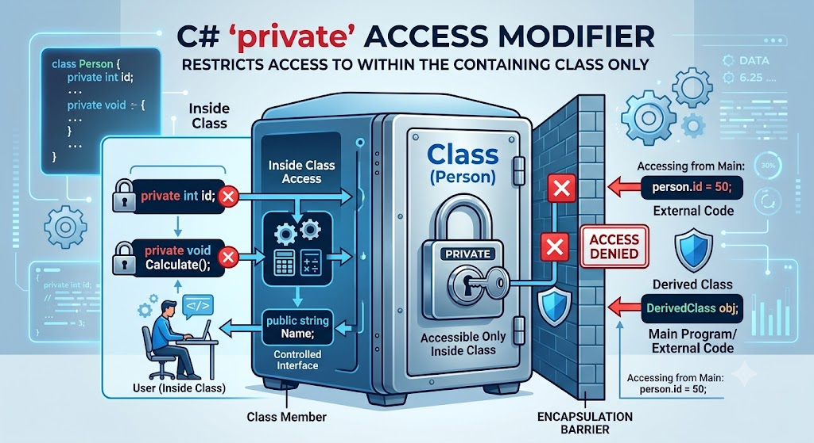

# Private

</img>

| **구분** | **내용** |
| --- | --- |
| **정의** | 멤버를 선언한 클래스/구조체 내부에서만 접근을 허용하는 가장 제한적인 접근 제어자 |
| **주요 역할** | 데이터 은닉, 객체 무결성 보장, 캡슐화(Encapsulation) 원칙 실현 |
| **기본값 여부** | 클래스/구조체 내부 멤버 선언 시 접근 제한자를 생략하면 기본으로 `private` 적용 |
| **상속 관계** | 자식 클래스에서도 접근 불가능 (`protected` 사용 필요) |
| **주 사용 대상** | 상태 관리용 필드(변수), 내부 검증용 메서드, 헬퍼(Helper) 함수 |

## 정의

- 데이터와 내부 로직을 외부로부터 보호하는 가장 제한적인 접근 제한자
- 클래스나 구조체 내부의 멤버(변수, 메서드, 프로퍼티 등)에 선언하여, 해당 멤버를 정의한 클래스(또한 구조체) 내부에서만 접근할 수 있도록 제한
- 클래스 외부나 상속받은 자식 클래스에서도 접근이 불가능

## 기능

- **캡슐화(Encapsulation) 구현 :** 객체의 내부 상태를 은닉하여 외부에서 임의로 데이터를 수정하거나 유효하지 않은 값을 넣는 것을 방지.
- **무결성 유지 :** 클래스가 의도한 방식(공개된 메서드나 프로퍼티)으로만 데이터를 조작하도록 강제하여 데이터의 유효성을 보장.
- **내부 구현 숨기기 :** 외부에 공개할 필요가 없는 복잡한 내부 로직(보조 메서드 등)을 숨겨 외부 인터페이스를 단순하게 유지.

## 특징

- **가장 높은 제한성 :** C#의 접근 제한자(`public`, `protected`, `internal`, `private`, `protected internal`, `private protected`) 중 접근 권한이 가장 좁다.
- **기본 접근 제한자(Default Access Modifier) :** 클래스나 구조체 내부의 멤버에 접근 제한자를 명시하지 않으면 기본적으로 `private`이 적용됨.
- **상속 관계에서의 접근 불가 :** 자식 클래스(Derived Class)라 할지라도 부모 클래스의 `private` 멤버에는 직접 접근할 수 없음.

## 알아두면 좋을 내용

- **C# 9.0+ `private protected`과의 차이 :**
    - `private`: 오직 해당 클래스 내부에서만 접근 가능합니다.
    - `private protected`: 같은 어셈블리(프로젝트) 내부이면서 상속받은 자식 클래스에서만 접근이 가능.
- **중첩 클래스(Nested Class)에서의 특수성 :**
    - 클래스 내부에 정의된 중첩 클래스가 `private`으로 선언되면, 외부 클래스는 이를 사용할 수 있지만 클래스 밖에서는 중첩 클래스 자체에 접근할 수 없음.
    - 반대로 중첩 클래스 내부에서는 자신을 둘러싼 외부 클래스의 `private` 멤버에 접근할 수 있음.
- **Backing Field 패턴 :**
    - C#의 자동 구현 프로퍼티(`public int Count { get; set; }`)를 사용하면 컴파일러가 내부적으로 컴파일 타임에 `private` 필드(Backing Field)를 자동으로 생성해 줌.