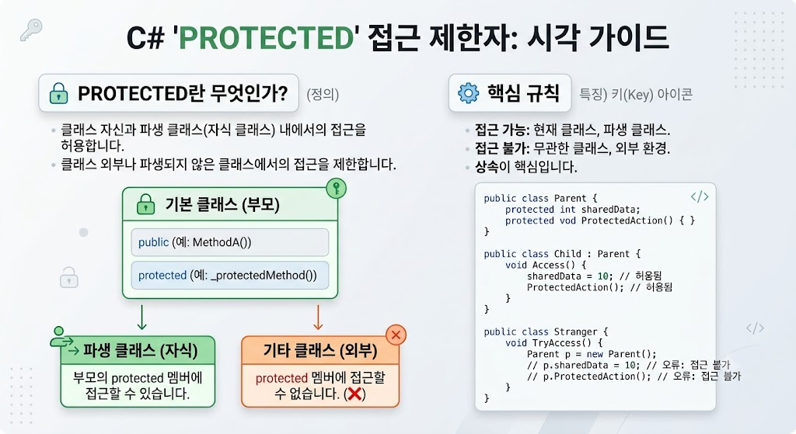

# Protected

</img>

| **항목** | **내용** |
| --- | --- |
| **정의** | 자신 클래스 및 상속받은 자식 클래스에서만 접근을 허용하는 접근 수정자 |
| **주요 역할** | 외부 노출을 막는 캡슐화 유지 + 자식 클래스로의 코드 재사용 및 확장 허용 |
| **접근 허용** | 현재 클래스 내부 (O), 자식 클래스 내부 (O), 외부 객체 직접 접근 (X) |
| **조합 수정자** | `protected internal` (같은 프로젝트 OR 자식 클래스) `private protected` (같은 프로젝트 AND 자식 클래스) |

## 정의

- 클래스의 멤버(변수, 메서드, 프로퍼티 등)에 대한 접근을 제한하는 접근 지정자(Access Modifier) 중 하나
- 자기 자신(현재 클래스)과 이를 상속받은 자식 클래스(파생 클래스)에서만 접근을 허용하는 접근 제어 키워드
    - **접근 가능 범위 :** 해당 클래스 내부 + 해당 클래스를 상속받은 모든 자식 클래스
    - **접근 불가능 범위 :** 상속 관계가 없는 외부 클래스나 객체 인스턴스를 통한 직접 접근

## 기능

- **상속 관계에서의 통로 역할 :** `private`처럼 외부로부터 데이터나 로직을 보호하면서도, 자식 클래스에서는 자유롭게 재사용하거나 확장할 수 있도록 길을 열어줌.
- **캡슐화 유지 :** 외부 사용자(객체를 사용하는 쪽)가 클래스의 내부 동작 방식에 직접 개입하지 못하도록 숨기면서, 하위 클래스 설계자에게만 수정/확장 권한을 부여함.
- **템플릿 메서드 패턴 지원 :** 부모 클래스에서 공통 흐름을 정의하고, 특정 세부 동작은 `protected` 메서드로 선언하여 자식 클래스에서 구현/오버라이딩하도록 유도할 수 있음.

## 특징

- **인스턴스를 통한 직접 접근 불가 :** 외부에서 객체 생성 후 `.` 연산자로 `protected` 멤버를 호출하려고 하면 컴파일 에러가 발생.
- **자식 클래스 내부에서만 접근 가능 :** 자식 클래스의 메서드나 프로퍼티 내부에서는 부모의 `protected` 멤버를 마치 자신의 것처럼 자유롭게 사용할 수 있음.
- **어셈블리(프로젝트)를 넘나드는 상속 :** 다른 프로젝트(DLL)에 있는 부모 클래스라 하더라도, 상속을 받았다면 `protected` 멤버에 접근할 수 있음.

## 알아두면 좋을 내용

### **`protected internal` vs `private protected`**

C#은 `protected`를 다른 접근 수정자와 조합하여 더 정교한 제어를 가능하게 함.

- **`protected internal` (합집합 개념) :**
    - 같은 프로젝트(어셈블리) 안이거나 OR 다른 프로젝트라도 상속받은 자식 클래스면 접근 가능
- **`private protected` (교집합 개념 - C# 7.2 이상) :**
    - 같은 프로젝트(어셈블리) 안이면서 AND 상속받은 자식 클래스인 경우에만 접근 가능