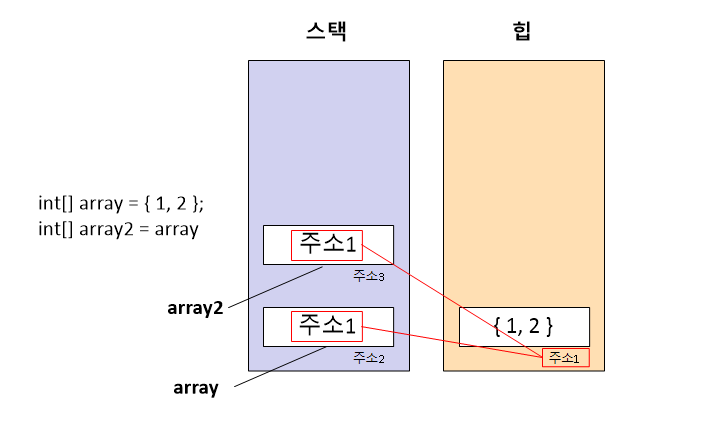

# Reference Type

</img>

| **구분** | **핵심내용** |
| --- | --- |
| **개념** | 데이터의 실제 값은 힙(Heap) 메모리에 저장하고, 변수에는 그 주소(참조)를 스택(Stack)에 저장하는 타입 |
| **메모리 특징** | 더 이상 참조되지 않는 객체는 가비지 컬렉터(GC)가 자동으로 해제 |
| **할당/전달 방식** | 주소 복사 (얕은 복사) — 한 변수에서 값을 바꾸면 같은 주소를 참조하는 다른 변수의 값도 변경됨 |
| **Null 여부** | 기본값은 `null` — 참조 대상이 없을 때 멤버 접근 시 `NullReferenceException` 발생 |
| **주요 종류** | `class`, `interface`, `delegate`, `array`, `object` |
| **특이사항** | `string`은 참조 타입이지만 불변(Immutable) 특성을 가져 값이 수정되면 새 객체를 생성함 |

## 정의

- 값이 위치한 메모리의 주소(참조)를 저장하는 데이터 타입
- 데이터의 실제 값(실체)은 Heap 메모리에 할당되고, 변수 자체는 그 실체를 가리키는 주소만 스택 메모리에 보유

## 특징

- 주소 복사 (Side Effect) : 참조 타입 변수를 다른 변수에 할당하면 실제 데이터가 복사되는 것이 아니라 주소만 복사됨. 따라서 한 변수를 통해 데이터를 수정하면 동일한 주소를 가리키는 다른 변수에도 영향을 미침.

```csharp
class Person 
{
    public string Name;
}

Person p1 = new Person();
p1.Name = "Alice";

Person p2 = p1; // 주소 복사 (p1과 p2는 같은 객체를 가리킴)
p2.Name = "Bob";

Console.WriteLine(p1.Name); // 출력: Bob (p1의 값도 변경됨)
```

- `null` 값 가리키기 : 참조 타입 변수는 메모리 주소를 가리키지 않는 상태인 `null`을 가질 수 있다. `null` 상태인 변수의 멤버에 접근하려 하면 `NullReferenceException` 예외가 발생.

```csharp
Person p = null;
// Console.WriteLine(p.Name); // 예외 발생! (NullReferenceException)
```

- 예외적인 참조 타입 `string` : `string`은 참조 타입이지만 불변성(Immutability)을 가짐. 문자열을 수정하면 기존 객체가 변경되는 것이 아니라 힙에 새로운 `string` 객체가 생성됨.

```csharp
string s1 = "Hello";
string s2 = s1;
s2 += " World"; // s2는 새로운 string 객체를 가리키게 됨

Console.WriteLine(s1); // 출력: Hello (s1은 영향받지 않음)
```

## 종류

- **`class`** : 사용자 정의 참조 타입의 기본 (예: `string`, 사용자 정의 클래스)
- **`interface`** : 규격을 정의하는 타입
- **`delegate`** : 메서드 참조를 저장하는 타입
- **`array`** : 배열 (내부 요소가 값 타입이어도 배열 객체 자체는 참조 타입)
- **`object`** : C#의 최상위 기본 타입