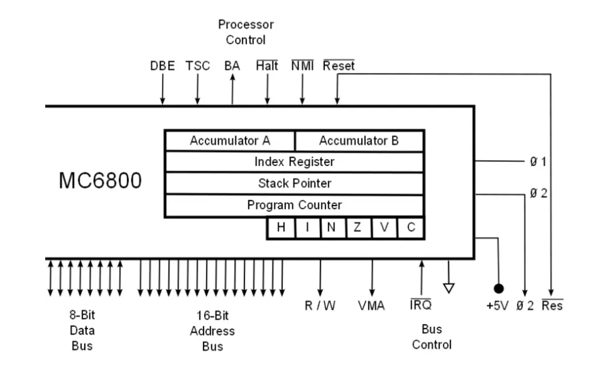

# Stack Pointer

</img>

| **구분** | **주요 내용** |
| --- | --- |
| **정의** | 메모리 스택 영역의 현재 최상단(Top) 주소를 가리키는 CPU 레지스터 |
| **핵심 기능** | 함수 호출 복귀 주소 저장, 지역 변수 할당, 프로세스 문맥(Context) 백업 |
| **동작 방향** | 대다수 아키텍처에서 상위 주소 → 하위 주소로장착 (데이터 추가 시 SP 감소) |
| **주요 특징** | `PUSH`/`POP` 명령어 실행 시 값(주소)이 자동으로 증감함 |
| **PC와의 차이** | PC: 다음에 실행할 *명령어* 주소 / SP: 현재 저장된 *데이터* 스택 주소 |
| **관련 유닛** | ALU(주소 계산), 제어 장치(명령어 해석), 메모리(RAM)(데이터 저장) |

## 정의

- 프로그램의 함수 호출, 지역 변수 저장, 임시 데이터 보관 등에 사용되는 스택(Stack) 메모리 영역의 현재 위치를 가리키는 핵심 레지스터
- 스택의 최상단 주소를 가지고 있음
- 메모리의 스택 영역(Stack Segment)에서 가장 마지막으로 데이터가 저장된(또는 다음에 저장될) 주소(Address)를 담고 있는 CPU 내부의 전용 레지스터

## 기능

- **함수 호출 관리 (Function Call Management) :** 함수가 호출될 때 복귀 주소(Return Address), 매개변수, 이전 함수의 레지스터 상태 등을 스택에 저장하고, 함수가 종료될 때 원래 상태로 정확하게 돌아갈 수 있도록 도움.
- **지역 변수 및 임시 데이터 저장 :** 함수 내에서 선언되는 지역 변수와 연산 과정 중 임시로 보관해야 하는 값들을 저장할 공간을 할당하고 해제.
- **문맥 교환 (Context Switching) 지원 :** 운영체제(OS)가 멀티태스킹을 위해 실행 중인 프로세스나 스레드를 바꿀 때, 현재 레지스터 상태를 스택에 백업하고 복원하는 데 필수적으로 사용.

## 특징

- **자동 갱신 (Auto-Update):** 데이터를 스택에 넣거나(`PUSH`) 뺄 때(`POP`), 프로그래머가 직접 연산하지 않아도 어셈블리 명령어에 의해 SP의 값이 자동으로 증감.
    - 일반적으로 메모리의 스택은 높은 주소에서 낮은 주소 방향으로 자라나는(Growing Downward) 구조를 가짐. 따라서 새로운 데이터가 스택에 쌓일 때(Push) SP의 값은 감소하고, 데이터가 제거될 때(Pop) SP의 값은 증가.
- **LIFO (Last-In, First-Out) 구조 :** 가장 나중에 들어간 데이터가 가장 먼저 나오는 후입선출 방식을 따른다.
- **아키텍처 의존성 :** CPU 아키텍처(x86, ARM, RISC-V 등)에 따라 레지스터의 이름(예: x86의 `RSP` 또는 `ESP`, ARM의 `SP`)이나 구체적인 동작 방식에 약간의 차이가 있음.

## 상호작용

- **PC (Program Counter, 프로그램 카운터)와의 관계 :**
    - PC는 '다음에 실행할 명령어의 주소'를 가리키고, SP는 ‘현재 데이터 스택의 위치'를 가리킵니다.
    - 함수가 호출(`CALL`)되면, CPU는 현재 PC의 값을 스택에 백업(Push)한 뒤, PC에 새로 실행할 함수의 시작 주소를 로드. 함수가 끝날 때(`RET`), 스택에 백업해 둔 주소를 다시 꺼내어(Pop) PC에 복원함으로써 이전 실행 위치로 돌아갈 수 있게 함.
- **ALU (Arithmetic Logic Unit, 산술논리장치)와의 관계 :**
    - 스택에 데이터를 넣거나 뺄 때, SP의 값을 메모리 주소 크기(예: 64비트 시스템에서는 8바이트)만큼 더하거나 빼는 연산(`SP = SP - 8`)이 필요함. 이때 ALU가 이 주소 계산을 수행.
- **메모리 관리 유닛 (MMU) 및 제어 장치 (Control Unit) :**
    - 제어 장치는 `PUSH`/`POP` 명령어를 해석하고, SP가 가리키는 메모리 주소로 데이터를 읽거나 쓰도록 메모리 버스에 신호를 보냄.