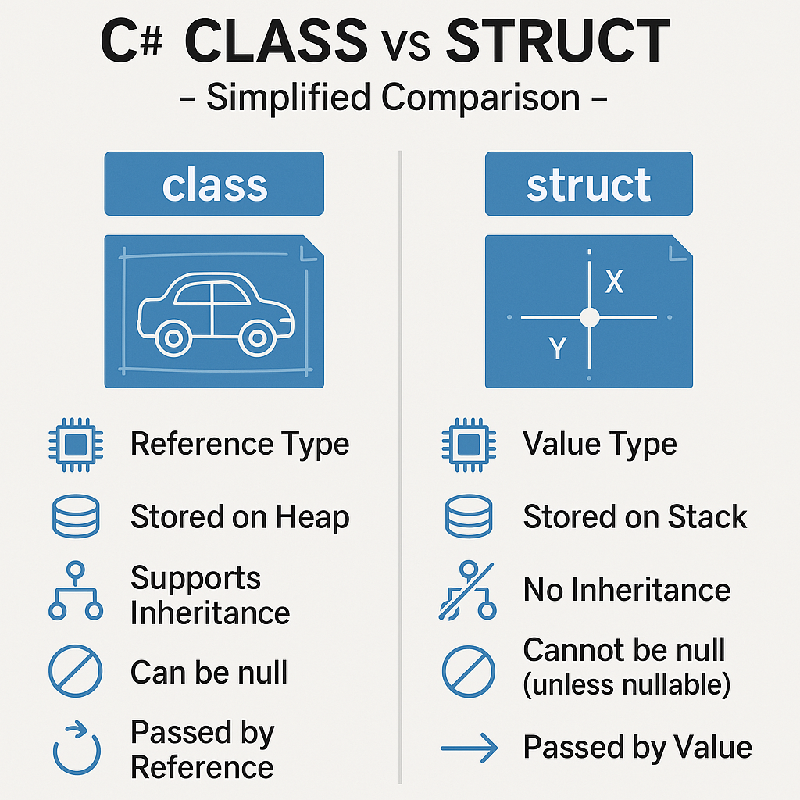

# Struct

</img>

| **구분** | **구조체 (struct)** |
| --- | --- |
| **형식 종류** | 값 형식 (Value Type) |
| **메모리 할당** | 주로 스택 (Stack) / 객체 내부 |
| **대입 및 전달** | 값 복사 (Deep Copy) |
| **상속 여부** | 상속 불가 (인터페이스 구현은 가능) |
| **Null 허용** | 기본 불가 (`Nullable` 사용 시 가능) |
| **주요 용도** | 작고 가벼운 데이터 구조 (`Vector3`, `Point`) |

## 정의

- 데이터와 관련 기능을 캡슐화하는 데 사용되는 사용자 정의 타입
- C#에서 `struct`는 값 형식(Value Type) 데이터 구조
- 데이터 자체가 스택(Stack) 메모리에 저장되거나, 선언된 변수 내에 직접 포함됨.

## 역할과 기능

- 주로 가볍고 수명이 짧은 데이터 묶음을 표현할 때 사용
    - **주요 사용 :** 2차원/3차원 좌표(`Point`, `Vector2`, `Vector3`), 색상(`RGBColor`), 날짜/시간 관련 일부 경량 데이터 등
    - **역할 :** Heap 메모리 할당을 피하고 가비지 컬렉터(GC)의 부하를 줄여 프로그램의 성능을 최적화하는 역할

## 특징

- **값 형식(Value Type) :** 변수를 복사하거나 메서드에 전달할 때 참조 주소가 아닌 값 전체가 복사.
- **상속 제약 :** 다른 구조체나 클래스로부터 상속받을 수 없으며, 다른 구조체에 상속해 줄 수도 없음. (단, 인터페이스(Interface) 구현은 가능.)
- **생성자 규칙 :**
    - C# 10부터는 매개변수가 없는 기본 생성자 및 필드 초기화(Field Initializer)를 명시적으로 정의할 수 있다.
    - 생성자 내에서는 모든 필드가 반드시 초기화되어야 함.
- **Null 허용 :** 기본적으로 `null`을 가질 수 없지만, `Nullable<T>`(예: `int?` 또는 `Point?`)를 사용하면 `null`을 허용할 수 있다.

## 장단점

- **장점**
    - **가비지 컬렉션(GC) 부담 감소 :** 주로 스택에 할당되므로 GC가 수거해야 할 객체 수가 줄어듦.
    - **캐시 지역성(Cache Locality) :** 메모리 상에 연속적으로 배치될 확률이 높아 CPU 캐시 효율이 뛰어남.
- **단점**
    - **복사 비용 발생 :** 크기가 큰 구조체를 대입하거나 매개변수로 넘길 경우, 전체 데이터가 복사되므로 오히려 성능이 저하될 수 있음.
    - **박싱(Boxing) 및 언박싱(Unboxing) :** 구조체가 `object`나 인터페이스로 형변환될 때 힙에 복사되는 박싱 현상이 발생하여 성능 손실이 생길 수 있음.
    - **의도치 않은 복사 버그 :** 값 형식의 특성 때문에 복사본을 수정할 때 원본이 변경되지 않아 디버깅이 까다로울 수 있음.

## 알아두면 좋을 내용

- **구조체 설계 가이드라인**
    - 크기가 **16바이트 미만**
    - 상태가 변하지 않는 **불변(Immutable)** 데이터
    - 자주 생성되고 소멸하는 경우에만 `struct` 사용을 권장(그 외에는 기본적으로 `class`를 사용하는 것이 안전)
- **`ref struct`**
    - 오직 스택에만 존재할 수 있는 특수한 구조체
    - 힙에 절대 올라갈 수 없으므로(박싱 불가, 제네릭 타입 불가, 비동기 메서드의 `await`  이후 사용 불가 등 제약이 큼), 고성능 메모리 처리를 위한 `Span<T>` 등에 사용