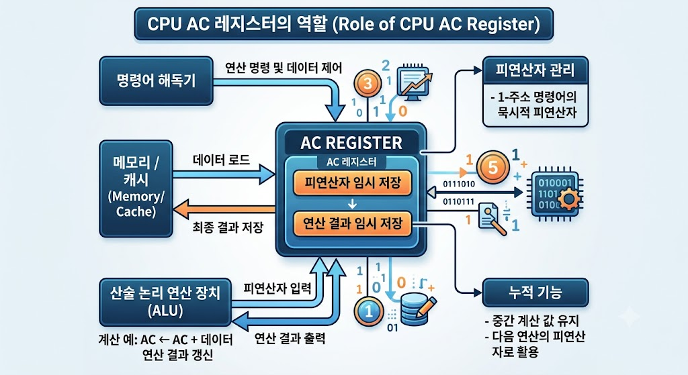

# [AC(Accumulator, 누산기)](../KeywordsList.md)

</img>

| **구분** | **내용** |
| --- | --- |
| **풀네임** | Accumulator (누산기) |
| **역할** | ALU 연산의 중간 결과 및 피연산자를 임시 저장 |
| **주요 장점** | 연산 속도 향상, 1-주소 명령어 사용 시 명령어 길이 감소 |
| **연관 유닛** | ALU(직접 연산 수행), MBR(메모리 데이터 입출력), CU(제어) |
| **현대적 위치** | EAX / RAX 등 범용 레지스터(GPR) 내부 기능으로 통합 확장 |

## 정의

- CPU의 산술 논리 연산 장치(ALU, Arithmetic Logic Unit)가 연산을 수행할 때, 피연산자(Operand)를 임시 저장하거나 연산 결과를 즉시 저장하는 전용 특수 목적 레지스터.

## 기능

- **중간 연산 결과 저장** : ALU에서 수행된 덧셈, 뺄셈, 논리 연산(AND, OR 등)의 결과값이 최종 메모리에 전송되기 전까지 일시적으로 남아있음.
- **연산의 피연산자 제공** : Single-address(1-주소) 명령 구조 등에서 연산 대상이 되는 데이터 중 하나로 자동 지정.
- **입출력 데이터의 임시 버퍼** : 외부 입출력 장치(I/O Device)와 CPU 간 데이터 전송 시 임시 보관 장소로 활용.

## 특징

- **ALU와의 밀접한 결합** : 연산 처리 속도를 극대화하기 위해 ALU와 직접 회로로 연결되어 있으며, 접근 속도가 레지스터 중에서도 최고 수준.
- **명령어 길이 절약** : 1-주소 명령어 형식(One-address instruction) 구조에서는 명령어 내에 AC의 주소를 명시하지 않아도 묵시적(Implicit)으로 지정되므로, 명령어의 비트 수를 획기적으로 줄일 수 있음.
- **현대 CPU에서의 변화** : 초기의 단일 누산기 구조(Single-Accumulator Architecture)와 달리, 현대의 RISC/x86 CPU에서는 여러 개의 범용 레지스터(General Purpose Register, e.g., RAX, RBX)가 AC의 역할을 분담하거나 확장하여 사용.

## 상호작용

```csharp
+-------------------------------------------------------+
|                        CPU                            |
|  +-------------------+        +--------------------+  |
|  |   Control Unit    |------->|        ALU         |  |
|  +-------------------+        +--------------------+  |
|            |                             ^            |
|            v                             | (연산/결과) |
|  +-------------------+                   v            |
|  | MBR (Memory Buffer|------------->[   AC   ]        |
|  |     Register)     |  (데이터 로드) (Accumulator)    |
|  +-------------------+                                |
+-------------------------------------------------------+
```

- **ALU (산술 논리 연산 장치)**
    - **입력** : AC에 담긴 기존 값이 ALU의 입력 중 하나로 전달.
    - **출력** : ALU의 연산 결과가 다시 AC로 출력되어 갱신.
- **MBR / MDR (메모리 버퍼 레지스터)**
    - 메모리(RAM)에서 읽어온 데이터는 MBR을 거쳐 AC로 로드(Load)되거나, AC의 최종 값이 MBR을 거쳐 메모리에 저장(Store).
- **CU (제어 장치, Control Unit)**
    - CU의 제어 신호에 따라 AC의 데이터가 ALU로 이동하거나, AC 값이 Bus(버스)를 타고 나가는 타이밍이 제어.