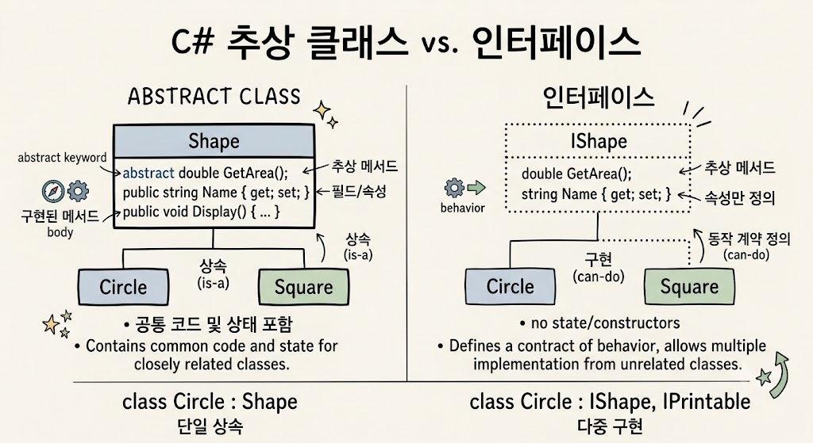

# Abstract Class vs Interface

</img>

| **비교 항목** | **추상 클래스 (Abstract Class)** | **인터페이스 (Interface)** |
| --- | --- | --- |
| **상속** | 단일 상속만 가능 (`class A : B`) | 다중 구현 가능 (`class A : B, C`) |
| **상태 유지** | 인스턴스 필드 및 생성자 보유 가능 | 인스턴스 필드 및 생성자 보유 불가 |
| **메서드 구현** | 추상 메서드와 일반 메서드 혼용 가능 | 시그니처 위주 (C# 8.0+ 부터 디폴트 구현 가능) |
| **접근 제어자** | 모든 접근 제어자 사용 가능 | 기본 `public` (C# 8.0+ 일부 허용) |
| **관계성** | Is-A (종속적, 부모-자식 관계) | Can-Do (행위의 계약, 기능적 정의) |
| **주요 목적** | 코드 재사용 및 계층 구조 정의 | 공통 동작 강제 및 다형성 확장 |

## 정의

- 추상 클래스 : 상속받을 자식 클래스들에게 공통적인 뼈대와 기능을 미리 제공하고 일부 구현을 강제하는 공통 조상 클래스
- Interface : 서로 다른 클래스들이 공통으로 가져야 할 행동 규격을 정의하는 기능 계약서
- 추상 클래스(Abstract Class)와 인터페이스(Interface)는 객체지향 프로그래밍에서 다형성과 공통 규격을 제공하지만, 설계 목적과 세부 기능에서 뚜렷한 차이를 가짐.

## 차이점

1. **상속 및 다중 구현**
    - **추상 클래스 :** 단일 상속만 지원. (`class A : B`) 클래스 간의 강한 계층 구조를 형성.
    - **인터페이스:**  다중 구현을 지원. (`class A : IB, IC`) 클래스가 여러 개의 역할을 동시에 수행하도록 설계할 수 있음.
2. **상태(필드) 및 생성자 보유 여부**
    - **추상 클래스 :** 인스턴스 필드(멤버 변수), 생성자, 소멸자를 가질 수 있어 객체의 상태를 유지하고 초기화할 수 있음.
    - **인터페이스 :** 인스턴스 필드와 생성자를 가질 수 없음. (C# 8.0 이후 정적(static) 필드, 상수, 기본 구현 메서드는 허용되나 객체 고유의 상태는 저장 불가)
3. **메서드 구현**
    - **추상 클래스 :** 구현부가 있는 일반 메서드와 구현부가 없는 `abstract` 메서드를 혼용할 수 있음. 자식 클래스는 `abstract` 메서드를 반드시 오버라이딩해야 함.
    - **인터페이스 :** 기본적으로 메서드 시그니처(선언부)만 정의하여 구현을 강제하지만, C# 8.0부터는 본문이 있는 디폴트 구현(Default Interface Methods)을 지원.
4. **접근 제어자**
    - **추상 클래스 :** `public`, `protected`, `private`, `internal` 등 다양한 접근 제어자를 자유롭게 사용할 수 있음.
    - **인터페이스 :** 기본적으로 모든 멤버가 `public`이며, C# 8.0부터는 `private`나 `protected` 접근 제어자를 가진 정적/헬퍼 멤버도 정의할 수 있음.
5. **설계 철학 및 사용 시기**
    - **추상 클래스 :** **"Is-A"** 관계. 밀접하게 연관된 클래스 간에 코드를 재사용하고 공통된 뼈대를 제공할 때 적합.
    - **인터페이스 :** **"Can-Do"** 관계. 관련 없는 클래스들이 공통된 동작(계약)을 수행하도록 강제하거나 다중 상속의 이점을 얻고 싶을 때 적합.