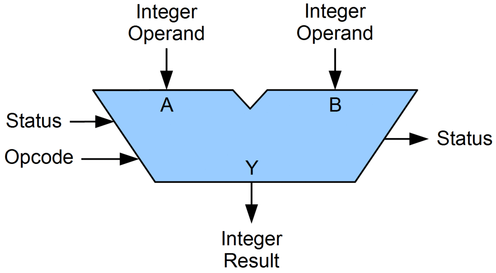

# [연산장치(ALU, Arithmetic Logic Unit)](../KeywordsList.md)

</img>

| **구분** | **주요 내용** |
| --- | --- |
| **정의** | CPU 내에서 산술 계산과 논리 판단을 실제로 실행하는 조합 논리 회로 집합 |
| **주요 기능** | 덧셈/뺄셈 등 사칙연산, `AND`/`OR`/`XOR` 논리 연산, 비트 Shift, 대소 비교 |
| **내부 구성** | 가산기(Adder), 보수기(Complementer), 누산기(AC), 플래그 레지스터(Status Register) |
| **상호작용 대상** | • 제어장치(CU): 연산 제어 신호 수신 및 플래그 상태 전달 • 레지스터: 연산 대상 데이터(Input) 입력받고 결과(Output) 저장 • 내부 버스: CPU 내부 요소 간 데이터 이동 통로 |
| **핵심 특징** | 피연산자의 뺄셈은 2의 보수를 통한 덧셈으로 처리하며, 연산 결과 상태(0, 음수, 오버플로우)를 플래그로 남겨 다음 제어 흐름에 영향을 줌 |

## 정의

- CPU 내부에서 실제 수학적 계산과 논리 판단을 직접 수행하는 핵심 디지털 회로
- 제어장치가 명령어를 해석해 신호를 보내면, ALU가 전달받은 데이터를 물리적·전자적으로 처리하여 결과

## 기능

ALU의 연산은 크게 4가지 영역으로 나뉩니다.

- **산술 연산 (Arithmetic Operations) :** 덧셈($+$), 뺄셈($-$), 곱셈($\times$), 나눗셈($\div$) 등 기본 사칙연산 및 부호 반전
- **논리 연산 (Logical Operations) :** 참·거짓을 판단하는 참값/거짓값 처리 및 논리게이트 연산 (`AND`, `OR`, `NOT`, `XOR` 등)
- **시프트 연산 (Shift Operations) :** 비트 데이터를 왼쪽이나 오른쪽으로 이동시키는 연산 (2의 거듭제곱 곱셈/나눗셈 및 비트 마스킹에 활용)
- **관계 연산 (Relational Operations) :** 두 데이터의 크기를 비교 (`>`, `<`, `==`, `!=`)하여 조건문 분기의 기준 제공

## 특징

- **내부 구성 회로 :**
    - **가산기 (Adder) :** 2진수의 덧셈을 수행하는 기본 회로 (뺄셈은 보수기를 거쳐 덧셈으로 처리)
    - **보수기 (Complementer) :** 뺄셈 연산을 위해 입력을 2의 보수 형태로 변환
    - **누산기 (Accumulator, AC) :** 연산에 사용될 피연산자나 연산 완료 후의 intermediate/final 결과를 임시 저장하는 특수 레지스터
    - **상태 레지스터 (Status/Flag Register) :** 연산 결과의 상태 정보(오버플로우, 0 여부, 음수 여부, 캐리 발생 등)를 비트 플래그로 기록
- **비동기식 순수 조합 논리 회로 (Combinational Logic) :**
    - 클록에 따라 상태가 유지되는 렌더링 영역이 아닌, 입력값이 주어지면 즉시 결과 신호를 출력하는 회로로 구성.
- **병렬 처리 및 다중 코어 :**
    - 현대 CPU는 정수 연산 전용 ALU와 부동소수점 연산 전용 FPU(Floating Point Unit)를 분리해 탑재하며, 한 코어 내에도 복수의 ALU를 두어 슈퍼스칼라(Superscalar) 구조로 병렬 연산을 수행.

## 상호 작용

1. **데이터 및 명령어 대기 :** 레지스터 및 제어장치 단계.
    - 메모리에서 읽어온 데이터가 피연산자 레지스터와 누산기(AC)에 로드되고, 제어장치(CU)는 실행할 명령어를 해독.
2. **제어 신호 전달 :** 제어장치 -
    - 제어장치가 해독된 명령에 따라 ALU에 어떤 연산(예: ADD, XOR)을 수행할지 결정하는 제어 신호(Control Signal)를 보냄.
3. **연산 수행 및 상태 기록 :** ALU 내부 연산
    - ALU가 입력된 레지스터의 데이터 값을 가져와 연산을 실행. 연산 결과에서 발생한 득실(음수, 0, 오버플로우 등)은 플래그 레지스터(Flag Register)에 즉시 반영됨.
4. **결과 저장 및 다음 작업 분기 :** ALU -
    - 레지스터 및 제어장치>
    연산 결과는 누산기(AC)나 목적지 레지스터로 전송됨. 이때 플래그 레지스터의 정보는 제어장치로 전달되어 다음 명령어의 조건문 분기(Jump/Branch) 여부를 결정하는 데 쓰임.