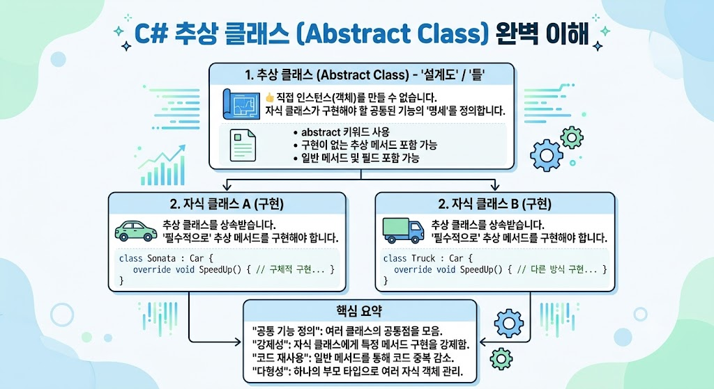

# [Abstract](../KeywordsList.md)

</img>

| **구분** | **추상 클래스 (Abstract Class)** | **추상 메서드 (Abstract Method)** |
| --- | --- | --- |
| **정의 방식** | `public abstract class 클래스명` | `public abstract 리턴타입 메서드명();` |
| **객체 생성** | 불가능 (`new` 키워드 사용 불가) | 해당 없음 (메서드 단위) |
| **구현 여부** | 일반 메서드/필드는 구현부 존재 | 구현부(`{}`) 없이 세미콜론으로 끝남 |
| **상속 및 구현** | 다른 클래스가 반드시 상속받아 사용 | 자식 클래스에서 반드시 `override` 해야 함 |
| **주요 목적** | 공통된 기본 틀 제공 및 코드 재사용 | 자식 클래스마다 다른 구현을 강제함 |

## 정의

- 불필요한 세부사항을 숨기고, 공통의 중요한 특징(속성과 메서드)만 추출하여 정의하는 것.
- 코드 레벨에서는 `abstract` 키워드를 사용하여 추상 클래스(Abstract Class)와 추상 메서드(Abstract Method)를 정의하는 방식으로 구현됨.
- 추상 클래스는 직접 인스턴스화(객체 생성)할 수 없으며, 반드시 상속을 통해 자식 클래스에서 구현되어야 함.

## 기능

- **공통 규격(인터페이스 역할) 제공 :** 여러 자식 클래스가 반드시 가져야 할 메서드의 틀을 강제하여, 일관된 설계(Contract)를 유지하게 함.
- **코드 중복 제거 :** 자식 클래스들에서 공통으로 사용하는 필드나 메서드는 추상 클래스에 미리 구현해 두고, 다르게 구현해야 하는 부분만 자식에게 위임.
- **다형성(Polymorphism) 구현 :** 상위 타입(추상 클래스)으로 하위 객체들을 묶어서 관리할 수 있어 유연한 코드 작성 가능.

## 특징

- **인스턴스 생성 불가 :** `new` 연산자를 사용해 직접 객체를 만들 수 없음 (예: `Animal a = new Animal();` (불가능))
- **추상 멤버 포함 가능 :** `abstract` 키워드가 붙은 메서드는 선언부만 있고 구현부(몸체, `{}`)가 없음**.**
- **일반 멤버 공존 가능 :** 추상 클래스라고 해서 추상 메서드만 가져야 하는 것은 아님. 일반 변수, 생성자, 구현된 일반 메서드도 함께 가질 수 있음.
- **오버라이딩(Overriding) 강제 :** 추상 클래스를 상속받는 자식 클래스는 부모의 모든 추상 메서드를 반드시 `override` 키워드로 구현해야 함.

```csharp
[코드 예시]
public abstract class Animal // 추상 클래스
{
    public string Name { get; set; }
    
    // 추상 메서드 (몸체가 없고, 상속받는 클래스가 반드시 구현해야 함)
    public abstract void MakeSound(); 
    
    // 일반 메서드 (공통 기능 제공 가능)
    public void Sleep() => Console.WriteLine($"{Name}이(가) 잠을 잡니다.");
}

public class Dog : Animal
{
    public override void MakeSound() => Console.WriteLine("멍멍!");
}
```

## 알아두면 좋을 내용

- **가상 메서드(`virtual`)와의 차이점 :**
    - `virtual` 메서드는 기본 구현을 제공하고 자식이 선택적으로 오버라이딩(재정의)할 수 있음.
    - `abstract` 메서드는 구현이 아예 없으므로 자식에게 구현을 강제.
- **추상 클래스에도 생성자가 있다 :** 직접 인스턴스를 만들지는 못하지만, 자식 클래스가 생성될 때 `base()` 키워드를 통해 추상 클래스의 생성자가 호출되어 초기화 작업을 수행할 수 있음.
