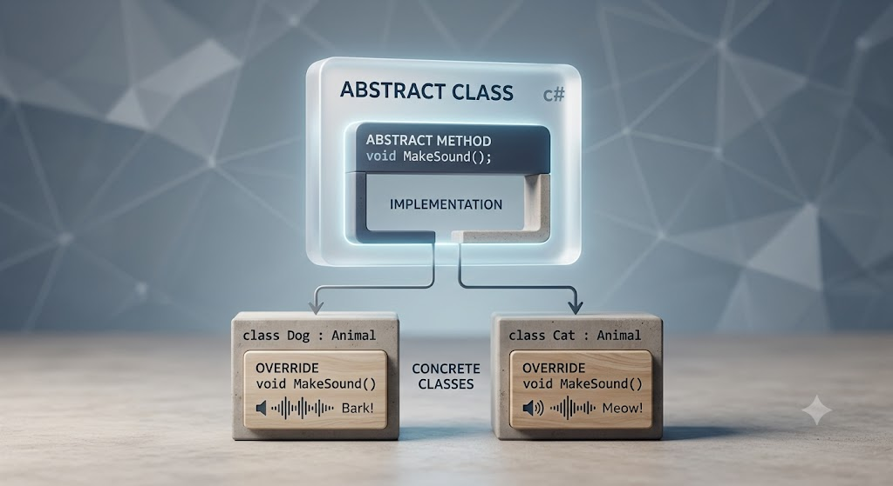

# [Abstract](../KeywordsList.md)

</img>

| **항목** | **추상 클래스 (abstract class)** | **비교: 인터페이스 (interface)** |
| --- | --- | --- |
| **인스턴스 생성 (`new`)** | 불가 | 불가 |
| **상속 방식** | 단일 상속만 지원 | 다중 구현(상속) 가능 |
| **멤버 구현 여부** | 추상 멤버(미구현) + 일반 멤버(구현) 혼용 가능 | 주로 미구현 선언 (C# 8.0부터 기본 구현 가능) |
| **필드(변수) 보유** | 인스턴스 필드/변수 보유 가능 | 필드 보유 불가 (프로퍼티/이벤트/메서드만 가능) |
| **접근 제한자** | `public`, `protected` 등 다양하게 지정 가능 | 기본적으로 `public` 형태 |
| **주 사용 목적** | 밀접하게 관련된 클래스 간의 코드 재사용 및 규격 정의 | 서로 다른 클래스 간의 공통 기능/행위 규약 |

## 정의

- **추상 클래스 (`abstract class`)** : 완벽하게 구현되지 않은 '미완성 설계도'. 단독으로 객체(인스턴스)를 생성(`new`)할 수 없으며, 반드시 다른 클래스가 상속받아 미완성된 부분을 완성(구현)해야만 사용할 수 있음.
- **추상 멤버 (`abstract method/property`)** : 구현부(`{ }`) 없이 선언만 존재하는 멤버. 추상 클래스 내부에서만 선언할 수 있으며, 자식 클래스에서 반드시 `override` 키워드를 통해 구체적인 로직을 구현해야 함.

## 기능

- **공통 규격(인터페이스) 정의** : 하위 클래스들이 반드시 구현해야 하는 메서드의 형태(이름, 매개변수, 반환형)를 강제하여 공통된 접근 방식을 제공.
- **코드 재사용성 향상** : 공통으로 사용하는 일반 필드나 실체가 있는 일반 메서드는 추상 클래스에 미리 구현해 두고, 클래스마다 달라지는 부분만 추상 메서드로 비워 두어 자식 클래스에서 작성하게 함.
- **다형성(Polymorphism) 지원** : 부모 추상 클래스 타입의 변수로 여러 형태의 자식 객체를 참조하고, 동일한 메서드를 호출하여 각 객체에 맞는 동작을 수행.

## 특징

- **`new` 키워드 사용 불가** : 미완성 상태이므로 `new AbstractClass()` 형태로 직접 인스턴스화할 수 없음.
- **구현 강제성** : 추상 클래스를 상속받은 자식 클래스는 부모의 모든 추상 멤버를 반드시 `override`하여 구현해야 함. (구현하지 않으면 컴파일 에러 발생)
- **일반 멤버 포함 가능** : 추상 멤버뿐만 아니라, 일반 필드, 생성자, 이미 구현된 일반 메서드/프로퍼티도 자유롭게 포함할 수 있음.
- **단일 상속 제한** : C#의 일반 클래스 상속 규칙을 그대로 따르므로, 한 클래스는 하나의 추상 클래스만 상속받을 수 있음.
- **`private` 사용 불가** : 추상 멤버는 자식 클래스에서 접근하여 오버라이딩해야 하므로 `private` 접근 제한자를 사용할 수 없음. (`public` 또는 `protected` 사용)

## 알아두면 좋을 내용

#### ① 추상 클래스 vs 인터페이스 (`interface`)

- **추상 클래스 (`is-a`)** : 명확한 계층 구조를 가지며, 코드 재사용과 상태(필드) 공유가 필요할 때 사용.
- **인터페이스 (`can-do`)** : 클래스 계층과 상관없이 특정 행위/기능을 규약하고 싶을 때 사용하며, 다중 상속이 가능.

#### ② 템플릿 메서드 패턴 (Template Method Pattern)

추상 클래스는 디자인 패턴 중 하나인 '템플릿 메서드 패턴'에 자주 쓰임. 전체적인 작업 흐름(알고리즘 구조)은 부모 클래스의 일반 메서드로 정의해 두고, 단계별 세부 로직만 추상 메서드로 비워두어 자식이 구현하게 만드는 패턴.