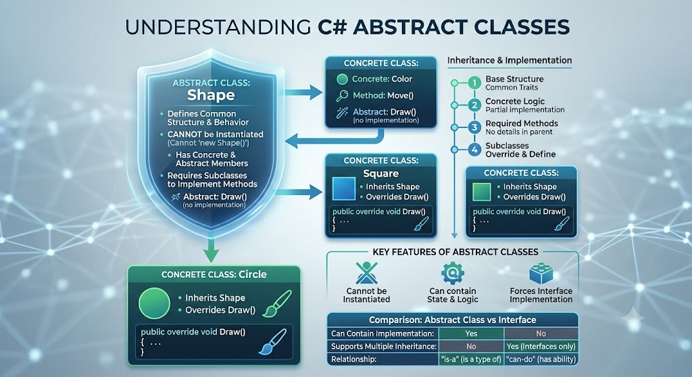

# Abstract Class

</img>

| **구분** | **주요 내용** |
| --- | --- |
| **선언 키워드** | `abstract class 클래스명` |
| **객체 생성 (`new`)** | 불가능 (자식 클래스를 통해서만 인스턴스화) |
| **멤버 구성** | 추상 멤버(미완성) + 일반/가상 멤버(완성) 모두 가능 |
| **자식 클래스 의무** | 모든 `abstract` 멤버를 `override`하여 필수 구현 |
| **상속 특징** | 단일 상속만 지원 (다중 상속 불가) |
| **주 목적** | 관련 클래스들의 공통 기능 재사용 + 필수 규격(인터페이스) 정의 |

## 정의

- 하나 이상의 추상 멤버(추상 메서드, 추상 프로퍼티 등)를 포함할 수 있으며, `abstract` 키워드를 사용하여 선언된 클래스
- 완전한 형태의 객체를 직접 만들 수는 없으며, 이를 상속받는 자식 클래스에서 세부 구현을 완성하도록 강제

## 기능

- **공통 로직 제공** : 자식 클래스들이 공유하는 실제 코드(구현부)를 미리 작성하여 코드 중복을 줄임.
- **구현 강제 (인터페이스 역할)** : 특정 메서드의 이름과 매개변수 형태(시그니처)만 정의해 두고, 실제 작동 방식은 상속받는 클래스가 반드시 작성하도록 만듦.

## 특징

- **인스턴스화 불가**: `new Animal()`과 같이 직접 객체를 생성할 수 없습니다. 반드시 자식 클래스를 통해서만 객체를 생성함.
- **완성된 멤버와 미완성 멤버의 공존** :
    - **추상 멤버 (`abstract`)** : 구현부(`{ }`)가 없으며, 자식 클래스에서 `override` 키워드로 반드시 구현해야 함.
    - **일반 멤버** : 일반 클래스처럼 변수, 필드, 구현된 메서드, 생성자 등을 자유롭게 포함 가능.
    - **가상 메서드 (`virtual`)** : 기본 구현을 제공하되, 필요시 자식 클래스에서 재정의할 수 있도록 허용할 수 있음.
- **단일 상속** : C#의 클래스 상속 규칙에 따라 추상 클래스 역시 하나의 클래스만 상속할 수 있음.

## 알아두면 좋을 내용

### 추상 클래스 vs 인터페이스(Interface)

- **추상 클래스 ("is-a" 관계)**: 명확한 부모-자식 관계일 때 사용. (예: `Dog` is an `Animal`) 코드 재사용과 상태(필드) 공유가 필요할 때 적합.
- **인터페이스 ("can-do" 관계)**: 클래스의 종류와 관계없이 특정 "기능"을 부여할 때 사용. (예: `Dog` can `Fly`, `Plane` can `Fly`) C#에서 다중 상속을 시뮬레이션할 때 유용함.

### 생성자(Constructor) 보유 가능

추상 클래스는 직접 `new`로 호출할 수 없지만 생성자를 가질 수 있음. 자식 클래스의 객체가 생성될 때 `base()`를 통해 부모 추상 클래스의 생성자가 먼저 실행되어 상태를 초기화함.