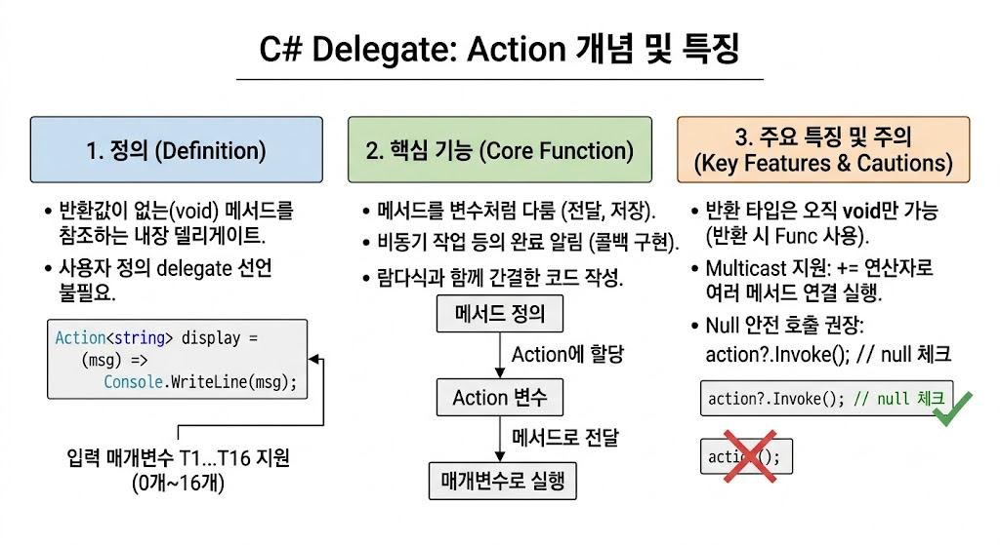

# [delegate - Action](../KeywordsList.md)

</img>

| **항목** | **내용** |
| --- | --- |
| **개념** | 반환값(`void`)이 없는 메서드를 참조하는 C# 내장 제네릭 델리게이트 |
| **반환 타입** | 무조건 **`void`** |
| **매개변수** | 0개부터 최대 16개까지 지정 가능 (`Action`, `Action<T1, ...>`) |
| **주요 용도** | 콜백 함수, 이벤트 리스너, LINQ/람다 표현식 전달, 비동기 완료 통지 |
| **`Func`와의 차이** | `Action`은 반환값 없음(`void`), `Func`는 반환값 존재 |
| **권장 호출 방식** | `action?.Invoke()` (Null 예외 방지) |

## 정의

- 반환값이 없는(void) 메서드를 가리키는 내장 제네릭 델리게이트(Delegate)
- 사용자 정의 델리게이트를 직접 선언하지 않고도, 표준화된 방식으로 메서드를 변수처럼 다룰 수 있게 해줌.
- **정의 형태**:
    - `public delegate void Action();` (매개변수 없음)
    - `public delegate void Action<in T>(T obj);` (매개변수 1개)
    - `public delegate void Action<in T1, in T2>(T1 arg1, T2 arg2);` (매개변수 2개)
    - ... 최대 `Action<T1, ..., T16>`까지 지원

## 기능

- **메서드의 변수화** : 메서드를 파라미터로 전달하거나, 변수에 저장하고, 리턴값으로 반환할 수 있음.
- **콜백(Callback) 구현** : 특정 작업이 완료된 후 실행할 동작을 등록할 때 사용.
- **이벤트 처리 및 람다식 전달** : 익명 메서드나 람다식을 간결하게 전달하는 통로 역할.

```csharp
using System;

class Program
{
    static void Main()
    {
        // 1. 일반 메서드 참조
        Action<string> printMessage = Display;
        printMessage("Hello, Action!");

        // 2. 람다 식(Lambda Expression) 활용
        Action<int, int> addAndPrint = (a, b) => 
        {
            Console.WriteLine($"합계: {a + b}");
        };
        addAndPrint(10, 20);

        // 3. 콜백 함수로 전달
        ProcessData("데이터 처리 중...", () => Console.WriteLine("작업 완료!"));
    }

    static void Display(string msg) => Console.WriteLine(msg);

    static void ProcessData(string info, Action onComplete)
    {
        Console.WriteLine(info);
        // Null 안전 호출 (?.)
        onComplete?.Invoke(); 
    }
}
```

## 특징

- **반환 타입 고정 (`void`)** : 반환값이 있는 메서드는 참조할 수 없음. (반환값이 필요하면 `Func`를 사용)
- **보일러플레이트 코드 감소** : `delegate` 키워드로 새로운 타입을 정의하는 번거로움을 줄여줌.
- **체이닝 지원 (Multicast Delegate)** : `+` 또는 `+=` 연산자를 사용하여 여러 개의 메서드를 하나에 등록하고 순차적으로 실행할 수 있음.
- **공반성/반반성 지원 (`in` 키워드)** : 입력 매개변수에 `in` 제네릭 수식어가 붙어 있어 다형성을 안전하게 활용할 수 있음.

## 알아두면 좋을 내용

#### `Func` vs `Action` 차이점

- `Action`: 반환값이 없는 (`void`) 메서드 전용
- `Func`: 반환값이 있는 메서드 전용 (마지막 제네릭 타입이 반환 타입: `Func<T1, TResult>`)

#### Null 안전성 (`?.Invoke()`)

`Action` 변수에 아무런 메서드도 할당되지 않은 상태(`null`)에서 호출하면 `NullReferenceException`이 발생합니다. C# 6.0부터 도입된 Null 조건 연산자를 활용해 `myAction?.Invoke()` 형태로 호출하는 것이 안전.

#### 체이닝 시 주의사항

여러 메서드를 묶어 실행할 때 중간에 위치한 메서드에서 예외가 발생하면, 그 뒤에 등록된 메서드들은 실행되지 않음.