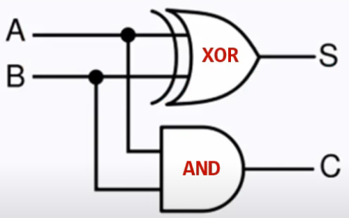

# [Adder](../KeywordsList.md)

</img>

| **구분** | **주요 내용** |
| --- | --- |
| **정의** | CPU 연산장치(ALU) 내에서 이진수 덧셈 및 산술 연산을 담당하는 기본 논리 회로 |
| **핵심 기능** | • 이진수 덧셈 및 뺄셈(보수 연산) 수행 • 곱셈·나눗셈 및 메모리 주소 계산의 기본 단위 |
| **반가산기 (HA)** | 2개 비트 입력($A, B$)만 연산 가능하며, 아랫자리 자리올림수($C_{in}$) 반영 불가 |
| **전가산기 (FA)** | 입력 2개 + 이전 자리올림수($C_{in}$)까지 총 3개 비트를 수용 가능한 완벽한 덧셈 회로 |
| **주요 특징** | • 보수기와 결합하여 뺄셈기 역할 겸임 • 속도 향상을 위해 현대 CPU에는 캐리 예측 가산기(CLA) 기법 적용 |

## 정의

- 2진수 형태의 디지털 데이터를 받아 두 개 이상의 수에 대한 덧셈 연산을 수행하는 논리 회로
- 컴퓨터의 모든 데이터는 `0`과 `1`로 이루어진 이진수이므로, 가산기는 기본 게이트(AND, OR, XOR 등)를 조합하여 2진수 자릿수별 덧셈과 자리올림(Carry)을 계산

## 기능

- **2진수 덧셈 계산 :** 입력받은 두 2진 데이터의 각 비트를 더하고, 합(Sum, $S$)과 자리올림수(Carry, $C$)를 산출.
- **뺄셈 연산 처리 (보수 활용) :** 컴퓨터에는 별도의 뺄셈기(Subtractor)를 두는 대신 가산기와 보수기(Complementer)를 조합하여 뺄셈을 처리. ($A - B = A + (-B)$ 형태)
- **곱셈 및 나눗셈의 기초 :** 곱셈은 반복적인 덧셈과 시프트(Shift) 연산으로, 나눗셈은 반복적인 뺄셈으로 구현되므로 모든 산술 연산의 기반이 됨.
- **메모리 주소 계산 :** CPU가 다음 명령어를 읽어오거나 배열/구조체 데이터의 위치를 찾기 위해 메모리 주소를 더할 때도 가산기가 쓰임.

## 특징

1. **반가산기 (Half Adder, HA)**
    - **특징 :** 2개의 1비트 입력($A, B$)을 더해 합($S$)과 자리올림수($C$) 2개의 출력을 만든다.
    - **한계 :** 아랫자리에서 올라온 자리올림수($C_{in}$)를 입력받아 더할 수 없다는 치명적인 한계가 있어, 최하위 비트(LSB) 연산에만 사용될 수 있다.
    - **논리식:**
        - 합 : $S = A \oplus B$ (XOR 게이트)
        - 자리올림 : $C = A \cdot B$ (AND 게이트)

**② 전가산기 (Full Adder, FA)**

- **특징 :** 2개의 1비트 입력($A, B$) 외에 아랫자리에서 올라온 자리올림수($C_{in}$)까지 총 3개의 비트를 더할 수 있는 회로.
- **구성 :** 보통 반가산기 2개와 OR 게이트 1개를 조합하여 구성.
- 멀티비트(8bit, 32bit, 64bit 등) 덧셈을 수행하려면 전가산기가 필수적.