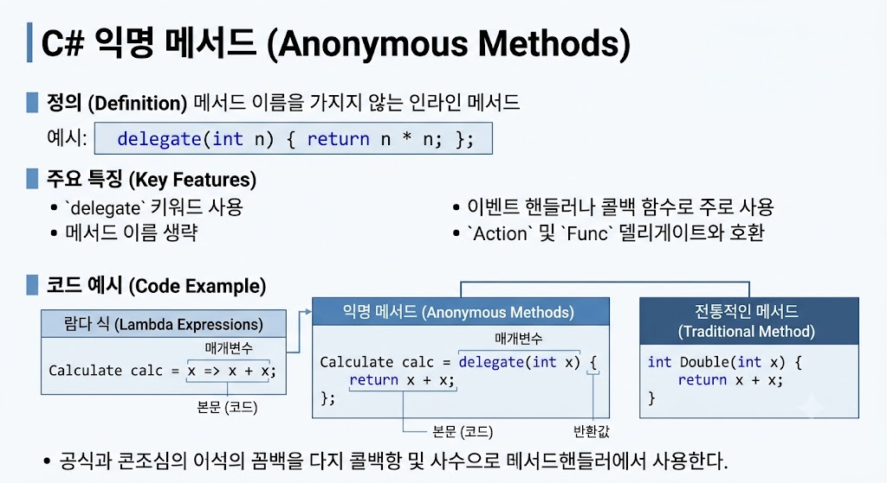

# [익명 메서드(Anonymous Method)](../KeywordsList.md)

</img>

| **구분** | **내용** |
| --- | --- |
| **정의** | 이름 없이 `delegate` 키워드로 정의된 코드 블록 |
| **기능** | 대리자에 직접 인라인 코드를 전달하여 별도 메서드 선언 생략 |
| **역할** | 일회성 이벤트 핸들러 및 콜백(Callback) 로직 간소화 |
| **특징** | 외부 변수 캡처 가능, 현재는 람다 식(`=>`)으로 대체되어 사용 |

## 정의

- 이름(Method Name)이 없는 메서드로, `delegate` 키워드를 사용하여 코드 블록을 인라인으로 직접 작성할 수 있는 기능.
- 프로그램 내에서 단 한 번만 사용되고 버려질 간단한 로직을 위해 별도의 메서드를 선언하는 번거로움을 없애고, 코드가 실행되는 위치에서 바로 대리자(Delegate)에 기능을 전달할 수 있도록 도움.

## 주요 기능 및 특징

- **인라인 코드 정의 :** 대리자 타입이 필요한 곳에 직접 메서드 본문을 작성 가능.
- **외부 변수 캡처(Closure) :** 익명 메서드 바깥쪽에 선언된 지역 변수나 매개변수를 메서드 내부에서 자유롭게 읽고 쓸 수 있음. (이를 통해 상태를 공유 가능.)
- **명시적 대리자 타입 :** 람다 식과 달리 `delegate` 키워드를 명시해야 하며, C# 2.0에서 처음 도입.

## 알아두면 좋을 내용

- **람다 식(`=>`)으로의 대체 :** 현재 C# 개발에서는 익명 메서드의 역할을 람다 식이 완전히 이어받아 수행하고 있음. 람다 식은 익명 메서드보다 훨씬 간결한 문법을 제공하므로, 신규 코드를 작성할 때는 익명 메서드 대신 람다 식을 사용하는 것이 표준.
- **하위 호환성 :** C# 3.0 이후로 람다 식이 대세가 되었지만, 기존 레거시 코드와의 호환성을 위해 익명 메서드 문법은 여전히 정상적으로 컴파일되고 동작함.