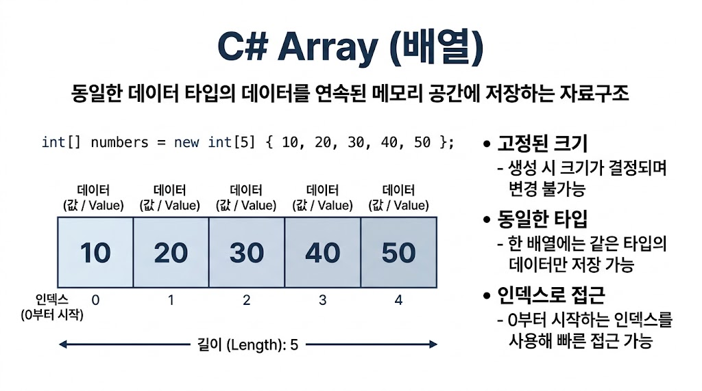

# [Array](../KeywordsList.md)

</img>

| 구분 | 내용 |
| --- | --- |
| **정의** | 같은 타입 요소를 연속 메모리에 고정 크기로 저장하는 참조 형식 (`System.Array` 상속) |
| **크기** | 생성 후 변경 불가 (`Resize`는 새 배열 생성) |
| **인덱스** | 0부터 시작, 범위 초과 시 `IndexOutOfRangeException` |
| **접근 속도** | 인덱스 접근 O(1) |
| **초기값** | 숫자 0, bool false, 참조형 null |
| **종류** | 1차원, 다차원(`[,]`), 가변(`[][]`) |
| **주요 메서드** | `Sort`, `Reverse`, `IndexOf`, `Copy`, `Clear`, `Resize`, `Length` |
| **복사** | 대입은 참조 공유, `Clone()`은 얕은 복사 |
| **최신 문법** | `^1`(Index), `1..3`(Range), `Span<T>` |
| **대안** | 크기가 유동적이면 `List<T>` |

## 정의

- 같은 타입의 요소를 연속된 메모리 공간에 고정된 크기로 저장하는 자료 구조
- C#의 모든 배열은 `System.Array` 클래스를 상속하는 참조 형식

```csharp
int[] numbers = new int[5];
int[] a = {1, 2, 3};
string[] names = new[] {"a", "b"}; 
```

## 특징

- 고정 크기 : 생성 후 길이를 바꿀 수 없음. (`Array.Resize`는 새 배열을 만들어 복사하는 방식)
- 단일 타입 : 선언한 타입의 요소만 저장
- 0부터 시작하는 인덱스 : 범위를 벗어나면 `IndexOutOfRangeException`이 발생
- 참조 형식 : 대입하면 복사가 아니라 같은 배열을 가리킴
- 힙에 할당 : 요소가 값 형식이어도 배열 자체는 힙에 저장
- 자동 초기화 : 숫자는 0, `bool`은 false, 참조 형식은 `null`로 채워짐
- 빠른 접근 : 인덱스로 O(1) 접근이 가능

## 기능

- 접근과 순회

```csharp
nums[0] = 10;
int len = nums.Length;
foreach(int n in nums) Console.WriteLine(n);
```

- `Array` 정적 메서드

```csharp
Array.Sort(nums); //정렬
Array.Reverse(arr); //뒤집기
Array.IndexOf(arr, 3); //검색(없으면 -1)
Array.Copy(src, dst, len); //복사
Array.Clear(arr, 0, 2); //기본값으로 초기화
Array.Resize(ref nums, 10); //크기변경(새 배열 생성)
```

- 다차원 배열

```csharp
int[,] grid = new int[3, 4];          // 직사각형 배열
int[][] jagged = new int[3][];        // 가변(jagged) 배열
jagged[0] = new int[2];
jagged[1] = new int[5];
```

- `[,]`은 모든 행의 길이가 같고, `[][]`는 행마다 길이가 다를 수 있음.
- 일반적으로 jagged ****배열이 더 빠름.

## 알아두면 좋을 내용

### 1. 얕은 복사 주의

```csharp
int[] b = a; //같은 배열 참조(복사x)
int[] c = (int[])a.Clone(); //얕은 복사
```

- 참조 형식 요소의 배열은 `Clone()`해도 객체 자체는 공유됨.

### Index/Range(C# 8.0+)

```csharp
nums[^1];        // 마지막 요소
nums[1..3];      // 인덱스 1~2 (새 배열로 복사됨)
```

### **pan<T>로 복사 없이 슬라이싱**

```csharp
Span<int> slice = nums.AsSpan(1, 3);
```

- 성능이 중요한 곳(예: Unity의 Update 루프)에서 GC 할당을 줄일 수 있음.

### **LINQ 활용**

- `using System.Linq;` 후 `Where`, `Select`, `Sum`, `Max`, `ToArray()` 등을 쓸 수 있으나 편의성 대신 할당 비용이 발생.

### **배열 vs `List<T>`**

- 크기가 고정이고 성능이 중요하면 배열
- 요소를 자주 추가/삭제하면 `List<T>` (내부적으로 배열을 자동 확장)

### **배열 공변성(covariance)**

- `object[] o = new string[3];`이 허용되지만, `o[0] = 1;`은 런타임에 `ArrayTypeMismatchException`이 발생.

### **기타**

- 큰 배열을 반복 생성하면 GC 부담이 커지므로 `ArrayPool<T>.Shared`로 재사용 가능.
- `params int[]`로 가변 인자를 받을 수 있음.