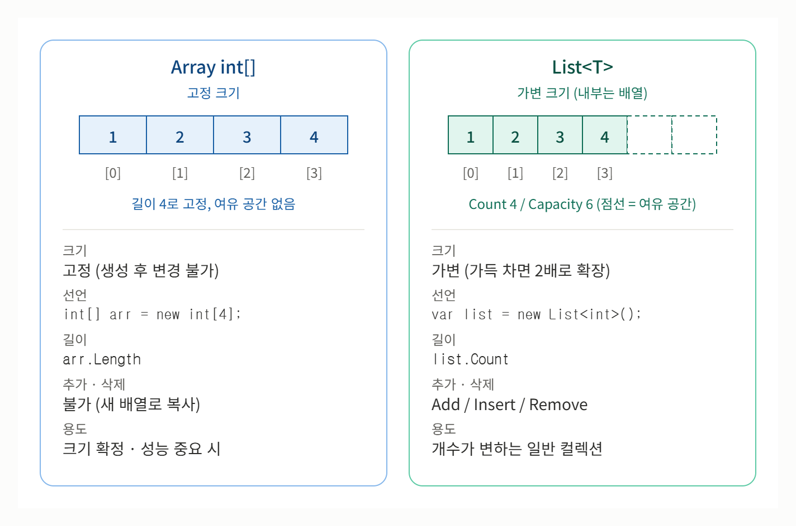

# [Array vs List](../KeywordsList.md)

</img>

| 구분 | Array | List (동적 배열) |
| --- | --- | --- |
| 크기 | 고정 | 가변 |
| 메모리 | 연속 | 연속 (여유 용량 포함) |
| 인덱스 접근 | O(1) | O(1) |
| 끝에 추가 | 불가 (재생성 필요) | 평균 O(1) |
| 중간 삽입/삭제 | O(n) | O(n) |
| 캐시 효율 | 매우 좋음 | 좋음 |
| 주 용도 | 크기 고정, 고성능 | 범용 컬렉션 |

## Array

- 크기가 고정. 생성 시 길이를 정하고 이후 변경 불가
- 같은 타입의 요소가 연속된 메모리에 저장됨
- 인덱스 접근이 O(1)이고, CPU 캐시 효율이 좋음
- 크기를 바꾸려면 새 배열을 만들어 복사해야 하므로 O(n)

```csharp
int[] arr = new int[3] { 1, 2, 3 };
arr[0] = 10;          // O(1)
// arr.Add(4);        // 불가능 (크기 고정)
```

## List

- 내부적으로 배열을 감싸고 있음
- 용량(capacity)이 가득 차면 보통 2배 크기의 새 배열을 만들어 복사
- 끝에 추가하는 `Add`는 평균 O(1)(amortized). 재할당이 일어나는 순간만 O(n).
- 중간 삽입/삭제는 뒤 요소를 밀어야 하므로 O(n).
- 인덱스 접근은 배열과 같은 O(1).
- 여유 용량 때문에 메모리를 조금 더 쓰고, 재할당 시 GC 부담이 생길 수 있음.

```csharp
var list = new List<int> { 1, 2, 3 };
list.Add(4);          // 평균 O(1)
list.Insert(0, 99);   // O(n)
list.RemoveAt(1);     // O(n)
```

## 선택 기준

- **Array** : 크기가 확정되어 있거나 거의 안 변할 때, 성능과 메모리가 중요할 때(예: 고정 크기 버퍼, 매 프레임 호출되는 코드)
- **List** : 요소 개수가 자주 변하거나 미리 알 수 없을 때. 대부분의 일반 상황에서 기본 선택.
- **팁** : 최종 크기를 대략 안다면 `new List<int>(capacity)`처럼 초기 용량을 지정해 재할당을 줄이면 좋음