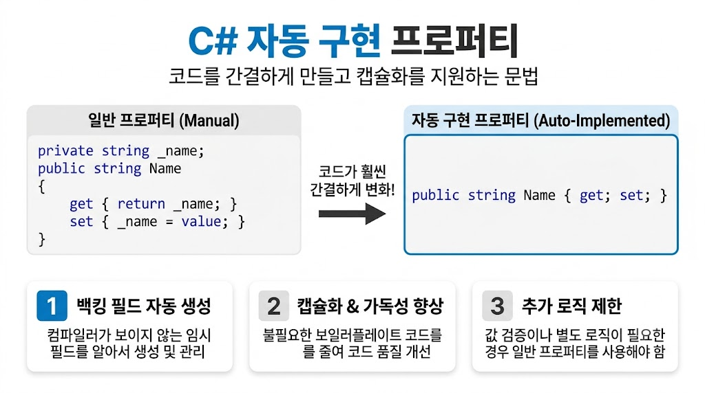

# [자동 구현 프로퍼티(Auto-Implemented Properties)](../KeywordsList.md)

</img>

| **구분** | **일반 프로퍼티** | **자동 구현 프로퍼티** |
| --- | --- | --- |
| **백킹 필드** | 개발자가 명시적으로 선언 | 컴파일러가 내부적으로 자동 생성 |
| **구문 형태** | `get { return _field; } set { _field = value; }` | `{ get; set; }` |
| **커스텀 로직** | 유효성 검사, 로그 기록 등 추가 가능 | 로직 작성 불가 (필요시 일반 프로퍼티로 전환) |
| **초기화 방식** | 생성자 또는 필드 선언 시점 | 선언부에서 직접 초기화 가능 (`= value;`) |
| **주 사용 목적** | 데이터 검증 및 변환 로직이 필요한 경우 | 단순한 데이터 전달 객체(DTO) 및 필드 캡슐화 |

## 정의

- 별도의 백킹 필드(Backing Field)를 직접 선언하지 않고, `{ get; set; }` 구문만으로 컴파일러가 알아서 익명의 프라이빗 필드를 생성하도록 맡기는 프로퍼티 정의 방식

```csharp
// 일반 프로퍼티 (Manual Property)
private string _name;
public string Name
{
    get { return _name; }
    set { _name = value; }
}

// 자동 구현 프로퍼티 (Auto-Implemented Property)
public string Name { get; set; }
```

## 기능

- **컴파일러 자동 처리 :** 백킹 필드를 백그라운드에서 숨겨진 상태(`[BackingField]`)로 자동 생성.
- **접근 제한자 분리 :** `get`과 `set` 각각에 서로 다른 접근 제어자를 부여 가능.
    - 예 : `public string Id { get; private set; }` (읽기는 외부 가능, 쓰기는 클래스 내부만 가능)
- **초기화 구문 지원 (C# 6.0+) :** 선언과 동시에 기본값을 부여 가능.
    - 예 : `public int Age { get; set; } = 20;`

## 특징

- **코드 간소화 :** 반복적인 Boilerplate 코드를 크게 줄여 가독성을 높임.
- **캡슐화 유지 :** 단순 필드(`public int Age;`)를 노출하는 대신 프로퍼티 형태를 유지하므로, 향후 데이터 검증 로직이 필요해질 때 기존 호출부를 수정하지 않고 일반 프로퍼티로 리팩토링하기 용이.
- **추가 로직 작성 불가 :** `get`이나 `set` 블록 내부에 유효성 검사, 이벤트 발생 등의 로직을 넣어야 할 경우 자동 구현 프로퍼티를 사용할 수 없고 일반 프로퍼티로 전환해야 함.

## 알아두면 좋을 내용

### 1. 읽기 전용 및 초기화 한정 프로퍼티

- **Get-Only 프로퍼티 (C# 6.0+) :** `set`을 생략하고 `get`만 작성하면 생성자나 선언 시점에만 값을 할당할 수 있는 불변(Immutable) 프로퍼티가 됨.

```csharp
public string CreatedAt { get; } = DateTime.Now;
```

- **init 접근자 (C# 9.0+) :** 객체 초기화(`new Person { Name = "Alice" }`) 시점에만 값을 설정하고 이후에는 변경하지 못하도록 제한 가능.

```csharp
public string Name { get; init; }
```

### 2. 인터페이스 및 튜플과의 활용

- 인터페이스에서 프로퍼티를 정의할 때 자동 구현 프로퍼티 형식을 사용하며, 이를 구현하는 클래스에서도 자동 구현 프로퍼티로 깔끔하게 처리 가능.