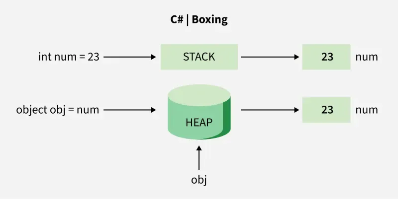

# [Boxing](../KeywordsList.md)

</img>

| **구분** | **박싱 (Boxing)** |
| --- | --- |
| **정의** | 값 형식을 참조 형식(`object` 등)으로 변환 |
| **변환 방향** | 값 형식 $\rightarrow$ 참조 형식 |
| **메모리 동작** | 힙(Heap)에 메모리 할당 후 값 복사 |
| **형식** | 암시적(자동) 변환 가능 |
| **성능 영향** | 메모리 할당 및 복사로 인한 **성능 저하 유발** |

## 정의

- 값 형식(Value Type)을 참조 형식(Reference Type)이나 그 값 형식이 구현하는 인터페이스 타입으로 변환하는 프로세스
    - 값 형식(Value Type) : `int`, `double`, `bool`, `struct` 등 스택(Stack)에 데이터가 직접 저장되는 형식입니다.
    - 참조 형식(Reference Type) : `class`, `string`, `object` 등 데이터가 힙(Heap)에 저장되고, 스택에는 힙 주소(참조)가 저장되는 형식입니다.
- 값 형식의 데이터를 힙에Alloc(할당)하고, 그 값의 복사본을 힙에 저장한 뒤, 스택에는 그 힙 메모리의 주소를 반환하는 과정(반대 과정을 언박싱(Unboxing))

```csharp
int num = 123;          // 값 형식 (스택에 저장)
object obj = num;       // 박싱 발생! (스택의 값이 힙으로 복사됨)
```

## 특징

- **자동 수행 (Implicit) :** 개발자가 명시적으로 캐스팅을 하지 않아도 컴파일러나 런타임에 의해 자동으로 수행됨.
- **힙 메모리 할당 :** 데이터가 기존의 스택 영역을 벗어나 관리되는 힙 영역에 새로 할당됨.
- **타입 안정성 유지 :** .NET의 모든 타입의 최상위 부모인 `object` 타입 등에 값을 담을 수 있게 해줌.

## 주의 사항(성능 및 부작용)

- **성능 저하 (Performance Overhead)  :**
    - 힙 메모리 할당, 메모리 복사, 가비지 컬렉터(GC)의 추적 대상이 되기 때문에 단순 스택 연산에 비해 성능이 크게 저하.
- **언박싱 비용 :** 박싱된 값을 다시 값 형식으로 꺼내 쓸 때(언박싱)도 타입 검사 및 데이터 복사 비용이 발생.
- **의도치 않은 박싱 (제네릭 이전 코드 및 비제네릭 컬렉션) :**
    - `ArrayList` 같은 비제네릭 컬렉션은 모든 요소를 `object`로 관리하기 때문에, `int` 같은 값 형식을 담을 때마다 무조건 박싱이 발생. 최신 코드는 제네릭 컬렉션(`List<T>`)을 사용하여 박싱을 방지해야 합니다.