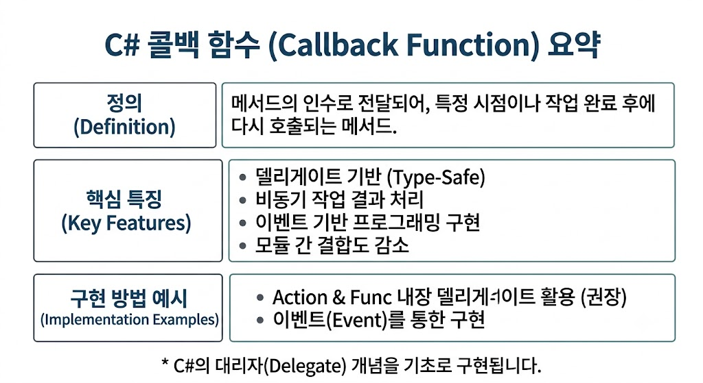

# [Callback Function](../KeywordsList.md)

</img>

| **구분** | **핵심 내용** |
| --- | --- |
| **정의** | 다른 메서드의 인수로 전달되어 특정 시점/이벤트에 호출되는 메서드 |
| **기반 기술** | C#의 Delegate(대리자), `Action`, `Func` 키워드 |
| **주요 역할** | 비동기 응답 처리, 이벤트 핸들링, 로직의 인젝션(주입) |
| **핵심 장점** | 형 안전성(Type Safety) 보장, 낮은 결합도, 멀티캐스트 지원 |
| **주의할 점** | 구독 해제 미비로 인한 메모리 누수, 비동기 시 스레드 Context 관리 |

## 정의

- 다른 메서드의 인수로 전달되어 특정 시점이나 작업 완료 후에 호출되는 메서드
- 메쏘드 자체를 변수처럼 전달하기 위해 델리게이트(Delegate, 대리자)를 기반으로 구현됨
- 호출하는 쪽에서 바로 실행하는 대신, 메서드의 참조(주소)를 다른 코드에 넘겨주어 지정된 조건이나 작업이 끝났을 때 다시 실행되도록(Call back) 만드는 패턴

## 기능

- **비동기 작업 결과 처리 :** 파일 I/O, 네트워크 요청 등 시간이 걸리는 작업이 끝난 후 결과를 받아 처리.
- **이벤트 기반 프로그래밍 :** 버튼 클릭, 데이터 수신 등 특정 상태 변경이나 이벤트 발생 시 지정된 로직을 실행.
- **모듈 간 결합도 감소 :** 호출하는 메서드가 실행할 세부 로직을 몰라도 되므로 코드 간 모듈화와 유연성이 높아짐.

## 특징

- **Type-Safe(형 안전성) :** C/C++의 함수 포인터와 달리, C#의 델리게이트는 반환 타입과 매개변수를 컴파일 시점에 검증하여 안전함.
- **일급 객체 취급 :** 메서드를 변수에 저장하거나, 인수로 전달하거나, 반환값으로 사용할 수 있음.
- **멀티캐스트 가능 :** 하나의 델리게이트에 여러 메서드를 연결(`+=`)하여 순차적으로 호출할 수 있음.

## 구현 방법 3가지

1. Action 및 Func 내장  delegate

```csharp
// 반환값이 없는 콜백 (Action)
void ProcessData(int value, Action<string> callback)
{
    // 작업 완료 후 콜백 호출
    callback($"작업 완료: {value}");
}

ProcessData(100, result => Console.WriteLine(result));
```

1. Event 기반 콜백

```csharp
public class Button
{
    public event Action OnClick;
    public void Press() => OnClick?.Invoke();
}
```

1. Task / async-await 비동기 콜백

```csharp
async Task FetchDataAsync(Action<string> onComplete)
{
    await Task.Delay(1000); // 비동기 작업
    onComplete("데이터 로드 성공");
}
```

## 알아두면 좋을 내용

- **메모리 누수 (Memory Leak) :** 이벤트나 멀티캐스트 델리게이트에 콜백을 등록(`+=`)한 뒤 해제(`=`)하지 않으면, 참조가 남아 GC(가비지 컬렉터)가 객체를 수거하지 못할 수 있음.
- **람다 캡처 및 클로저(Closure) :** 람다 식으로 콜백을 작성할 때 외부 변수를 참조하면 예상치 못한 시점에 변수 값이 변경될 수 있음.