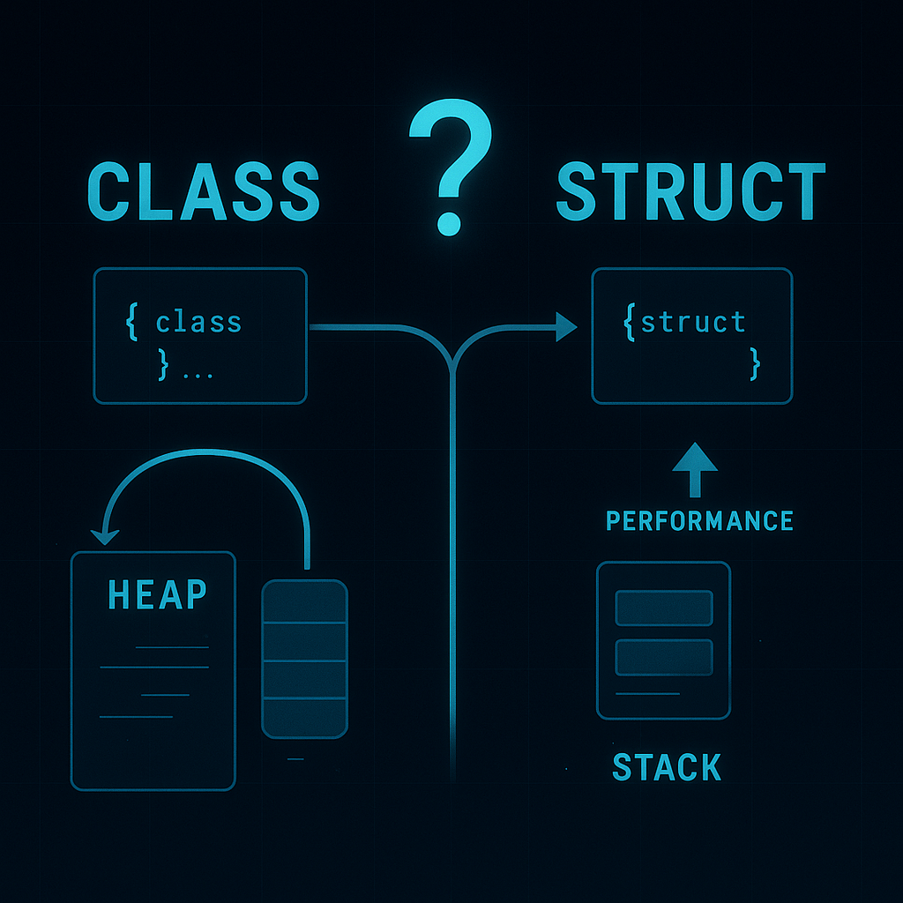

# [Class](../KeywordsList.md)

</img>

| **구분** | **내용** |
| --- | --- |
| **정의** | 객체를 생성하기 위한 설계도(청사진) |
| **핵심 역할** | 데이터(필드/프로퍼티)와 기능(메서드)을 하나로 묶는 캡슐화 단위 |
| **주요 특징** | 참조 타입(Heap 할당), 상속 지원, 접근 지정자를 통한 보안성 확보 |
| **장점** | 높은 코드 재사용성, 유지보수 용이, 객체지향적 설계 가능 |
| **단점** | 단순한 로직에도 복잡한 설계 필요 가능, 힙 메모리 사용으로 인한 오버헤드 |
| **파생 형태** | 일반 클래스, 부분 클래스(Partial), 정적 클래스(Static), 레코드(Record) 등 |

## 정의

- 데이터(속성)와 그 데이터를 조작하는 코드(함수/메서드)를 하나의 단위로 묶는 사용자 정의 데이터 타입
- 객체(Object)를 만들기 위한 설계도
    - 메모리에 실제로 적재되어 구체화된 형태를 인스턴스(Instance) 또는 객체라고 부르며, 클래스로부터 인스턴스를 생성하는 과정을 인스턴스화(Instantiation)라고 함.

## 역할과 기능

- **데이터와 기능의 캡슐화 :** 관련된 데이터(필드, 프로퍼티)와 동작(메서드)을 하나의 구조로 묶어 코드의 응집도를 높임.
- **재사용성 제공 :** 한 번 작성된 클래스는 프로그램 내에서 여러 번 인스턴스화하여 재사용할 수 있다.
- **프로그램의 모듈화 :** 로직을 논리적인 단위로 나누어 관리하므로 대규모 애플리케이션 개발과 유지보수가 용이해짐..
- **객체지향 설계 구현 :** 상속과 다형성을 활용하여 현실 세계의 복잡한 개념을 코드로 모델링.

## 특징

- **참조 타입(Reference Type) :** 클래스의 인스턴스는 힙(Heap) 메모리에 할당되며, 변수에는 메모리 주소(참조)가 저장됨.
- **접근 지정자 지원 :** `public`, `private`, `protected`, `internal` 등을 통해 클래스 내부 멤버의 접근 범위를 제어할 수 있음.
- **상속(Inheritance) :** C#은 단일 상속만 지원하지만, 여러 개의 인터페이스를 구현(Interface Implementation)할 수 있어 유연한 설계가 가능.
- **생성자(Constructor)와 소멸자(Destructor) :** 객체가 생성될 때 초기화를 담당하는 생성자와, 소멸될 때 자원을 정리하는 소멸자(또는 가비지 컬렉터 연계)를 가짐.

## 장단점

### **장점**

- **유지보수 용이 :** 문제가 발생했을 때 해당 클래스만 수정하면 되므로 수정 범위가 명확.
- **확장성 :** 기존 코드를 변경하지 않고 상속을 통해 기능을 확장하기 쉽다.
- **협업에 최적 :** 역할별로 클래스를 나누어 담당할 수 있어 팀 프로젝트에 적합.

### **단점**

- **설계의 복잡성 :** 간단한 프로그램에서도 지나치게 클래스 구조를 복잡하게 만들면 오버엔지니어링(Over-engineering)이 될 수 있다.
- **메모리 오버헤드 :** 구조체(Struct)와 달리 힙 메모리를 사용하고 가비지 컬렉터(GC)의 관리를 받기 때문에, 객체가 무분별하게 생성되면 성능 저하를 유발할 수 있다.

## 알아두면 좋을 내용

- **부분 클래스 (Partial Class) :** `partial` 키워드를 사용하면 하나의 클래스 정의를 여러 파일로 나누어 작성 가능. (예: UI 코드와 로직 분리 시 유용)
- **정적 클래스 (Static Class) :** 인스턴스를 생성할 수 없고 내부의 모든 멤버가 `static`이어야 하는 클래스로, 유틸리티 함수 모음 등에 주로 사용됨.