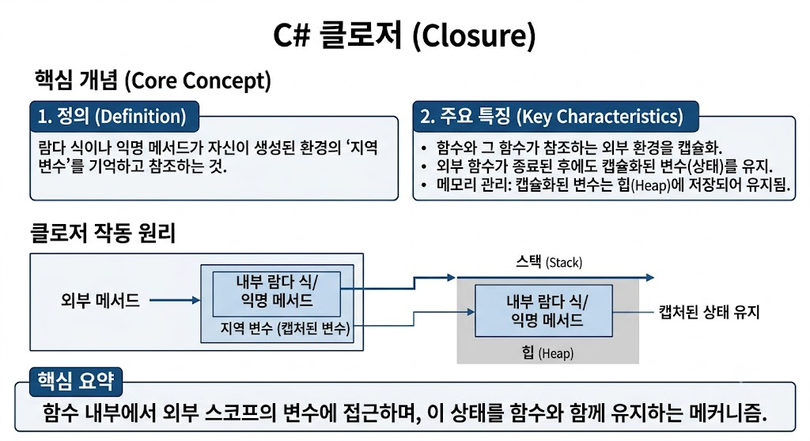

# [클로저(Closure)](../KeywordsList.md)

</img>

| **구분** | **내용** |
| --- | --- |
| **정의** | 외부 지역 변수를 캡처하여 내부 함수에서 참조할 수 있는 기능 및 상태 |
| **기능** | 함수가 종료된 후에도 외부 변수의 값을 유지하고 접근할 수 있게 함 |
| **역할** | 콜백 함수, LINQ, 이벤트 등에서 상태 정보를 별도로 전달하지 않고 활용 |
| **특징** | 컴파일러가 내부적으로 클래스를 생성해 변수를 필드로 변환하며, 값 공유 가능 |

## 정의 및 역할

- 외부 범위(Scope)에 선언된 지역 변수를 자신의 내부 영역(익명 메서드나 람다 식 등)에서 자유롭게 참조하고 활용할 수 있는 함수와 환경의 결합체
- 함수가 선언된 시점의 주변 환경(변수 등)을 기억하고 있다가, 나중에 함수가 실행될 때 그 환경에 접근할 수 있도록 도와줌.
- 주로 콜백, LINQ 쿼리, 비동기 프로그래밍 등에서 상태를 유지하며 데이터를 전달할 때 핵심적인 역할.

## 주요 기능 및 특징

- **변수 수명 연동(외부 변수 캡처) :** 원래 지역 변수는 메서드가 끝나면 메모리에서 사라지지만, 클로저에 의해 캡처된 변수는 클로저가 살아있는 동안 함께 수명이 연장.
- **컴파일러의 숨겨진 마법 (Display Class) :** C# 컴파일러는 클로저를 만나면 내부적으로 숨겨진 클래스(Display Class 또는 Compiler-generated class)를 자동으로 생성함. 이때 바깥쪽의 지역 변수는 이 클래스의 필드(멤버 변수)로 변환되어 관리됨.
- **값의 공유 :** 람다 식 안과 밖에서 동일한 변수를 공유하므로, 클로저 내부에서 변수의 값을 변경하면 외부의 원본 변수 값도 함께 변경됨.

## 알아두면 좋을 내용

- **반복문(Loop) 변수 캡처 함정**
    - `for` 문 안에서 클로저를 사용할 때 루프 변수(예: `i`)를 그대로 캡처하면, 반복문이 끝난 시점의 최종 값만 참조하게 되는 문제가 자주 발생.
    - *참고:* C# 5.0 이후부터 `foreach` 문은 매 반복마다 새로운 변수를 생성하도록 개선되었지만, `for` 문이나 전통적인 루프에서는 여전히 주의 필요.
- **메모리 누수 주의 :** 클로저가 참조하는 외부 변수의 생명 주기가 의도치 않게 길어지기 때문에, 무겁고 큰 객체를 클로저가 오래 붙잡고 있으면 가비지 컬렉터(GC)가 메모리를 수거하지 못해 성능에 영향을 줄 수 있음.