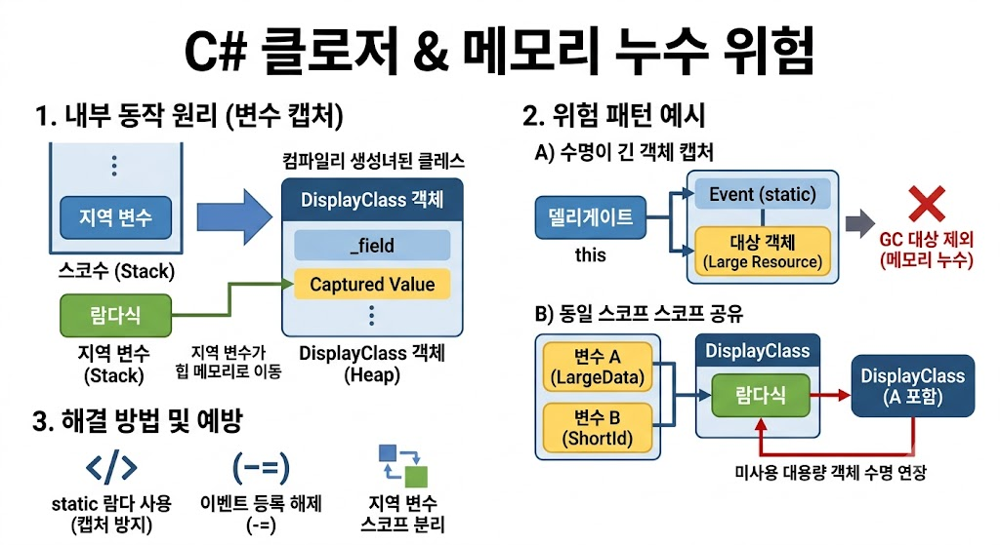

# [Closure Memory Leak](../KeywordsList.md)

</img>

| **원인** | **결과** | **해결책** |
| --- | --- | --- |
| **지역 변수의 힙 이관** | 스택 변수가 DisplayClass 객체로 전환되어 GC 관리 대상으로 변함 | 캡처가 꼭 필요한지 검토 |
| **장수명 객체 캡처** | 델리게이트가 수거되지 않아 인스턴스 전체 누수 | `static` 람다 사용 / 이벤트 해제 |
| **동일 스코프 묶임** | 미사용 대용량 객체가 함께 메모리에 유지됨 | 스코프 분리 / 지역 변수 최소화 |

## 클로저

- 익명 함수(람다식, 무명 메서드)가 자신이 정의된 외부 스코프(자신의 바깥쪽 변수)의 지역 변수를 참조(Capture)할 때 생성되는 객체
- 코드 작성의 편의성을 높여주지만, 메모리 관리(GC) 관점에서는 외부 변수의 수명을 자신이 소멸할 때까지 강제로 연장시키기 때문에 주의해서 사용하지 않으면 메모리 누수(Memory Leak)를 유발하는 대표적인 원인

## 메모리 누수 발생하는 대표적인 패턴

### 1. 수명이 긴 객체에 델리게이트/이벤트 등록

- 가장 흔한 메모리 누수 형태. 수명이 짧은 객체가 수명이 긴 객체(예: 싱글톤, static 이벤트)에 클로저를 이벤트 핸들러로 등록할 때 발생.

```csharp
public class EventPublisher
{
    public static event Action OnDataReceived; // 수명이 애플리케이션 전체인 static 이벤트
}

public class MemoryLeakExample
{
    private byte[] _largeData = new byte[100 * 1024 * 1024]; // 100MB 대용량 데이터

    public void Register()
    {
        // _largeData(this)를 캡처하는 클로저를 static 이벤트에 등록
        EventPublisher.OnDataReceived += () => 
        {
            Console.WriteLine(_largeData.Length);
        };
    }
}
```

- 누수 원인 : `EventPublisher.OnDataReceived` 이벤트는 static이므로 프로그램 종료 시까지 살아있음. 이 이벤트가 람다식을 참조하고, 람다식은 `this`(`MemoryLeakExample` 객체)를 캡처했기 때문에, `MemoryLeakExample` 객체와 100MB 대용량 데이터는 이벤트 해제(`-=`)를 하지 않는 한 절대로 GC에 의해 수거되지 않음.

### 2. 동일한 스코프 내 다른 변수의 수명 연장

- 컴파일러는 동일한 메서드/스코프 내에서 캡처된 변수들을 단 하나의 DisplayClass로 묶어서 생성. 사용이 끝난 대용량 객체까지 함께 캡처 스코프에 묶여 살아남는 현상이 일어남.

```csharp
public Action ProcessData()
{
    byte[] heavyBuffer = new byte[500 * 1024 * 1024]; // 500MB 대용량 데이터
    int shortId = 42;

    // heavyBuffer를 사용하고 무거운 처리가 끝남...
    Console.WriteLine(heavyBuffer.Length);

    // shortId만 사용하는 람다 반환
    Action logAction = () => Console.WriteLine(shortId);

    return logAction;
}
```

- 누수 원인 : 개발자는 `logAction`이 `shortId`만 사용한다고 생각하지만, C# 컴파일러는 `heavyBuffer`와 `shortId`를 동일한 DisplayClass의 필드로 만듦.
- 결과적으로 `logAction`이 반환되어 누군가에 의해 유지되는 동안, 이미 사용이 종료된 500MB 크기의 `heavyBuffer` 역시 메모리에 남아있게 됨.

### 3. 비동기 메서드(async/await) 및 타이머/태스크 누수

- `Task.Run`, `CancellationToken`, `Timer` 등의 작업에 클로저를 전달하면서, 이 작업이 끝나지 않거나 오래 유지되는 경우

```csharp
public class Controller
{
    private LargeResource _resource = new LargeResource();

    public void StartBackgroundWork()
    {
        Task.Run(async () => 
        {
            while (true) // 무한 루프 또는 장시간 실행되는 비동기 작업
            {
                await Task.Delay(1000);
                _resource.DoSomething(); // this(_resource) 캡처
            }
        });
    }
}
```

- 누수 원인 : 비동기 루프가 끝나지 않으면 백그라운드 Task가 `Controller` 인스턴스(`this`)를 계속 참조하게 되어, 해당 컨트롤러가 더 이상 필요 없어지더라도 GC가 수거하지 못함.

## 메모리 누수 예방 및 해결 방법

### `static` 익명 함수 활용

- 외부 변수를 캡처하지 못하도록 컴파일 타임에 강제할 수 있음. `static` 키워드를 익명 함수 앞에 붙이면 외부 변수 캡처 시 컴파일 에러가 발생.

```csharp
int count = 10;

// 컴파일 에러 발생: CS8421 A static local function/lambda cannot contain a reference to 'count'.
Action action = static () => { Console.WriteLine(count); }; 

// 올바른 사용: 필요 데이터를 인자로 명시적으로 전달
Action<int> safeAction = static (c) => { Console.WriteLine(c); };
safeAction(count);
```

### 변수 스코프 분리

- 동일한 메서드 내에서 대용량 데이터와 캡처 대상 변수의 스코프(중괄호 `{ }`)를 나누어 컴파일러가 개별 DisplayClass를 생성하게 유도.

```csharp
public Action ProcessData()
{
    {
        byte[] heavyBuffer = new byte[500 * 1024 * 1024];
        Console.WriteLine(heavyBuffer.Length);
    } // heavyBuffer의 스코프 종료

    int shortId = 42;
    return () => Console.WriteLine(shortId); // shortId만 독립적으로 캡처
}
```

### 이벤트 등록 해제 (Unsubscribe) 및 약한 참조(WeakReference)

- 수명이 긴 객체에 등록한 델리게이트는 사용 완료 후 반드시 `-=`를 통해 해제하거나, `WeakReference` 패턴을 활용하여 GC를 방해하지 않도록 작성.