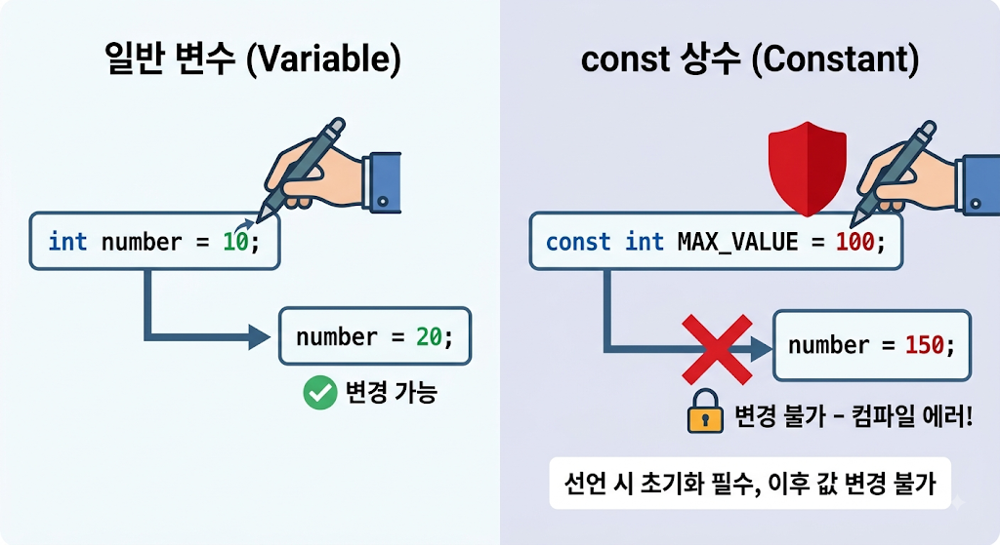

# [Const](../KeywordsList.md)

</img>

| **구분** | **const (상수)** |
| --- | --- |
| **평가 시점** | 컴파일 타임 (Compile-time) |
| **초기화 시점** | 선언과 동시에 필수 |
| **`static` 여부** | 기본적으로 `static` 포함 (인스턴스 생성 불가) |
| **사용 가능 타입** | 기본형(`int`, `double`, `bool` 등) 및 `string` |
| **주요 용도** | 수학 상수, 고정된 설정값 등 절대 안 변하는 값 |

## 정의

- 컴파일 타임 상수(Compile-time Constant)를 정의하는 키워드
- 변수 앞에 붙여서 해당 값이 선언된 시점 이후로 절대 바뀔 수 없는 읽기 전용(Read-only) 값임을 컴파일러에게 알림.

```csharp
const double Pi = 3.14159;
const int MaxUsers = 100;
const string WelcomeMessage = "환영합니다!";
```

## 기능

- **값의 불변성 보장 :** 프로그램이 실행되는 동안 의도치 않게 중요한 데이터가 변경되는 것을 원천적으로 방지하여 코드의 안정성을 높임.
- **매직 넘버(Magic Number) 제거 :** 코드 내에 의미를 알 수 없는 숫자나 문자열 리터럴 대신 의미 있는 이름(상수명)을 부여하여 가독성과 유지보수성을 극대화.
- **성능 최적화 :** 컴파일 시점에 값이 결정되어 코드에 직접 박히기(Hard-coding) 때문에, 런타임에 메모리를 별도로 할당하거나 계산할 필요가 없어 성능 면에서 약간의 이점이 있다.

## 특징

1. 반드시 선언과 동시에 초기화 필요
    - `const`는 선언과 동시에 값을 할당해야 하며, 생성자나 다른 메서드에서 값을 나중에 대입할 수 없다.
2. 암묵적으로 `static`
    - `const` 멤버는 클래스의 인스턴스가 아니라 타입 자체에 소속됨. 따라서 `static` 키워드를 붙이지 않아도 인스턴스화 없이 `ClassName.ConstantName` 형태로 접근. (에러: `const`와 `static`을 함께 쓰면 중복이라고 판단하여 컴파일 에러가 발생!)
3. 기본 데이터 타입과 문자열에만 사용할 수 있음
    - 정수형, 부동소수점형, 부울(`bool`), 문자(`char`), 문자열(`string`) 등의 원시 타입(Primitive types)과 `null`에만 사용 가능.
    - 사용자 정의 클래스나 구조체(`struct`), 배열 등은 `const`로 선언할 수 없다. (참조 타입 중 유일하게 `string`만 허용!)