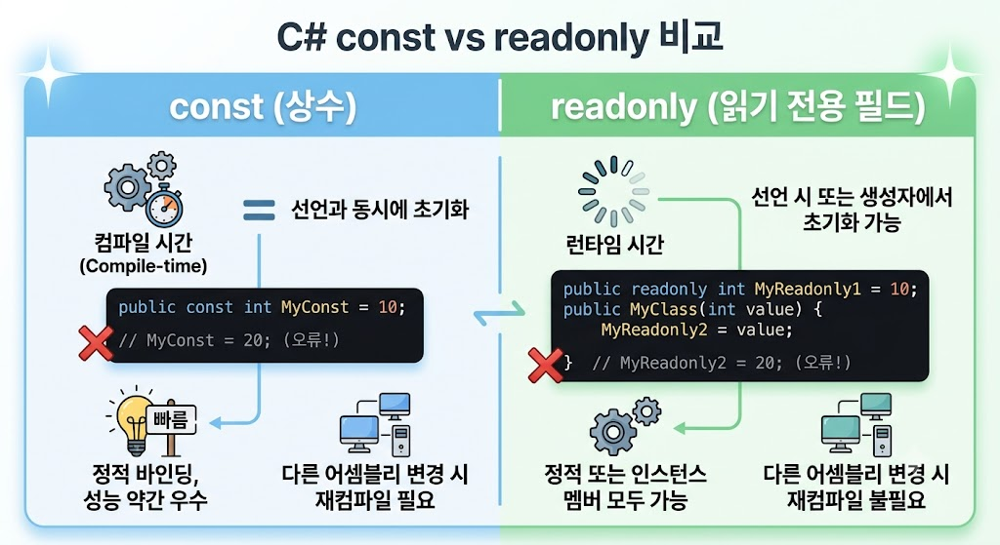

# [const vs readonly](../KeywordsList.md)

</img>

| **특징** | **const (상수)** | **readonly (읽기 전용 필드)** |
| --- | --- | --- |
| **시 평가(Evaluation)** | 컴파일 타임(Compile-time) 상수 | 런타임(Runtime) 상수 |
| **값 할당 시점** | 선언과 동시에 반드시 값을 할당해야 함 | 선언 시 또는 생성자(Constructor) 내에서만 할당 가능 |
| **적용 대상** | 지역 변수, 클래스/구조체 내 필드 | 클래스/구조체 내 필드만 가능 |
| **`static` 여부** | 암시적으로 `static` (인스턴스화 불필요) | `static`을 붙여서 클래스 레벨로 사용 가능 |
| **메모리 할당** | 별도의 메모리 공간을 차지하지 않음 (값 자체가 코드에 치환됨) | 객체(인스턴스)마다 메모리 공간이 할당됨 |
| **유연성** | 값 변경 시 사용하는 모든 코드를 **재컴파일**해야 함 | 값 변경 시 해당 어셈블리만 다시 컴파일하면 됨 |

## `const` (상수)

- **컴파일 타임 상수** : 코드가 컴파일되는 시점에 값이 확정되어 코드 자체에 박힘.
- **사용 제약** : 기본 데이터 타입(int, string, double 등)과 null을 대입할 수 있는 참조형 타입(string 등)에만 사용 가능. `new` 키워드를 통해 객체를 생성해야 하는 타입에는 사용할 수 없다.(예: `DateTime`은 `const` 불가).
- **동작 방식** : 만약 외부 라이브러리(DLL)에 있는 `const` 값을 변경하고 라이브러리만 교체하더라도, 이를 사용하는 프로그램은 재컴파일하지 않으면 이전 값을 계속 참조하는 문제가 발생할 수 있다.

```csharp
public class MathConstants
{
    public const double Pi = 3.14159; // 선언과 동시에 초기화 필수
    
    public void PrintPi()
    {
        // const constLocal = 10; // 지역 변수로도 사용 가능
        Console.WriteLine(Pi);
    }
}
```

## `readonly` (읽기 전용)

- **런타임 상수** : 프로그램이 실행되는 도중(런타임)에 단 한 번만 값이 결정.
- **사용 제약** : 클래스나 구조체의 **필드**에만 사용할 수 있으며, 지역 변수로는 사용할 수 없다.
- **유연성** : 선언 시점뿐만 아니라 생성자(Constructor) 내부에서도 값을 할당할 수 있음. 따라서 객체가 생성되는 시점(런타임)마다 다른 값을 갖도록 설정할 수 있다.

```csharp
public class UserProfile
{
    public readonly string UserId; // 선언 시 초기화 안 해도 됨
    public readonly DateTime CreatedAt;

    public UserProfile(string userId)
    {
        UserId = userId; // 생성자에서 초기화 가능 (단 한 번만 허용)
        CreatedAt = DateTime.Now; // 런타임에 값 결정 (DateTime 사용 가능)
    }
}
```

## 그래서 언제 쓰나요?

- **`const`를 써야 하는 경우** :
수학적 상수(`PI`), 프로그램 전반에 걸쳐 절대 바뀌지 않는 고정값(예: `DaysInWeek = 7`)이며, 성능 최적화가 중요하고 컴파일 시점에 값이 완전히 고정되어도 안전한 경우에 사용.
- **`readonly`를 써야 하는 경우** :
객체가 생성될 때마다 값이 달라질 수 있지만 이후에는 절대 변경되면 안 되는 경우(예: 의존성 주입된 서비스, 생성자로 주입받는 설정 값 등)나 `DateTime`처럼 런타임에 계산되는 객체에 사용.