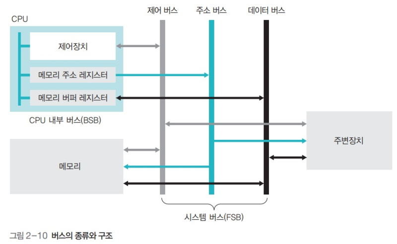

# {Control Bus](../KeywordsList.md)

</img>

| **구분** | **주요 내용** |
| --- | --- |
| **정의** | 장치 간의 동작(읽기/쓰기, 인터럽트 등)을 지시하고 조율하는 제어 신호의 전송 통로 |
| **주요 기능** | • 메모리/I/O 읽기 및 쓰기 지시 • 인터럽트 요청 및 승인 관리 • 버스 사용권 조정 (Bus Request/Grant) • 시스템 클럭 및 리셋 동기화 |
| **특징** | • 양방향(Bidirectional) 통신 구조 • 여러 개의 독립된 제어선들의 집합 • 시스템의 타이밍과 안정성을 총괄 |
| **상호작용** | • CPU $\leftrightarrow$ 메모리: Read/Write 신호로 데이터 입출력 제어 • I/O 장치 $\leftrightarrow$ CPU: 인터럽트(IRQ)를 통해 비동기 이벤트 처리 조율 |

## 정의

- 모든 장치 사이의 데이터 전송과 동작을 지시하고 조율하기 위한 제어 신호(Control Signal)를 전송하는 통로
- 데이터 버스가 '실제 데이터'가 다니는 고속도로라면, 제어버스는 그 데이터가 언제, 어디로 가야 하는지, 읽기(Read)를 해야 하는지 쓰기(Write)를 해야 하는지 지시하는 '신호등과 교통경찰'의 역할

## 기능

- **동작 지시 (Read/Write) :** 특정 메모리 주소나 I/O 장치로부터 데이터를 읽어올 것인지(`Memory Read`, `I/O Read`), 아니면 데이터를 기록할 것인지(`Memory Write`, `I/O Write`)를 지시.
- **버스 요청 및 승인 관리 (Bus Request / Bus Grant) :** 여러 장치(CPU, DMA 컨트롤러 등)가 동시에 버스를 사용하려고 할 때, 충돌을 막기 위해 버스 사용권을 누구에게 줄지 조율.
- **인터럽트 관리 (Interrupt Request / Acknowledge) :** 입출력 장치 등이 CPU에게 긴급하게 처리해야 할 일이 있음을 알리고(인터럽트 요청, `INTR`), CPU가 이를 접수했음을 회신(인터럽트 승인, `INTA`)하는 신호를 전달.
- **시스템 동기화 및 리셋 (Clock / Reset) :** 시스템 전체의 타이밍을 맞추기 위한 클럭 신호를 전달하거나, 시스템 오류 발생 시 초기화(Reset) 신호를 보냄.

## 특징

- **양방향성 (Bidirectional) :** 제어버스를 구성하는 개별 라인들은 단방향인 것도 있지만, 전체 제어버스 관점에서는 CPU에서 다른 장치로 명령을 보내기도 하고(출력), 장치에서 CPU로 신호(인터럽트 등)를 보내기도 하므로 양방향(Bidirectional) 특성을 가짐.
- **독립된 신호선들의 집합   :** 단일선이 아니라 여러 개의 독립된 제어 선(Control Lines)들로 묶여 있으며, 각 선마다 고유한 제어 신호를 담당.
- **시스템 속도 및 안정성 좌우  :** 제어 신호가 정확한 타이밍에 전달되어야 하므로 시스템의 안정성과 동기화에 결정적인 역할.

## 상호작용

- **CPU와 주기억장치(RAM) 간의 상호작용 :**
    - CPU가 메모리의 특정 위치에서 데이터를 읽고 싶을 때, 주소버스로 해당 주소를 보냄과 동시에 제어버스를 통해 [메모리 읽기(Memory Read)] 신호를 보냄.
    - 메모리는 이 제어 신호를 인식하고 데이터 버스에 해당 주소의 데이터를 실어 보냄.
- **CPU와 입출력(I/O) 장치 간의 상호작용 (인터럽트) :**
    - 키보드 입력이나 프린터 출력 완료 등 이벤트가 발생하면, I/O 장치는 제어버스를 통해 CPU로 [인터럽트 요청(IRQ)] 신호를 보냄.
    - CPU는 현재 하던 작업을 잠시 멈추고, 제어버스를 통해 [인터럽트 승인(INTA)] 신호를 보낸 뒤 해당 입출력 처리 루틴을 실행.