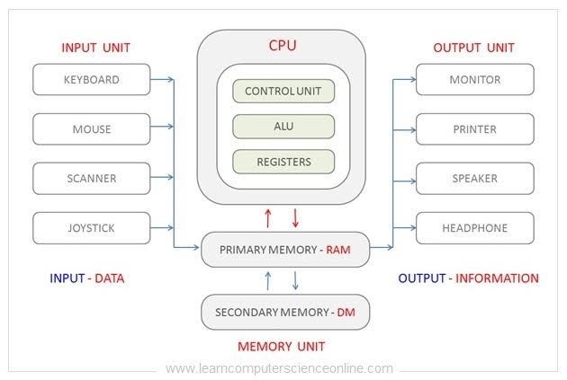

# [Control Unit](../KeywordsList.md)

</img>

| **구분** | **주요 내용** |
| --- | --- |
| **정의** | CPU 내에서 모든 장치의 동작을 지시하고 통제하는 지휘자 역할의 핵심 구성 요소 |
| **핵심 기능** | • 명령어 해독 • 제어 신호(Control Signal) 생성 및 전송 • 명령어 사이클(인출-해독-실행) 흐름 제어 |
| **주요 특징** | • 데이터에 대한 직접적인 산술/논리 연산은 수행하지 않음 • 구현 방식에 따라 하드와이어드 방식과 마이크로프로그램 방식으로 나뉨 |
| **타 유닛과의 상호작용** | • PC/IR: 실행할 명령어의 주소를 확인하고, 가져온 명령어를 받아와 해석 • ALU: 연산 종류를 지시하는 제어 신호 전달 • 레지스터/메모리: 데이터의 이동 경로와 읽기/쓰기 타이밍 조율 |

## 정의

- 컴퓨터 시스템의 두뇌인 중앙처리장치(CPU) 내에서 모든 장치들의 동작을 지시하고 통제하는 핵심 구성 요소.
- 명령어의 해석부터 실행 과정 전체의 흐름을 조율하는 역할을 담당.
- 데이터 자체를 직접 연산하거나 처리하지는 않지만, 데이터가 어디로 이동해야 하고 언제 연산이 수행되어야 하는지를 결정하는 제어 신호(Control Signal)를 생성하고 내보냄.

## 기능

- **명령어 해석 (Instruction Decoding) :** 메모리에서 읽어들인 명령어(Instruction)를 해독하여 어떤 작업이 필요한지 파악.
- **제어 신호 생성 및 전송 :** 해독된 명령어에 따라 ALU, 레지스터, 메모리, 입출력 장치 등으로 제어 신호(읽기, 쓰기, 연산 등)를 보냄.
- **명령어 사이클 관리 :** 명령어의 인출(Fetch), 해독(Decode), 실행(Execute), 인터럽트(Interrupt) 등의 전체 흐름을 순차적으로 제어.

## 특징

- **데이터 직접 처리 불가 :** ALU(산술논리연산장치)처럼 직접 덧셈, 뺄셈 등의 산술 연산이나 논리 연산을 수행하지 않고, 오직 흐름 제어만을 담당.
- **하드웨어 및 마이크로프로그램 방식 :**
    - **하드와이어드 제어 유닛(Hardwired CU) :** 하드웨어 논리 회로로 직접 구현되어 속도가 매우 빠름.
    - **마이크로프로그램 제어 유닛(Microprogrammed CU) :** 제어 기억장치에 저장된 마이크로 명령어(Micro-instruction)들을 읽어와서 제어 신호를 생성하며, 유연성이 높고 수정이 쉽다.

## 상호작용

- **프로그램 카운터(PC) 및 명령어 레지스터(IR)와의 상호작용 :**
    - **PC(Program Counter) :** 다음에 실행할 명령어의 주소를 저장하고 있으며, 제어 유닛은 이 주소를 바탕으로 메모리에서 명령어를 가져온다.
    - **IR(Instruction Register) :** 메모리에서 가져온 명령어를 잠시 저장하는 곳으로, 제어 유닛은 IR에 담긴 명령어를 가져와 해석.
- **ALU(산술논리연산장치)와의 상호작용 :**
    - 제어 유닛은 ALU에게 "지금 입력된 두 데이터 값을 더하라" 또는 "AND 연산을 수행하라"는 연산 제어 신호를 보냄.
- **레지스터 파일과의 상호작용 :**
    - 데이터를 레지스터에서 가져올지, 혹은 연산 결과를 어떤 레지스터에 저장할지 지정하는 데이터 이동 경로(Bus) 제어 신호를 관리.