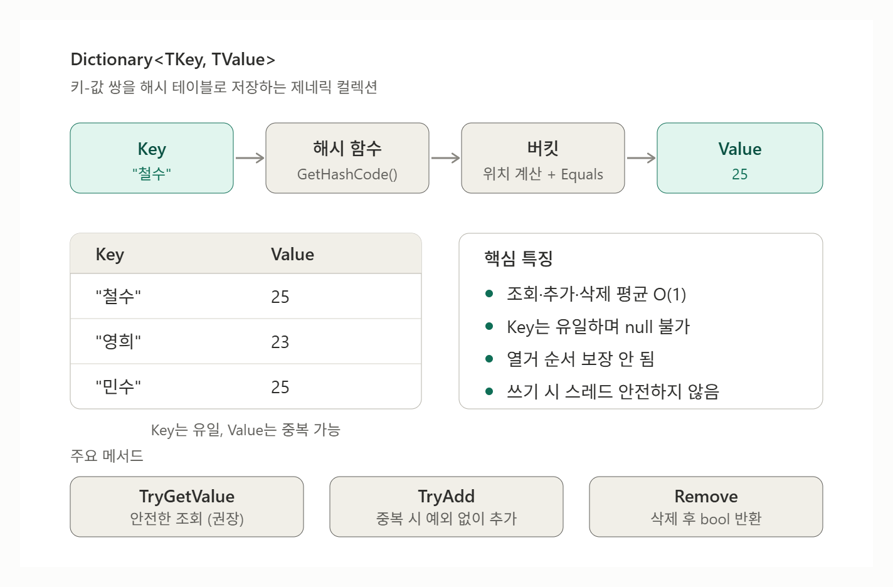

# [Dictionary<TKey, TValue>](../KeywordsList.md)

</img>

| 항목 | 핵심 내용 |
| --- | --- |
| **정의** | 키-값 쌍을 해시 테이블로 저장하는 제네릭 컬렉션 |
| **성능** | 조회·추가·삭제 평균 O(1), 최악 O(n) |
| **키** | 유일해야 하며 `null` 불가. `Equals`/`GetHashCode` 일관성 필요, 불변 타입 권장 |
| **값** | 중복 허용, 참조 타입이면 `null` 허용 |
| **순서** | 보장되지 않음 |
| **스레드 안전성** | 쓰기 시 안전하지 않음 → `ConcurrentDictionary` 또는 `lock` |
| **추가** | `Add`(중복 시 예외), `TryAdd`, 인덱서(덮어쓰기) |
| **조회** | `TryGetValue`(권장), `GetValueOrDefault`, `ContainsKey` |
| **삭제** | `Remove`, `Clear` |
| **주의 예외** | `KeyNotFoundException`, `ArgumentException`, `ArgumentNullException`, `InvalidOperationException` |
| **성능 팁** | 초기 용량 지정, `IEquatable<T>` 구현, `StringComparer` 명시 |
| **대안** | `SortedDictionary`(정렬), `ConcurrentDictionary`(멀티스레드), `FrozenDictionary`(읽기 전용) |
| **Unity** | 인스펙터 직렬화 안 됨 → `List` 두 개 + `ISerializationCallbackReceiver` 사용 |

## 정의

- `System.Collections.Generic` 네임스페이스에 있는 제네릭 컬렉션으로, 키(Key)와 값(Value)을 쌍으로 저장하고 키로 값을 빠르게 찾는 해시 테이블 기반 자료구조

```csharp
using System.Collections.Generic;

var ages = new Dictionary<string, int>
{
    ["철수"] = 25,
    ["영희"] = 23
};

Console.WriteLine(ages["철수"]); // 25
```

- `TKey`: 키의 타입 (중복 불가, `null` 불가)
- `TValue`: 값의 타입 (중복 가능, 참조 타입이면 `null` 가능)
- 요소는 `KeyValuePair<TKey, TValue>` 구조체로 표현.
- `IDictionary<,>`, `IReadOnlyDictionary<,>`, `ICollection<>`, `IEnumerable<>` 등을 구현

## 특징

- 평균 O(1)의 빠른 조회·삽입·삭제
    - 키의 `GetHashCode()`로 버킷 위치를 찾으므로, 데이터가 아무리 많아도 조회 속도가 거의 일정함(`List<T>`에서 검색하면 O(n))
    - 해시 충돌이 많으면 최악의 경우 O(n)까지 느려질 수 있음.
- 키는 유일해야 하며 `null`이 될 수 없음
    - 같은 키를 `Add`하면 `ArgumentException`이 발생.
    - `null` 키를 사용하면 `ArgumentNullException`이 발생.
    - 인덱서(`dict[key] = value`)는 키가 없으면 추가하고, 있으면 덮어씀.
- 키 비교 방식
    - 기본적으로 `EqualityComparer<TKey>.Default`를 사용하며, 내부적으로 `GetHashCode()`와 `Equals()`로 키를 비교.
    - 생성자에 `IEqualityComparer<TKey>`를 넘기면 비교 방식을 바꿀 수 있음.

```csharp
var dict = new Dictionary<string, int>(StringComparer.OrdinalIgnoreCase);
dict["Apple"] = 1;
Console.WriteLine(dict["APPLE"]); // 1 (대소문자 무시)
```

- 순서가 보장되지 않음
    - 공식적으로 열거 순서는 보장되지 않음.
    - 삭제 없이 추가만 했다면 대개 삽입 순서로 나오지만, 삭제 후 추가하면 빈 자리를 재사용하므로 순서가 달라질 수 있음.
- 자동 크기 조정
    - 내부 배열이 가득 차면 소수(prime) 크기로 용량을 늘리고 재해싱.
    - 이 과정은 비용이 크므로, 대략적인 크기를 알면 생성자에서 용량을 지정하는 것이 좋음.
- 스레드 안전하지 않음
    - 여러 스레드가 동시에 읽기만 하는 것은 안전하지만, 쓰기가 섞이면 동기화가 필요.
    - 이 경우 `lock`이나 `ConcurrentDictionary`를 사용

## 기능

### 생성 및 초기화

```csharp
var d1 = new Dictionary<string, int>();                  // 기본
var d2 = new Dictionary<string, int>(100);               // 초기 용량 지정
var d3 = new Dictionary<string, int>(StringComparer.Ordinal); // 비교자 지정
var d4 = new Dictionary<string, int>(d1);                // 복사

// 컬렉션 초기화자
var d5 = new Dictionary<string, int>
{
    { "a", 1 },
    { "b", 2 }
};

// 인덱스 초기화자 (중복 키여도 예외 없이 덮어씀)
var d6 = new Dictionary<string, int>
{
    ["a"] = 1,
    ["b"] = 2
};
```

### 추가/수정

| 메서드 | 설명 |
| --- | --- |
| `Add(key, value)` | 추가. 키가 이미 있으면 `ArgumentException` |
| `dict[key] = value` | 없으면 추가, 있으면 덮어쓰기 |
| `TryAdd(key, value)` | 키가 없을 때만 추가하고 `bool` 반환 (예외 없음) |

### 조회

```csharp
// 1) 인덱서: 키가 없으면 KeyNotFoundException
int a = ages["철수"];

// 2) TryGetValue: 가장 권장되는 안전한 방식 (조회 1회)
if (ages.TryGetValue("영희", out int age))
    Console.WriteLine(age);

// 3) GetValueOrDefault (확장 메서드): 없으면 기본값
int x = ages.GetValueOrDefault("민수", -1);

// 4) ContainsKey: 존재 여부만 확인
bool exists = ages.ContainsKey("철수");
```

- `if (ContainsKey(k)) { var v = dict[k]; }` 방식은 해시 조회를 두 번 하므로, `TryGetValue`가 더 효율적

### 삭제

| 메서드 | 설명 |
| --- | --- |
| `Remove(key)` | 삭제 후 성공 여부(`bool`) 반환 |
| `Remove(key, out value)` | 삭제하면서 값을 꺼냄 (.NET Core 2.0+) |
| `Clear()` | 전체 삭제 |

### 열거 및 속성

```csharp
foreach (KeyValuePair<string, int> kv in ages)
    Console.WriteLine($"{kv.Key}: {kv.Value}");

foreach (var (name, age) in ages)   // 구조 분해 (.NET Core 2.0+)
    Console.WriteLine($"{name}: {age}");

Console.WriteLine(ages.Count);      // 요소 개수
var keys = ages.Keys;               // KeyCollection (뷰, 복사 아님)
var values = ages.Values;           // ValueCollection (뷰, 복사 아님)
```

### 기타

- `ContainsValue(value)`: 값으로 검색하며 **O(n)** . 자주 쓴다면 설계를 재고.
- `EnsureCapacity(n)` / `TrimExcess()`: 용량을 미리 확보하거나 줄임.
- `Comparer`: 현재 사용 중인 비교자를 반환.

## 알아두면 좋을 내용

### Unity 사용 시 참고

- `Dictionary`가 인스펙터에 직렬화되지 않고 `[SerializeField]`도 적용되지 않음.
- 에디터에서 편집하려면 `List`로 키·값을 따로 저장했다가 `ISerializationCallbackReceiver`로 변환하는 방식이 일반적.
- `foreach`나 `Keys`/`Values` 사용 시 버전에 따라 GC 할당이 발생할 수 있으니 주의.