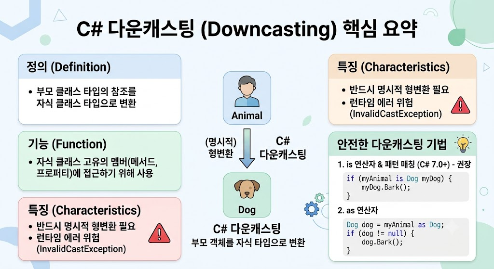

# [Downcasting](../KeywordsList.md)

</img>

| **구분** | **내용** |
| --- | --- |
| **정의** | 부모 클래스 타입의 참조를 자식 클래스 타입으로 변환하는 것 |
| **주요 기능** | 업캐스팅으로 인해 접근할 수 없었던 자식 클래스 고유의 멤버 호출 |
| **변환 방식** | 명시적 변환 (개발자가 직접 `(자식타입)` 명시) |
| **주요 위험** | 실제 객체 타입과 불일치 시 `InvalidCastException` 런타임 예외 발생 |
| **권장 해결책** | `is` 연산자, `as` 연산자, 또는 패턴 매칭(`is ClassName varName`) 활용 |

## 정의

- 상위 클래스(부모 클래스) 타입의 참조 변수를 하위 클래스(자식 클래스) 타입의 참조 변수로 변환하는 것
- 상속 관계 트리에서 위(부모)에서 아래(자식)로 내려가는 형태의 캐스팅이기 때문에 '다운(Down)'캐스팅
    - **업캐스팅 :** 자식 객체를 부모 타입으로 변환 (암시적/자동 변환 가능, 안전함)
    - **다운캐스팅 :** 부모 타입으로 참조되고 있던 객체를 다시 자식 타입으로 변환 (명시적 변환 필요, 위험성 존재)

## 기능

- 목적은 자식 클래스에만 정의되어 있는 고유한 멤버(메서드, 프로퍼티 등)에 다시 접근하기 위함
- 다양한 자식 객체들을 부모 타입으로 묶어서 관리(다형성 활용)하다가, 특정 객체의 자식 전용 기능이 필요할 때 다운캐스팅을 통해 원래 자식의 기능에 접근

```csharp
List<Animal> zoo = new List<Animal> { new Dog(), new Cat() };

foreach (Animal animal in zoo)
{
    animal.Eat(); // 부모의 공통 기능 사용

    // Dog 객체일 때만 짖는(Bark) 고유 기능 호출
    if (animal is Dog)
    {
        Dog dog = (Dog)animal; // 다운캐스팅
        dog.Bark();            // 자식 고유 기능 접근
    }
}
```

## 특징

- **명시적 형변환(Explicit Casting) 필요 :** 컴파일러가 안전성을 보장할 수 없기 때문에 개발자가 괄호 `(Type)`를 사용해 직접 변환을 지정해야 함.
- **런타임 에러 발생 위험 :** 컴파일 시점에는 형변환 오류를 잡아내지 못할 수 있음. 만약 실제 힙(Heap) 메모리에 있는 객체와 변환하려는 자식 타입이 다르면 런타임에 `InvalidCastException` 예외가 발생하고 프로그램이 강제 종료.
- **다형성(Polymorphism)과의 연계 :** 항상 '실제 메모리에 할당된 객체'가 무엇인지가 중요. 부모 타입 변수가 실제로 자식 객체를 가리키고 있을 때만 성공.

## 알아두면 좋을 내용

#### ① `is` 연산자

타입을 확인하여 `true`/`false`를 반환.

```csharp
if (myAnimal is Dog)
{
    Dog dog = (Dog)myAnimal;
    dog.Bark();
}
```

#### ② `as` 연산자

형변환을 시도하고, 실패할 경우 예외를 던지는 대신 `null`을 반환합니다. (참조 타입 및 nullable 타입에만 사용 가능)

```csharp
Dog dog = myAnimal as Dog;

if (dog != null) // 변환 성공 여부 체크
{
    dog.Bark();
}
```

#### ③ 패턴 매칭 (Pattern Matching) — **C# 7.0 이상 권장**

타입 검사와 변수 할당을 한 번에 처리하는 가장 최신의 깔끔한 방식

```csharp
if (myAnimal is Dog dog) // 타입 검사 + 다운캐스팅 동시 진행
{
    dog.Bark();
}
```