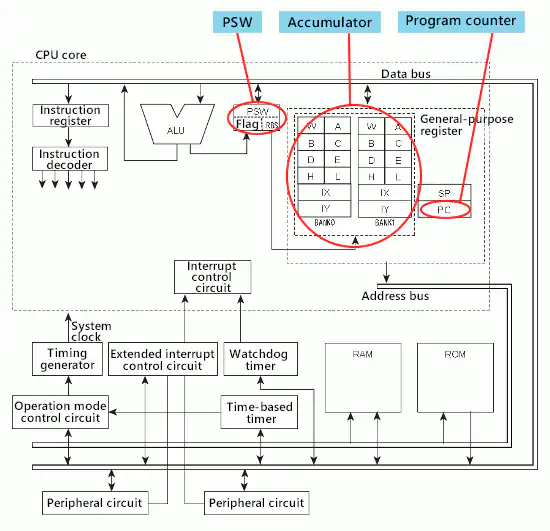

# [Flag Register](../KeywordsList.md)

</img>

| **구분** | **플래그 명칭** | **1(True)이 되는 조건** | **주요 역할 및 용도** |
| --- | --- | --- | --- |
| **상태 플래그 (Status Flags)** | **제로 플래그 (ZF, Zero)** | 연산 결과가 `0`일 때 | 두 값이 서로 같은지 비교 (`A - B == 0`) |
|  | **캐리 플래그 (CF, Carry)** | 덧셈에서 자리올림(Carry) 또는 뺄셈에서 자리빌림(Borrow) 발생 시 | 무부호(Unsigned) 수의 연산 범위 초과 감지 |
|  | **부호 플래그 (SF, Sign)** | 연산 결과가 음수(-)일 때 (최상위 비트가 1일 때) | 결과값의 부호 판별 |
|  | **오버플로우 플래그 (OF, Overflow)** | 표현 가능한 범위를 초과하여 부호가 의도치 않게 바뀔 때 | 유효 범위를 벗어난 부호 있는(Signed) 수의 연산 오류 감지 |
|  | **패리티 플래그 (PF, Parity)** | 연산 결과의 1의 개수가 짝수 개일 때 | 데이터 오류 검출 보조 |
| **제어 플래그 (Control Flags)** | **인터럽트 플래그 (IF, Interrupt)** | 외부 인터럽트 요청을 수용할 상태일 때 (`1`이면 허용, `0`이면 차단) | 하드웨어 인터럽트 제어 |
|  | **방향 플래그 (Direction, DF)** | 문자열 처리 시 주소를 증가(`0`) 또는 감소(`1`)시킬지 결정할 때 | 문자열 복사/검색 연산 방향 제어 |

## 정의

- 연산 장치에서 수행된 연산 결과의 상태나 CPU의 제어 상태를 1비트(Bit) 단위의 신호(플래그)로 저장하는 특수 목적 레지스터.
- 프로세서에 따라 상태 레지스터(Status Register) 또는 PSW(Program Status Word)라고도 부르며, CPU가 프로그램의 흐름을 제어하고 현재 상태를 파악하는 데 핵심적인 역할.
- 플래그 레지스터 안의 각 비트는 독립적인 의미를 지니며, 크게 상태 플래그(Status Flags)와 제어 플래그(Control Flags)로 나뉨.

## **주요 기능**

- **연산 결과 상태 표시 (Status Flags) :** ALU(산술논리장치)에서 덧셈, 뺄셈, 비교 등의 연산이 끝난 직후 그 결과가 어떤 상태인지를 기록.
    - **제로 플래그 (Zero Flag, ZF) :** 연산 결과가 `0`이면 1, 아니면 0이 됨.
    - **캐리 플래그 (Carry Flag, CF) :** 덧셈에서 자리올림(Carry)이 발생하거나, 뺄셈에서 자리빌림(Borrow)이 발생했을 때 1이 됨. (주로 부호 없는 수의 오버플로우 판단에 사용)
    - **부호 플래그 (Sign Flag, SF) :** 연산 결과의 최상위 비트(MSB) 값을 그대로 가져와, 결과가 음수(-)일 때 1이 됨.
    - **오버플로우 플래그 (Overflow Flag, OF) :** 연산 결과가 표현 가능한 범위를 초과하여 부호가 의도치 않게 바뀔 때 1이 됨. (부호 있는 수의 오버플로우 판단)
    - **패리티 플래그 (Parity Flag, PF) :** 연산 결과의 1의 개수가 짝수인지 홀수인지 나타냄.
- **CPU 동작 제어 (Control Flags) :** CPU의 특정 작동 모드를 결정.
    - **인터럽트 플래그 (Interrupt Flag, IF) :** 외부 인터럽트를 허용할지(1) 무시할지(0) 제어.
    - **방향 플래그 (Direction Flag, DF) :** 문자열 처리 명령어 수행 시 메모리 주소를 증가시킬 것인지 감소시킬 것인지 제어.

## 특징

- **비트 단위(Bit-mapped) 구조 :** 일반 레지스터가 전체 데이터를 하나의 값으로 쓰는 것과 달리, 플래그 레지스터는 비트 하나하나가 독립된 스위치나 신호등 역할을 함.
- **조건 분기(Conditional Branch)의 기준 :** 프로그래밍의 `if`문이나 `while`문 같은 조건문은 실제 하드웨어 레벨에서 플래그 레지스터의 상태(예: ZF=1이면 점프)를 확인하여 실행.
- **자동 갱신 :** 프로그래머가 직접 값을 대입하기보다, ALU에서 산술/논리 연산이 일어날 때 하드웨어에 의해 자동으로 값이 갱신됨.

## 상호작용

- **산술논리장치 (ALU)와의 상호작용 :**
    - ALU가 연산을 수행한 직후, 그 결과값은 범용 레지스터로 가지만 연산 과정에서 발생한 상태 정보(0인지, 음수인지, 자리올림이 생겼는지 등)는 즉시 플래그 레지스터로 전달되어 해당 비트들을 갱신.
- **제어장치 (Control Unit, CU)와의 상호작용 :**
    - 제어장치는 프로그램의 다음 명령어를 해석할 때 플래그 레지스터의 상태를 모니터링. 예를 들어 `JE(Jump if Equal)` 같은 조건부 분기 명령어를 만나면, 제어장치는 플래그 레지스터의 제로 플래그(ZF)가 1인지 확인한 후 프로그램 카운터(PC)의 주소를 조작하여 코드의 실행 순서를 바꿈.