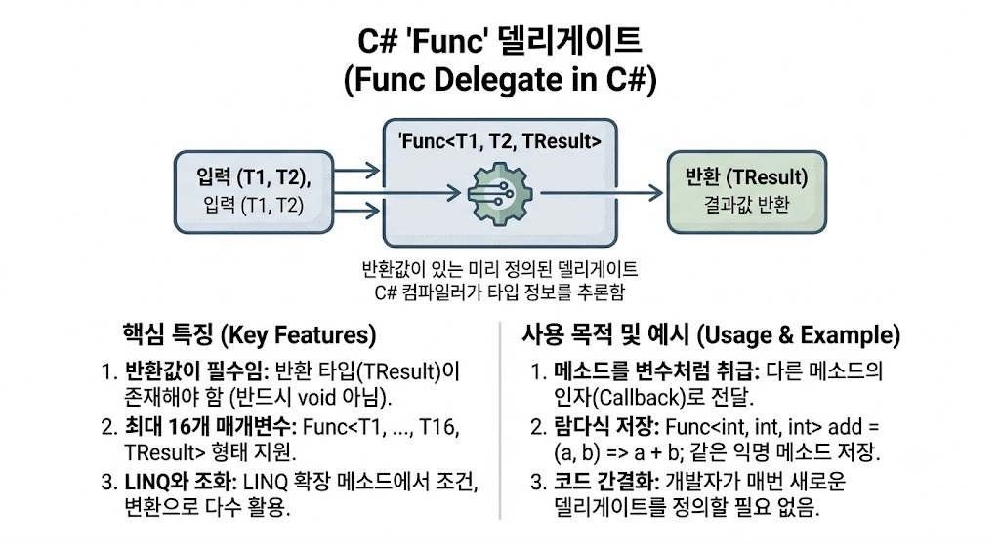

# [delegate - Func](../KeywordsList.md)

</img>

| **항목** | **내용** |
| --- | --- |
| **개념** | 반환값이 있는 메소드를 참조하는 C# 내장 일반화(Generic) 델리게이트 |
| **반환값 여부** | 필수 (선언의 가장 마지막 타입 파라미터가 반환 타입) |
| **Action과의 차이** | `Action`은 `void` 메소드용, `Func`는 반환값이 있는 메소드용 |
| **최대 매개변수** | 입력 매개변수 최대 16개 + 반환값 1개 |
| **주요 활용처** | LINQ 쿼리 연산, 람다식 저장, 고차 함수(메소드를 인자로 전달) 구현 |

## 정의

- 반환값이 있는 메소드를 지칭하기 위해 미리 정의된 일반화(Generic) 델리게이트(Delegate)
- 마지막 매개변수 타입이 무조건 반환(Return) 타입
    - **반환값 타입 지정 :** `Func<TResult>` (매개변수 없음, `TResult` 반환)
    - **매개변수 1개 :** `Func<T1, TResult>`
    - **매개변수 2개 :** `Func<T1, T2, TResult>`
    - **매개변수 n개 :** `Func<T1, ..., T16, T2, TResult>` (최대 16개의 입력 매개변수 지원)

```csharp
// 입력: int 2개, 반환: int
Func<int, int, int> add = (a, b) => a + b;

int result = add(3, 5); // 8
```

## 기능

- **메소드의 파라미터 전달 :** 메소드를 다른 메소드의 인자(Argument)로 넘겨주는 콜백(Callback) 패턴 구현에 사용됨.
- **람다식(Lambda Expression)과의 결합 :** 익명 메소드 및 람다 표현식을 변수에 담아두거나 다룰 때 가장 표준적인 타입으로 동작.
- **LINQ(Language Integrated Query)의 핵심 :** `Where`, `Select`, `OrderBy` 등 C# LINQ의 수많은 확장 메소드들이 `Func`를 매개변수로 받아 조건 판별이나 데이터 변환을 수행.

```csharp
List<int> numbers = new List<int> { 1, 2, 3, 4, 5 };

// Where는 Func<T, bool> 타입의 조건식을 매개변수로 받음
IEnumerable<int> evenNumbers = numbers.Where(n => n % 2 == 0);
```

## 특징

- **반환값이 필수 :** 반환 타입(`TResult`)이 존재하지 않는 메소드는 `Func`로 표현할 수 없으며, 이 경우 `Action` 델리게이트를 사용해야 함.
- **공변성(Covariance)과 반공변성(Contravariance) :** `Func<in T, out TResult>` 형태의 공변/반공변 속성이 지원되어 상위/하위 타입 간의 유연한 대입이 가능.
- **타입 안전성(Type Safety) :** 컴파일 시점에 입력 매개변수와 반환값의 타입 검사가 엄격하게 이루어짐.

## 알아두면 좋을 내용

#### Action vs Func 비교

- **`Func`** : 결과값을 반환하는 메소드 지칭 (`Func<int, string>` -> int를 받아 string 반환)
- **`Action`** : 반환값이 없는(`void`) 메소드 지칭 (`Action<int>` -> int를 받고 반환 없음)

#### Expression Tree와의 관계

`Func<T, bool>`을 `Expression<Func<T, bool>>` 형태(식 트리)로 감싸면, C# 코드가 실행 가능한 대리자가 아니라 분석 가능한 데이터 구조(AST)로 변환됨. 이는 Entity Framework 등 ORM 기술에서 람다 코드를 SQL 쿼리로 해석·변환할 때 필수적으로 사용됨.

#### 멀티캐스트(Multicast) 지원

`Func`도 일반 델리게이트처럼 `+=` 연산자를 사용해 여러 메소드를 체이닝(Chaining)할 수 있습니다. 다만, 호출 시 마지막으로 등록된 메소드의 반환값만 반환된다는 점을 주의.