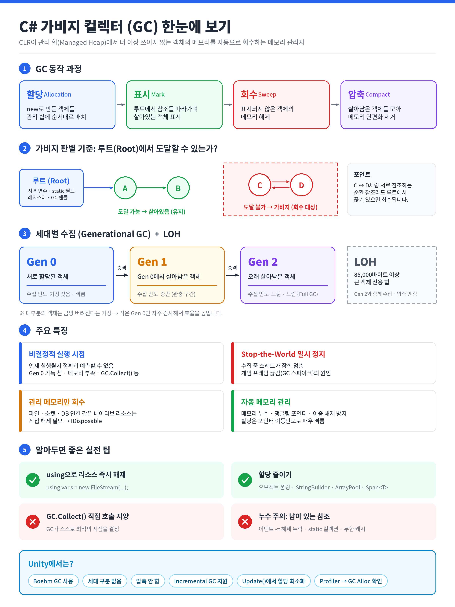

# [가비지 컬렉터(Garbage Collector)](../KeywordsList.md)

</img>

| 구분 | 핵심 내용 |
| --- | --- |
| **정의** | CLR이 관리 힙에서 더 이상 쓰이지 않는 객체의 메모리를 자동으로 회수하는 메모리 관리자 |
| **판별 방식** | 루트(스택, static 등)에서 도달할 수 없는 객체를 가비지로 판단 (순환 참조도 회수 가능) |
| **주요 기능** | 빠른 할당, 가비지 판별(Mark), 회수 및 압축(Compact), 메모리 버그 방지 |
| **세대별 수집** | Gen 0(신규, 자주 수집) → Gen 1(완충) → Gen 2(장기, 드물게 수집) |
| **LOH** | 85,000바이트 이상의 큰 객체 전용 힙, Gen 2와 함께 수집, 기본적으로 압축 안 함 |
| **실행 시점** | 비결정적, 개발자가 정확히 예측할 수 없음 |
| **성능 영향** | 수집 중 스레드 일시 정지 → 게임에서 프레임 끊김의 원인 |
| **한계** | 파일·소켓 등 관리되지 않는 리소스는 회수하지 않음 → `IDisposable` + `using` |
| **주의 사항** | 종료자는 회수를 늦춤, `GC.Collect()` 직접 호출 지양, 이벤트 미해제는 누수 원인 |
| **최적화** | 할당 줄이기: 풀링, `StringBuilder`, `ArrayPool`, `Span<T>`, 박싱 회피 |
| **Unity** | Boehm GC(비세대·비압축), Incremental GC 지원, 매 프레임 할당 최소화가 핵심 |

## 정의

- .NET 런타임(CLR)에 포함된 자동 메모리 관리자
- `new`로 만든 참조 타입 객체는 **관리 힙(Managed Heap)**에 할당되는데, GC는 프로그램이 더 이상 사용하지 않는 객체를 찾아 그 메모리를 자동으로 회수함.
- C/C++에서는 `malloc`/`free`, `new`/`delete`로 메모리를 직접 해제해야 했지만, C#에서는 이 일을 GC가 대신 맡음.

```csharp
void Example()
{
    var player = new Player();  // 관리 힙에 할당
    player.Attack();
}   // 메서드가 끝나면 player를 참조하는 곳이 없어짐 → 이후 GC가 회수
```

## 기능

- **메모리 할당 :** 관리 힙은 "다음 할당 위치" 포인터를 하나 가지고 있어서, 새 객체를 만들 때 그 포인터를 객체 크기만큼 옮기기만 하면 됨. 그래서 C#의 객체 할당은 매우 빠름.
- **사용하지 않는 객체 판별 (Mark) :** GC는 루트(Root)에서 출발해 참조를 따라가며 도달할 수 있는 객체를 표시함. 루트에는 다음이 있음.
    - 스택의 지역 변수와 매개변수
    - 정적(static) 필드
    - CPU 레지스터
    - GC 핸들 등
    - 루트에서 도달할 수 없는 객체는 가비지로 판단함. 참조 개수를 세는 방식이 아니므로 순환 참조(A↔B)가 있어도 루트에서 끊겨 있으면 정상적으로 회수됨.
- **메모리 회수 및 압축 (Sweep & Compact) :** 가비지 객체의 메모리를 회수하고, 살아남은 객체를 한쪽으로 모아 메모리 단편화를 줄임. 객체가 이동하면 그 객체를 가리키는 참조도 GC가 자동으로 갱신함.
- **메모리 관련 버그 방지 :** 해제를 잊어서 생기는 메모리 누수, 이미 해제한 메모리에 접근하는 댕글링 포인터, 이중 해제 같은 문제를 원천적으로 막아줌.

## 특징

#### 세대별 수집 (Generational GC)

- "새로 만든 객체는 금방 버려지고, 오래 살아남은 객체는 계속 살아남는다"는 경험적 가정을 바탕으로 힙을 3세대로 나눔.

| 세대 | 내용 | 수집 빈도 |
| --- | --- | --- |
| **Gen 0** | 새로 할당된 객체 | 가장 자주 (빠름) |
| **Gen 1** | Gen 0 수집에서 살아남은 객체 (완충 구간) | 중간 |
| **Gen 2** | 오래 살아남은 객체 (정적 데이터, 캐시 등) | 드묾 (느림, Full GC) |
- 수집에서 살아남은 객체는 다음 세대로 승격(Promotion)됨. 대부분의 수집은 작은 Gen 0만 대상으로 하므로 효율적.

#### LOH (Large Object Heap)

- 85,000바이트 이상의 큰 객체(큰 배열 등)는 별도의 LOH에 할당됨.
- LOH는 Gen 2와 함께 수집되며, 큰 객체를 옮기는 비용이 크기 때문에 기본적으로 압축하지 않음. 그래서 큰 배열을 자주 만들고 버리면 단편화와 Full GC가 늘어날 수 있음.

#### 비결정적 실행 시점

- GC가 언제 실행될지 개발자가 정확히 알 수 없음.
- Gen 0 영역이 차거나, 시스템 메모리가 부족하거나, `GC.Collect()`를 호출하는 등의 조건에서 실행.

#### 실행 중 일시 정지 (Stop-the-World)

- 수집 중에는 객체 참조가 바뀌면 안 되므로 관리 스레드가 잠깐 멈춤.
- 게임에서 순간적으로 프레임이 끊기는 “GC 스파이크”의 원인.
- 이를 줄이기 위해 .NET은 Gen 2를 백그라운드에서 수집하는 Background GC를 사용.

#### 실행 모드

- **Workstation GC** : 데스크톱·클라이언트 앱 기본값, 응답성 우선
- **Server GC** : 코어마다 힙과 GC 스레드를 두고 처리량을 우선하는 서버용 모드

#### 관리되지 않는 리소스는 처리하지 않음

- GC는 관리 힙의 메모리만 회수.
- 파일 핸들, 네트워크 소켓, DB 연결, 네이티브 메모리 같은 리소스는 개발자가 직접 해제해야 함.

## 알아두면 좋을 내용

#### Unity에서의 GC

Unity는 표준 .NET CLR이 아니라 Mono/IL2CPP 런타임에서 Boehm GC를 사용하므로 위 설명과 차이가 있음.

- 세대 구분이 없고 압축도 하지 않움 : 매번 힙 전체를 검사하므로 할당이 많을수록 비용이 큼.
- 끊김을 줄이기 위해 수집 작업을 여러 프레임에 나눠 처리하는 Incremental GC를 제공(Project Settings → Player).
- 그래서 Unity에서는 `Update()`처럼 매 프레임 실행되는 코드에서 할당을 피하는 것이 특히 중요. `GetComponent` 결과 캐싱, 오브젝트 풀링, 문자열 연산 최소화 등이 대표적이고, Profiler의 GC Alloc 항목으로 할당 위치를 찾을 수 있음.