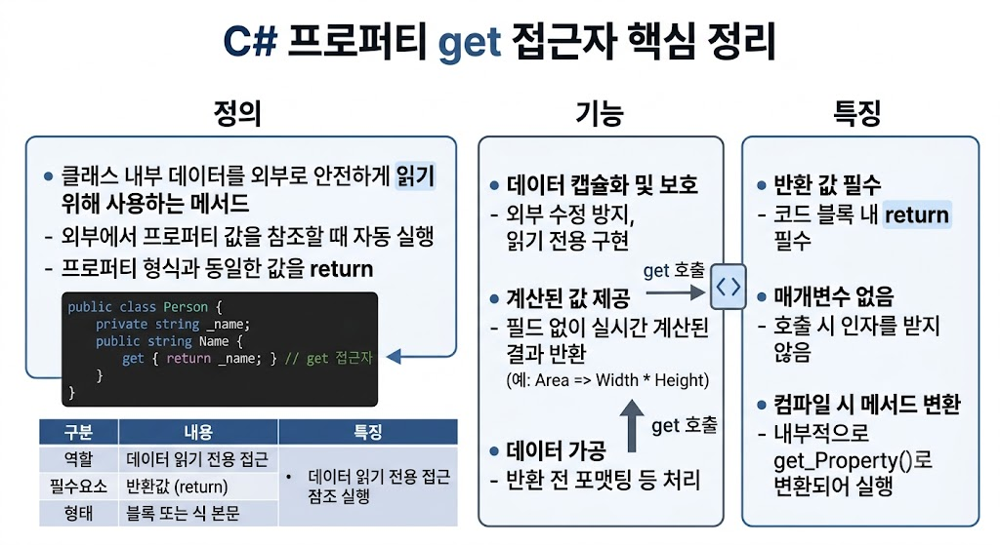

# [프로퍼티 Get](../KeywordsList.md)

</img>

| **구분** | **주요 내용** |
| --- | --- |
| **정의** | 프로퍼티의 값을 읽고 반환하는 역할을 하는 데이터 접근자 |
| **핵심 역할** | 객체의 내부 상태를 외부에 안전하게 노출(캡슐화) 및 계산된 값 제공 |
| **반환 특성** | 프로퍼티의 데이터 타입과 일치하는 값을 반드시 `return` 해야 함 |
| **작성 문법** | 블록 형태(`get { ... }`) 또는 식 본문 형태(`get => ...` / `=> ...`) |
| **읽기 전용 구현** | `set` 없이 `get`만 작성 시 읽기 전용(Read-Only) 프로퍼티 형성 |

## 정의

- `get` 접근자(Accessor)는 클래스나 구조체의 내부 데이터를 외부로 안전하게 읽기(Read) 위해 사용하는 특수 메서드
- 프로퍼티 값을 반환하는 코드 블록
- 외부 코드에서 프로퍼티의 값을 참조하려고 할 때 자동으로 실행되며, 프로퍼티의 데이터 형식과 동일한 값을 반환(`return`)

## 기능

- **데이터 캡슐화 및 보호** : 필드를 `private`으로 지정하여 외부의 직접적인 수정으로부터 보호하고, `get`만 제공하여 읽기 전용(Read-Only) 데이터를 구현할 수 있습니다.
- **계산된 값(Computed Property) 제공** : 실제 필드가 존재하지 않아도, `get` 호출 시점에 실시간으로 계산된 결과를 반환하도록 만들 수 있음.

```csharp
public class Rectangle
{
    public double Width { get; set; }
    public double Height { get; set; }

    // 별도의 필드 없이 계산된 값을 반환하는 get
    public double Area
    {
        get { return Width * Height; }
    }
}
```

- **데이터 가공 및 유효성 제어** : 반환하기 전에 데이터를 가공하거나 포맷팅 가능

## 특징

- **반환 값 필수** : `get` 접근자 내부에서는 반드시 프로퍼티 타입에 맞는 값을 `return` 해야 함. (단, 예외를 던지는 특수 상황 제외)
- **매개변수 없음** : 일반 메서드와 달리 `get` 접근자는 별도의 인자(Parameter)를 받지 않음.
- **접근 제어자 설정 가능** : 프로퍼티 전체의 접근 가능 범위와 별개로 `get` 단독에 대한 접근 제어자(`private`, `protected` 등)를 지정 가능.
- **컴파일 시 메서드로 변환** : C# 컴파일러는 `get_Property()` 형태의 IL 메서드로 내부 변환하여 실행.

## 알아두면 좋을 내용

### 1. 식 본문 형태의 멤버 (Expression-bodied member)

- C# 6.0부터 단일 반환 문이 있는 `get` 접근자는 `=>` (람다 화살표) 기호를 사용하여 간결하게 작성 가능

```csharp
// 기존 방식
public string Name
{
    get { return _name; }
}

// 간결한 표현식
public string Name => _name;
```

### 2. 자동 구현 프로퍼티(Auto Implemented Property)

- 별도의 백킹 필드(Backing Field)를 선언하지 않고, 컴파일러가 자동으로 생성하게 만드는 방식

```csharp
// 읽기/쓰기 모두 가능한 자동 구현 프로퍼티
public int Age { get; set; }

// C# 6.0+: init-only 또는 읽기 전용 자동 구현 프로퍼티
public string Id { get; get; } // 생성자에서만 값 설정 가능
```

### 3. `get` 접근자만 존재하는 경우 (Read-Only Property)

- `set` 접근자 없이 `get`만 정의하면 해당 프로퍼티는 외부에서 값을 변경할 수 없는 읽기 전용 프로퍼티가 됨.

### 4. `init`과의 차이점

- `init` 접근자는 객체 생성 시점(인시셔라이저)에만 값을 설정할 수 있게 해주는 `set`의 변형. `get` 접근자는 `init` 또는 `set`과 조합되어 데이터를 읽는 동일한 역할을 수행.