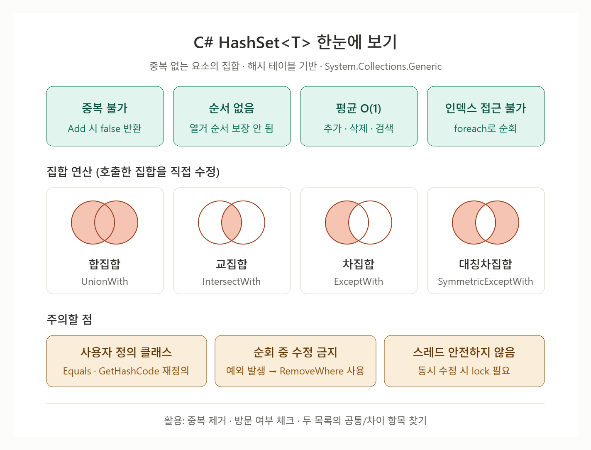

# [HashSet\<T>](../KeywordsList.md)

</img>

| 구분 | 내용 |
| --- | --- |
| 정의 | 중복 없는 요소의 집합을 저장하는 해시 테이블 기반 제네릭 컬렉션 (`System.Collections.Generic`) |
| 중복 | 허용 안 함 — `Add`가 `false` 반환 |
| 순서 / 인덱스 | 순서 보장 없음, 인덱스 접근 불가 |
| 성능 | `Add` / `Remove` / `Contains` 평균 O(1) |
| 기본 기능 | `Add`, `Remove`, `Contains`, `Clear`, `Count`, `RemoveWhere`, `TryGetValue` |
| 집합 연산 | `UnionWith`, `IntersectWith`, `ExceptWith`, `SymmetricExceptWith` (원본 수정) |
| 관계 비교 | `IsSubsetOf`, `IsSupersetOf`, `Overlaps`, `SetEquals` 등 |
| 동등성 | 사용자 클래스는 `Equals`·`GetHashCode` 재정의 필요, 또는 `IEqualityComparer<T>` 지정 |
| 주의점 | 저장 후 키 값 변경 금지, 순회 중 수정 금지, 스레드 안전하지 않음 |
| 대안 | 정렬 필요 → `SortedSet<T>`, 값 매핑 → `Dictionary`, 읽기 전용 → `FrozenSet<T>` |

## 정의

- `System.Collections.Generic` 네임스페이스에 있는 제네릭 컬렉션
- 중복 없는 요소들의 집합(Set)을 표현
- 내부적으로 해시 테이블을 사용해 요소를 저장하기 때문에 "이 값이 들어 있는가?"를 매우 빠르게 확인할 수 있음.

## 특징

- **중복이 없음** : 이미 있는 값을 `Add`하면 예외 없이 무시되고 `false`를 반환

```csharp
var set = new HashSet<int>();
Console.WriteLine(set.Add(1)); // True
Console.WriteLine(set.Add(1)); // False (이미 존재)
Console.WriteLine(set.Count);  // 1
```

- **순서를 보장하지 않음** : 넣은 순서대로 열거되는 것처럼 보일 때도 있지만, 이는 구현상의 우연일 뿐 보장되는 동작이 아님
- **인덱스로 접근 불가** : `HashSet<T>.Contains`는 해시값으로 바로 위치를 찾아감. 요소가 많을수록 차이가 커짐. (해시 충돌이 심하면 최악의 경우 O(n)까지 느려질 수 있음.)
- **`null` 하나 저장 가능** : 참조 형식이나 nullable 형식이라면 `null`도 하나의 값으로 취급.
- **스레드 안전하지 않음** : 여러 스레드에서 동시에 수정하려면 `lock` 등으로 직접 동기화 필요.

## 기능

| 멤버 | 설명 |
| --- | --- |
| `Add(item)` | 추가. 성공하면 `true`, 이미 있으면 `false` |
| `Remove(item)` | 제거. 성공하면 `true`, 없으면 `false` |
| `Contains(item)` | 포함 여부 확인 |
| `Clear()` | 모든 요소 제거 |
| `Count` | 요소 개수 |
| `RemoveWhere(predicate)` | 조건에 맞는 요소를 모두 제거하고 제거한 개수를 반환 |
| `TryGetValue(equalValue, out actual)` | 같다고 판정되는 "실제 저장된 인스턴스"를 가져옴 |

```csharp
var set = new HashSet<int> { 1, 2, 3, 4, 5, 6 };
set.Remove(3);
int removed = set.RemoveWhere(x => x % 2 == 0); // 2, 4, 6 제거 → 3
bool has = set.Contains(5);                    // true
```

### 집합 연산

- `HashSet<T>`의 가장 큰 강점
- 이 메서드들은 새 집합을 반환하지 않고 호출한 집합 자체를 바꿈.

```csharp
var a = new HashSet<int> { 1, 2, 3, 4 };
var b = new HashSet<int> { 3, 4, 5, 6 };

a.UnionWith(b);           // 합집합  → a = {1,2,3,4,5,6}
a.IntersectWith(b);       // 교집합  → a = {3,4}
a.ExceptWith(b);          // 차집합  → a = {1,2}
a.SymmetricExceptWith(b); // 대칭차  → a = {1,2,5,6}
```

- 원본을 보존하고 싶다면 복사본을 만든 뒤 연산.

### 집합 관계 비교(`bool` 반환)

| 메서드 | 의미 |
| --- | --- |
| `IsSubsetOf(other)` | 부분집합인가 (⊆) |
| `IsProperSubsetOf(other)` | 진부분집합인가 (⊂) |
| `IsSupersetOf(other)` | 상위집합인가 (⊇) |
| `IsProperSupersetOf(other)` | 진상위집합인가 (⊃) |
| `Overlaps(other)` | 공통 요소가 하나라도 있는가 |
| `SetEquals(other)` | 순서·중복 무관하게 같은 요소로 구성되는가 |
- 인자로는 `HashSet<T>`뿐 아니라 `List<T>`, 배열 등 어떤 `IEnumerable<T>`든 넘길 수 있음.

## 알아두면 좋을 내용

#### 비슷한 컬렉션과 비교

- `SortedSet<T>`: 중복 없음 + 정렬 유지. 대신 연산이 O(log n).
- `List<T>`: 순서·인덱스·중복 허용. 검색은 O(n).
- `Dictionary<TKey, TValue>`: 키에 값을 매달아야 할 때. `HashSet<T>`는 "값 없는 키만 있는 Dictionary"라고 생각하면 됨.
- `ImmutableHashSet<T>`, `FrozenSet<T>`(.NET 8+): 읽기 전용 집합. 특히 `FrozenSet`은 한 번 만들고 조회만 많이 하는 경우 더 빠름.
- 스레드 안전한 HashSet은 기본 제공되지 않아, 흔히 `ConcurrentDictionary<T, byte>`로 대체.

### 대표적인 활용 예

- 리스트에서 중복 제거: `var unique = new HashSet<int>(list);`
- 방문 여부 체크(BFS/DFS의 `visited`)
- 이미 처리한 ID, 이미 획득한 아이템 등 "본 적 있는가?" 판단
- 두 목록의 공통/차이 항목 찾기