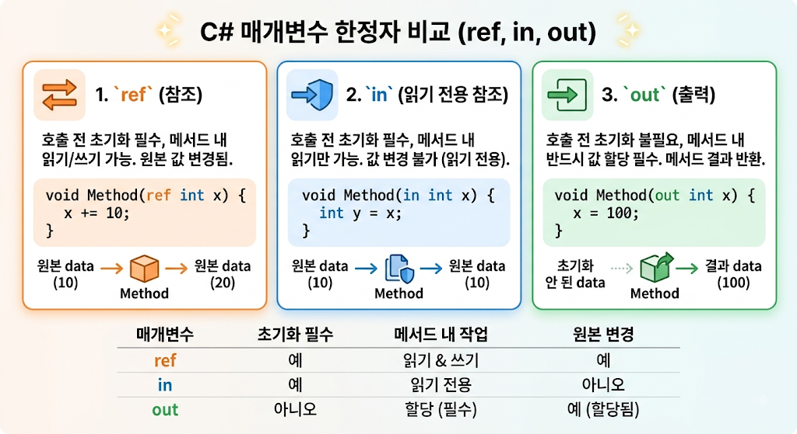

# [In](../KeywordsList.md)

</img>

| **구분** | **in** | **ref** | **out** |
| --- | --- | --- | --- |
| **전달 방식** | 참조 전달 (Read-only) | 참조 전달 (Read/Write) | 참조 전달 (Write-only) |
| **호출 전 초기화** | **필수** | **필수** | 불필요 |
| **메서드 내 수정** | **불가 (컴파일 에러)** | 가능 | **필수 (값 할당해야 함)** |
| **호출 시 키워드** | 생략 가능 (`in x` 또는 `x`) | 필수 (`ref x`) | 필수 (`out x`) |
| **주요 목적** | 대용량 구조체 복사 방지 & 읽기 전용 보호 | 원본 데이터 직접 수정 | 여러 개의 결과값 반환 |

## 정의

- 메서드에 인자를 읽기 전용 참조(Read-Only Reference) 방식으로 전달하도록 지정하는 키워드
- 값에 의한 전달(Pass-by-value)의 복사 오버헤드와 참조에 의한 전달(Pass-by-reference, `ref`)의 수정 가능성을 보완하기 위해 만들어짐.

## 기능

- 변수의 주소(참조)를 전달하여 복사 비용을 0으로 감소시키고, 해당 매개변수를 `readonly`로 지정하여 메서드 내부에서 수정할 수 없게 보호

```csharp
void ProcessData(in BigStruct data)
{
    // 읽기 작업 가능
    Console.WriteLine(data.Value);

    // 컴파일 에러 발생 (in 매개변수는 수정 불가)
    // data.Value = 100; <- 불가
}
```

## 특징

1. 읽기 전용 보장 (Read-Only Safety)
    - `in`으로 전달된 매개변수는 메서드 내부에서 수정이 불가능.
    - 메서드 안에서 해당 매개변수의 값을 변경하려고 하면 컴파일러 오류가 발생.
2. 인자 전달 시 키워드 생략 가능
    - `ref`나 `out`과 달리, 메서드를 호출할 때 `in` 키워드를 생략 가능.
    - 호출하는 코드의 가독성을 유지하면서 컴파일러가 알아서 참조 전달로 처리.
    
    ```csharp
    BigStruct myData = new BigStruct();
    
    ProcessData(in myData); // 명시적 표현
    ProcessData(myData);    // 키워드 생략 가능
    ```
    
3. 방어적 복사본(Defensive Copy) 주의
    - `in` 매개변수로 전달된 구조체(Struct) 내부의 메서드나 프로퍼티를 호출할 때, 해당 메서드가 값을 변경하지 않는다는 보장이 없으면 컴파일러가 임시 복사본을 만들어 호출.
    - 이를 방지하려면 구조체 자체를 `readonly struct`로 정의하는 것이 좋다.
    
    ```csharp
    public readonly struct BigStruct
    {
        public readonly int Value;
        // readonly struct로 선언해야 in 전달 시 방어적 복사가 일어나지 않음
    }
    ```
    

## 언제 사용하는가

- **사용하기 적합한 경우:**
    - 크기가 큰 구조체(`struct`)를 자주 전달하는 고성능 작업 (예: 게임 엔진, 그래픽 처리, 대량의 수치 계산).
    - 전달하는 값을 메서드 내부에서 절대 변경하면 안 되는 경우.
- **사용할 필요가 없는 경우:**
    - `int`, `double`, `bool` 등 크기가 작고 기본 제공되는 값 타입 (참조/주소 전달 비용이 복사 비용보다 클 수 있음).
    - 참조 타입(`class`) 전달 시 (클래스 객체는 이미 주소만 전달되므로 `in`을 붙여도 성능 이점이 없으며, 오직 참조 변경 방지 용도로만 쓰임).