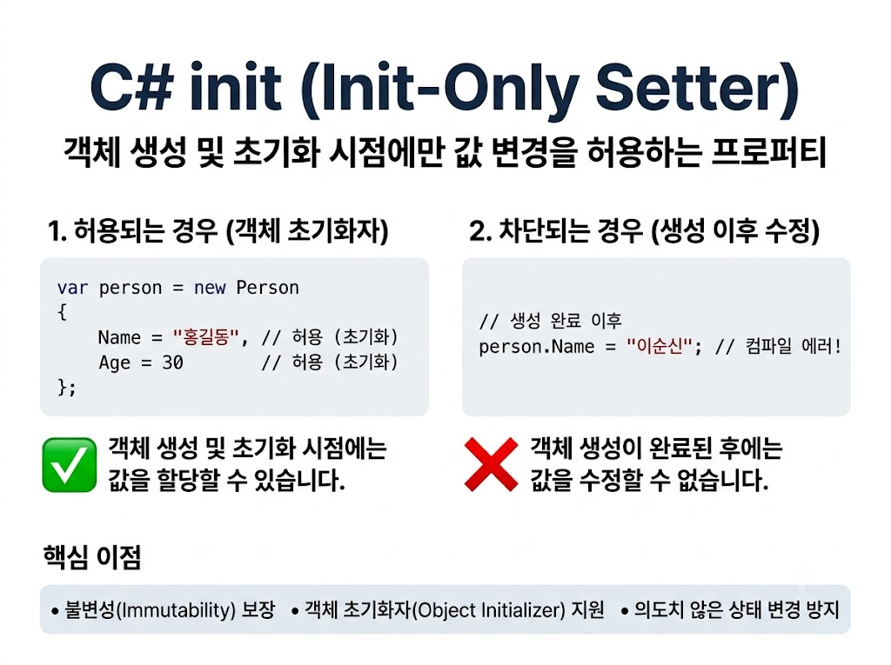

# [Init](../KeywordsList.md)

</img>

| **구분** | **{ get; set; }** | **{ get; private set; }** | **{ get; init; }** | **{ get; }** |
| --- | --- | --- | --- | --- |
| **외부 값 수정** | 언제나 가능 | 불가 | 초기화 시에만 가능 | 불가 |
| **생성자 내부 수정** | 가능 | 가능 | 가능 | 가능 |
| **객체 초기화자 지원** | O | X | O | X |
| **주요 활용 목적** | 가변 객체 (일반 데이터) | 내부 캡슐화 제어 | 생성 시 결정되는 불변 객체 | 완벽한 읽기 전용/계산된 프로퍼티 |

## 정의

- 객체를 생성할 때만 값을 할당할 수 있도록 제한하는 프로퍼티 수정자
- 객체 생성 및 초기화 시점에만 값 변경을 허용하되, 객체 초기화자(Object Initializer) 문법을 사용할 수 있게 만들어줌.

```csharp
public class Person
{
    public string Name { get; init; }
    public int Age { get; init; }
}
```

## 기능

- **객체 초기화 시점 할당 가능 :** `new` 키워드를 사용한 객체 초기화 구문(`{ ... }`) 및 생성자 내부에서만 값을 지정 가능.
- **생성 이후 수정 불가 :** 객체 생성이 완료된 시점 이후에는 외부 또는 내부 메서드에서 값을 변경하려 하면 컴파일 에러가 발생.

```csharp
// 1. 객체 초기화자를 통한 값 할당 (가능)
var person = new Person 
{ 
    Name = "홍길동", 
    Age = 30 
};

// 2. 생성 이후 수정 시도 (컴파일 에러 발생!)
// person.Name = "이순신"; // Error: Init-only property or indexer 'Person.Name' can only be assigned in an object initializer
```

## 특징

- **불변성(Immutability) 보장 :** 객체가 완전히 생성된 후에는 상태 변경을 방지하여 프로그램 실행 중 의도치 않은 상태 변경 사고를 막아줌.
- **객체 초기화자(Object Initializers) 지원 :** `private set`이나 읽기 전용(`{ get; }`) 프로퍼티는 객체 초기화자 구문을 사용할 수 없었지만, `init`을 통해 유연한 객체 생성이 가능.
- **생성자 오버로딩 감소 :** 모든 필드 조합에 대해 복잡한 생성자를 만들 필요 없이 깔끔하게 필요한 프로퍼티만 골라 초기화.

## 알아두면 좋을 내용

### 1. `record` 타입과의 관계

- C# 9.0에 추가된 `record` 구문은 기본적으로 프로퍼티를 `get; init;`으로 자동 생성.

```csharp
// positional record 사용 시 내부적으로 get; init; 구조 생성
public record UserRecord(string Name, int Age);
```

### 2. 백킹 필드(Backing Field)와의 조합

- 자동 구현 프로퍼티뿐만 아니라 직접 백킹 필드를 정의하여 값 검증을 처리할 때도 `init`을 쓸 수 있음.

```csharp
public class Product
{
    private readonly double _price;

    public double Price
    {
        get => _price;
        init
        {
            if (value < 0) 
                throw new ArgumentException("가격은 0 이상이어야 합니다.");
            _price = value;
        }
    }
}
```