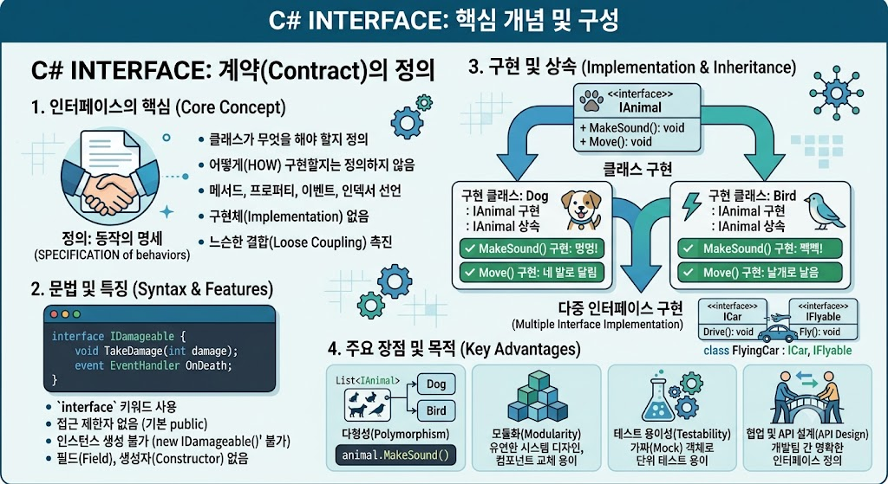

# [Interface](../KeywordsList.md)

</img>

| **구분** | **주요 특징** |
| --- | --- |
| **정의 및 형태** | 클래스가 구현해야 할 멤버(메서드, 프로퍼티 등)의 껍데기(시그니처) 모음 |
| **상속(구현)** | 클래스는 단일 상속만 가능하나, 인터페이스는 다중 구현 가능 |
| **멤버 제한** | 필드(변수) 선언 불가, 구현부(코드 블록) 원칙적으로 불가 |
| **C# 8.0+ 변화** | 기본 구현 메서드 및 접근 제한자(private 등) 일부 허용 |
| **주요 목적** | 다형성 확보, 컴포넌트 간 결합도 감소, 표준화된 설계 보장 |

## 정의

- 클래스가 구현해야 하는 멤버(메서드, 프로퍼티, 이벤트, 인덱서)의 시그니처를 모아둔 규약(Contract)
- 클래스가 "무엇을 해야 하는지" 행동 양식을 정의하지만, 구체적인 내부 로직("어떻게 하는지")은 포함하지 않는 것이 원칙

## 역할

- **결합도 낮추기(Loose Coupling) :** 객체 간의 직접적인 의존성을 줄이고 인터페이스에 의존하게 만들어, 코드 변경 시 파급 효과를 최소화(의존성 주입/DI의 핵심 기반).
- **다형성(Polymorphism) 구현 :** 상속 관계가 다른 클래스들이라도 동일한 인터페이스를 구현한다면 동일한 타입으로 묶어서 처리할 수 있음.
- **설계 표준화 :** 대규모 프로젝트나 협업 시 개발자 간에 지켜야 할 명확한 공통 규격(가이드라인)을 제공.

## 특징

- **다중 구현 지원 :** C#의 클래스는 단일 상속만 지원하지만, 인터페이스는 쉼표(`,`)를 이용해 개수 제한 없이 여러 개를 동시에 구현(Multiple Implementation)할 수 있음.
- **인스턴스화 불가 :** `new` 키워드를 사용해 직접 객체를 생성할 수 없습니다. 인터페이스를 구현한 자식 클래스의 인스턴스를 통해 사용해야 함.
- **상태(필드) 유지 불가 :** 데이터 값을 저장하는 필드(Field)는 선언할 수 없으며, 오직 동작을 나타내는 메서드나 프로퍼티 형태만 가질 수 있음.
- **접근 제한자 :** 전통적으로 모든 멤버는 암시적으로 `public`이며 접근 제한자를 명시할 수 없음.

## 알아두면 좋을 내용

- **기본 인터페이스 메서드 (Default Interface Methods, C# 8.0+) :** 인터페이스 내부에서도 본문(구현부)이 있는 메서드를 정의할 수 있게 됨. 이를 통해 기존에 배포된 인터페이스에 새로운 메서드를 추가해도 기존 구현 클래스들이 깨지지 않도록 하위 호환성을 유지할 수 있음.
- **명시적 인터페이스 구현 (Explicit Implementation) :** 이름이 동일한 메서드를 가진 두 개 이상의 인터페이스를 하나의 클래스가 구현할 때, 클래스 내부에서 특정 인터페이스 소속임을 명시(`반환타입 인터페이스이름.메서드이름`)하여 충돌을 해결할 수 있음.
- **자주 쓰이는 표준 내장 인터페이스:**
    - `IEnumerable` / `IEnumerator`: 컬렉션 순회(foreach 문 사용 가능)
    - `IDisposable`: 가비지 컬렉터가 수거하기 전 비관리 리소스 해제 (`using`문 지원)
    - `IComparable`: 객체 간의 대소 비교