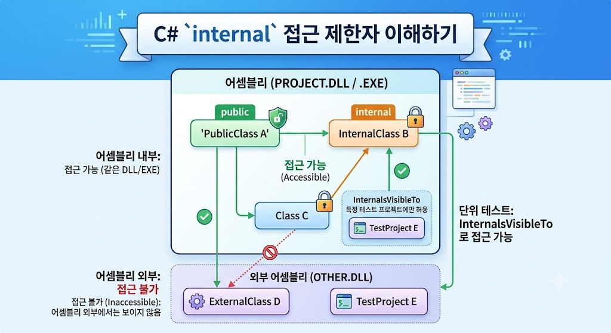

# [Internal](../KeywordsList.md)

</img>

| **항목** | **내용** |
| --- | --- |
| **개념** | 동일한 어셈블리 내에서만 접근을 허용하는 접근 제한자 |
| **기본 범위** | 최상위 클래스/인터페이스 선언 시 생략할 경우 적용되는 기본값 |
| **핵심 목적** | 라이브러리 내부 구현 은닉 및 어셈블리 단위의 캡슐화 |

## 정의

- 클래스, 구조체, 인터페이스, 메서드, 프로퍼티 등의 멤버나 형식에 지정할 수 있는 접근 제한자(Access Modifier)
- 동일한 어셈블리(Assembly, 보통 하나의 `.dll` 또는 `.exe` 파일) 내부에서만 접근 가능하며, 어셈블리 외부에서는 접근할 수 없도록 제한

## 기능

- **어셈블리 단위의 캡슐화** : 외부 프로젝트나 라이브러리 사용자에게는 숨기고, 동일 프로젝트 내의 다른 코드끼리만 공유해야 할 때 사용.
- **라이브러리 내부 구현 보호** : 외부 SDK/라이브러리를 제작할 때, 사용자가 직접 호출해서는 안 되는 내부 헬퍼 클래스나 핵심 데이터 구조를 안전하게 보호.
- **불필요한 API 노출 방지** : 외부로 공개되는 public API 구성을 깔끔하게 유지하여, 사용자가 라이브러리를 잘못 사용할 확률을 낮춤.

## 특징

- **C# 클래스의 기본 접근 제한자** : 클래스나 인터페이스를 선언할 때 접근 제한자를 명시하지 않으면 기본적으로 `internal`이 적용됨. (단, 클래스 내부의 멤버 변수/메서드는 명시하지 않을 경우 `private`이 기본값.)
- **상속 및 접근성 규칙** :
    - `internal` 클래스를 상속받아 `public` 클래스를 만들 수 없음. (더 좁은 접근성을 가진 형식을 더 넓은 접근성의 공개 타입으로 노출할 수 없음)
    - `public` 메서드의 매개변수나 반환 타입으로 `internal` 형식을 사용할 수 없음.
- **`protected internal`과의 차이점** :
    - `internal`: 동일 어셈블리 내부라면 어디서든 접근 가능.
    - `protected internal`: 동일 어셈블리 내부 또는 다른 어셈블리이더라도 상속받은 자식 클래스라면 접근 가능 (OR 조건).