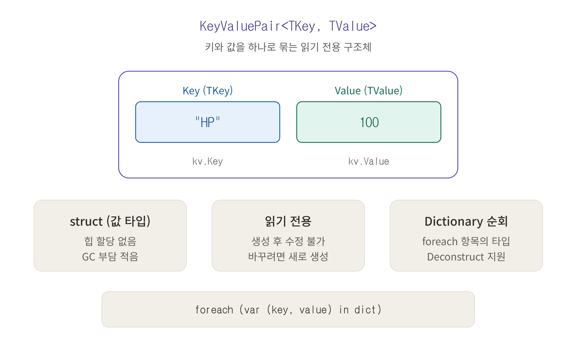

# [KeyValuePair<TKey, TValue>](../KeywordsList.md)

</img>

| 구분 | KeyValuePair<K,V> | ValueTuple (a, b) | Tuple<T1,T2> | 직접 정의 Pair |
| --- | --- | --- | --- | --- |
| 종류 | struct | struct | class | struct 또는 class |
| 수정 가능 | 불가 (읽기 전용) | 가능 | 불가 | 설계에 따름 |
| 힙 할당 | 없음 | 없음 | 있음 | struct면 없음 |
| 요소 이름 | Key, Value | 직접 지정 가능 | Item1, Item2 | 직접 지정 |
| Deconstruct | 지원 | 지원 | 지원 | 직접 구현 필요 |
| 주 용도 | Dictionary 순회, 키-값 목록 | 반환값 2개, 임시 묶음 | 레거시 코드 | 특수 요구사항, Unity 직렬화 |
| 표준 제공 | 제공 | 제공 | 제공 | 미제공 |

## 정의

```csharp
namespace System.Collections.Generic
{
    public readonly struct KeyValuePair<TKey, TValue>
    {
        public TKey Key { get; }
        public TValue Value { get; }
        public KeyValuePair(TKey key, TValue value);
    }
}
```

- 키 하나와 값 하나를 하나의 단위로 묶는 제네릭 구조체(struct)
- `Dictionary<TKey, TValue>`를 순회하면 항목이 `KeyValuePair`로 나옴

## 특징

- **값 타입(struct)** : 힙 할당 없이 스택이나 컨테이너 안에 저장됨. 가비지가 생기지 않아 Unity처럼 GC에 민감한 환경에서 유리.
- **불변(immutable)** : `Key`, `Value`는 get만 있어서 생성 후 수정 불가(바꾸려면 새로 만들어야 함)
- **제네릭** : 키와 값의 타입을 각각 지정해 타입 안전성을 확보.
- **키 유일성을 보장하지 않음** : 이는 `Dictionary`의 역할이고, `KeyValuePair`는 단순한 묶음

## 기능

- 생성과 접근

```csharp
var pair = new KeyValuePair<string, int>("HP", 100);// 또는 KeyValuePair.Create("HP", 100);  (.NET Core 2.0+ / .NET Standard 2.1+)Console.WriteLine(pair.Key);    // HPConsole.WriteLine(pair.Value);  // 100
```

- Dictionary 순회

```csharp
var stats = new Dictionary<string, int> { ["HP"] = 100, ["MP"] = 50 };foreach (KeyValuePair<string, int> kv in stats)    Console.WriteLine($"{kv.Key}:{kv.Value}");
```

- 분해(Deconstruct) : Key와 Value를 바로 변수로 꺼낼 수 있음.

```csharp
foreach (var (key, value) in stats)    Console.WriteLine($"{key}:{value}");
```

- 문자열 변환: `ToString()`은 `[HP, 100]` 형태로 출력.
- 리스트로 활용 : 중복 키가 필요하거나 순서가 중요할 때 `Dictionary` 대신 씀.

```csharp
var list = new List<KeyValuePair<string, int>>{    new("Sword", 10),    new("Sword", 15),   // 중복 키 허용};
```

## 알아두면 좋을 내용

### Pair를 직접 정의하기

- 수정 가능한 쌍이나 의미 있는 이름이 필요하면 직접 생성

```csharp
// 가변 struct
public struct Pair<T1, T2>
{
    public T1 First;
    public T2 Second;
    public Pair(T1 first, T2 second) { First = first; Second = second; }
}
```

### 튜플이 더 나은 경우

```csharp
(string name, int score) result = ("Kim", 95);
Console.WriteLine(result.name);

// 메서드에서 값 2개 반환
(int min, int max) GetRange(int[] arr) => (arr.Min(), arr.Max());
```

- 일회성으로 두 값을 묶거나 반환할 때는 `ValueTuple`이 가장 간결함.
- 이름 있는 요소로 가독성이 좋고, 필드가 가변이라 수정도 가능.