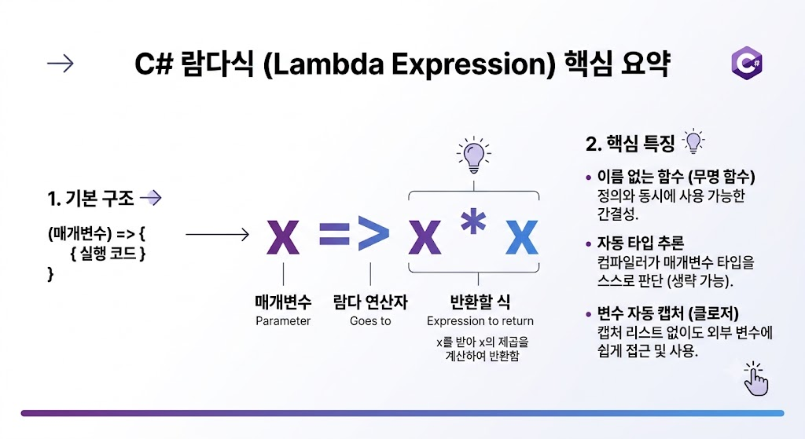
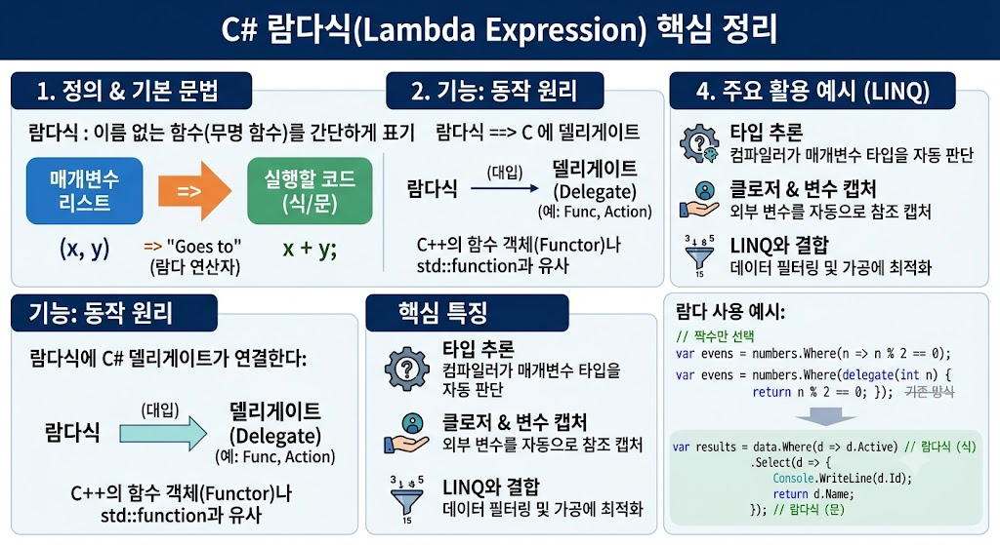

# [Lambda Expression](../KeywordsList.md)

</img>

| **구분** | **C# 람다식** | **C++ 대조 개념 / 비유** |
| --- | --- | --- |
| **정의** | 코드 내에서 즉석으로 생성하는 이름 없는 함수 | 무명 함수, 람다 표현식 (`[](...) { ... }`) |
| **기본 문법** | `(param) => expression_or_block` | `[capture](param) { body }` |
| **주된 전달 대상** | `Func<T>`, `Action<T>` (델리게이트) | `std::function`, 함수 포인터 |
| **타입 추론** | 매개변수 타입 자동 추론 (생략 가능) | C++ 람다 매개변수 타입 명시 필요 (`auto` 지원) |
| **변수 캡처 (클로저)** | 캡처 명시 없이 자동 참조 캡처 | `[=]`, `[&]`, `[var]` 등으로 명시 필요 |
| **주요 활용처** | LINQ 데이터 처리, 이벤트 핸들러, 비동기 콜백 | `std::algorithm`, 스레드 작업, 콜백 |

## 정의

- 이름이 없는 함수(무명 함수, Anonymous Function)를 간단하게 표기하는 방법
- 메서드(함수)를 만들려면 클래스 안에 이름을 붙여 정의해야 하지만, 단 한 번만 쓰일 짧은 코드 block을 매번 별도의 메서드로 선언하는 것은 번거로움. ⇒ 
람다식을 사용하면 코드 한가운데에서 즉석으로 함수를 만들어 변수에 담거나 다른 함수에 인자로 전달할 수 있음.

## 기본 문법

- `=>` (람다 연산자) : ~$로 이동/전달 이라고 읽음. 왼쪽에는 매개변수가 오고 오른쪽에는 실행할 코드(식 또는 문)이 옴

```csharp
(매개변수) => 식_또는_문장 block
```

- 식 람다(Expression Lambda) : 실행 결과가 단일 식인 경우(중괄호 없이 작성)

```csharp
x => x * x; // x를 받아 x의 제곱을 반환
```

- 문 람다(Statement Lambda) : 여러 줄의 코드가 들어가거나 명시적 제어가 필요한 경우(중괄호 사용)

```csharp
(x, y) => {
    Console.WriteLine($"더하기: {x} + {y}");
    return x + y;
};
```

## 기능

- 델리게이트(Delegate)에 람다식을 할당
- `Func<int, int, int> func = (a, b) => a + b;`
- C#에는 대표적인 범용 델리게이트 두 가지가 이미 정의되어 있음
    - `Action` : 반환값이 없는 함수(`void`)
    - `Func` : 반환값이 있는 함수(마지막 데이터 타입이 반환 타입)

```csharp
// 1. Action: 반환값 없음 (void)
Action<string> printMessage = name => Console.WriteLine($"Hello, {name}!");
printMessage("C# Master"); // 출력: Hello, C# Master!

// 2. Func: 매개변수 int 2개, 반환값 int 1개
Func<int, int, int> add = (a, b) => a + b;
int result = add(3, 5); // result = 8
```

## 특징

- **타입 추론 (Type Inference)**
    - C++의 `auto`처럼 C# 람다식도 매개변수 타입을 직접 명시하지 않아도 컴파일러가 델리게이트 정의를 보고 타입을 자동으로 추론함.
    - `(int x, int y) => x + y` 대신 `(x, y) => x + y`로 생략 가능.
- **클로저 (Closure) 및 변수 캡처**
    - C++ 람다에서는 `[x, &y]`처럼 외부 변수를 값으로 가져올지(`=`), 참조로 가져올지(`&`) 캡처 리스트를 명시해야 했음.
    - C#에서는 캡처 리스트를 적지 않아도 외부 변수를 자동으로 참조 캡처

```csharp
int factor = 2;
Func<int, int> multiply = x => x * factor; // 외부 변수 factor를 자동으로 참조 캡처

Console.WriteLine(multiply(5)); // 10
factor = 10;
Console.WriteLine(multiply(5)); // 50 (참조 캡처이므로 바뀐 값이 반영됨)
```

- **LINQ(Language Integrated Query)와의 환상적인 궁합**
    - C#의 핵심 기능 중 하나인 LINQ(데이터 필터링/가공 기능)의 대부분은 람다식을 인자로 받음.
    - C++ `std::algorithm` 의 람다 사용보다 훨씬 가독성이 뛰어납니다.

```csharp
int[] numbers = { 1, 2, 3, 4, 5, 6 };

// 짝수만 골라내어 10을 곱함
var result = numbers.Where(n => n % 2 == 0)
                    .Select(n => n * 10);
// 출력: 20, 40, 60
```

## 알아두면 좋을 내용

- **식 트리 (Expression Tree)**
    - C# 람다식은 단순히 "실행 가능한 코드(`Func`/`Action`)"로 변환될 수도 있지만, "코드를 분석할 수 있는 데이터 구조(`Expression<T>`)"로도 변환될 수 있음.
    - 이 기능 덕분에 C# Entity Framework 같은 ORM은 람다식을 SQL 쿼리로 자동 변환하여 DB에 전달할 수 있음.
- **C++ 사용자 입장에서의 메모리 주의점 (Garbage Collection)**
    - C# 람다식이 외부 변수를 캡처하면 내부적으로 클로저 클래스가 인스턴스화됨. 자주 호출되는 루프 내부에서 변수를 캡처하는 람다식을 매번 생성하면 GC(Garbage Collector) 할당 오버헤드가 발생할 수 있음.
    - *C# 9.0 이상:* 변수 캡처를 실수로 하지 않도록 `static` 키워드를 붙여 `static (x, y) => x + y` 형태로 사용하면 GC 할당을 방지할 수 있습니다.

</img>