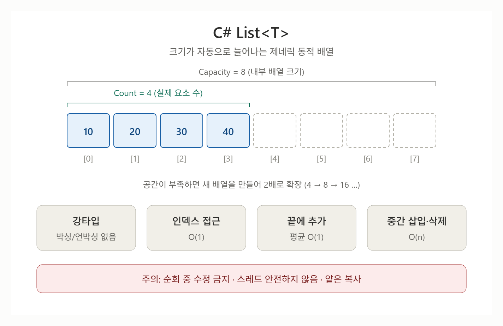

# [List](../KeywordsList.md)

</img>

| 구분 | 내용 |
| --- | --- |
| **정의** | 크기가 자동으로 늘어나는 제네릭 동적 배열 (`System.Collections.Generic`) |
| **내부 구조** | `T[]` 배열 + `Count`/`Capacity`, 공간 부족 시 2배 확장 |
| **주요 기능** | `Add`, `Insert`, `Remove`, `RemoveAt`, `RemoveAll`, `Find`, `Contains`, `Sort`, `Reverse`, `ToArray` 등 |
| **핵심 특징** | 강타입, 박싱 없음, 인덱스 접근 O(1), 순서 유지, 중복·null 허용 |
| **성능** | 끝 추가 평균 O(1) / 중간 삽입·삭제, 검색 O(n) / 정렬 O(n log n) |
| **주의점** | 순회 중 수정 금지, 스레드 안전 X, 얕은 복사, struct 요소 직접 수정 불가 |
| **최적화 팁** | 예상 크기를 `Capacity`로 미리 지정, 삭제는 뒤에서부터 또는 `RemoveAll` |
| **대안** | 키 조회 `Dictionary`, 집합 `HashSet`, 고정 크기 `T[]`, 동시성 `Concurrent*` |

## 정의

- `System.Collections.Generic` 네임스페이스에 있는 제네릭 동적 배열 컬렉션.
- 인덱스로 요소에 접근할 수 있고, 요소 개수에 따라 크기가 자동으로 늘어남.
- 지정한 형식(`int`, `string`, 사용자 정의 클래스 등)의 요소만 담을 수 있음.

## 특징

- 강타입(Type-safe) : 컴파일 시점에 형식이 검증됨. 옛 `ArrayList`와 달리 형 변환이 필요 없고, 값 형식도 박싱/언박싱 없이 저장됨.
- 동적 크기 : 배열처럼 크기를 미리 정할 필요가 없음.
- 인덱스 접근이 빠름 : 인덱스로 읽고 쓰는 것은 O(1).
- 순서 유지 + 중복 허용 : 추가한 순서가 유지되고 같은 값을 여러 번 넣을 수 있음.
- null 허용 : 참조 형식 `T`라면 null 요소도 저장할 수 있음.
- 스레드 안전하지 않음 : 여러 스레드에서 동시에 수정하면 문제가 생길 수 있으니 `lock`을 쓰거나 `ConcurrentBag<T>` 같은 동시성 컬렉션을 고려해야 함.

## 기능

- 추가

```csharp
var list = new List<int>();
list.Add(10);                      // 맨 뒤에 추가
list.AddRange(new[] { 20, 30 });   // 여러 개 추가
list.Insert(1, 15);                // 특정 위치에 삽입
```

- 삭제

```csharp
list.Remove(15);                   // 값으로 첫 번째 일치 항목 삭제 (bool 반환)
list.RemoveAt(0);                  // 인덱스로 삭제
list.RemoveAll(x => x > 20);       // 조건에 맞는 항목 모두 삭제
list.Clear();                      // 전체 삭제
```

- 검색

```csharp
list.Contains(10);                 // 존재 여부
list.IndexOf(10);                  // 위치 (없으면 -1)
list.Find(x => x > 10);            // 조건에 맞는 첫 요소 (없으면 default)
list.FindAll(x => x > 10);         // 조건에 맞는 모든 요소 (List<T> 반환)
list.Exists(x => x == 10);         // 조건 만족 요소 존재 여부
```

- 정렬/변환

```csharp
list.Sort();                               // 기본 비교자로 정렬
list.Sort((a, b) => b.CompareTo(a));       // 내림차순
list.Reverse();                            // 순서 뒤집기
int[] arr = list.ToArray();                // 배열로 변환
List<int> part = list.GetRange(0, 2);      // 일부 구간 복사
```

- 접근/순회

```csharp
int first = list[0];               // 인덱서 접근
list[0] = 99;                      // 값 수정
foreach (var n in list) { }        // 순회
list.ForEach(n => Console.WriteLine(n));
```

## 알아두면 좋을 내용

### Count와 Capacity

- Count : 실제로 담긴 요소 수
- Capacity : 내부 배열의 크기(재할당 없이 담을 수 있는 최대 개수)

### **순회 중 수정 금지**

`foreach` 도중에 `Add`/`Remove`를 하면 `InvalidOperationException`이 발생합니다. 삭제는 `RemoveAll`을 쓰거나 `for`문을 뒤에서부터 돌리면 안전.

```csharp
for (int i = list.Count - 1; i >= 0; i--)    if (list[i] % 2 == 0) list.RemoveAt(i);
```

### **중간 삽입/삭제가 잦다면 주의**

요소를 한 칸씩 밀어야 해서 느립니다. 이런 용도가 많다면 `LinkedList<T>`를 검토할 수 있지만, 캐시 효율 때문에 실무에서는 `List<T>`가 더 빠른 경우가 많음.

### **복사는 얕은 복사**

`new List<T>(원본)`은 요소 참조만 복사합니다. 참조 형식 요소는 같은 객체를 가리키므로 한쪽에서 수정하면 다른 쪽에도 반영됨.

### **구조체(struct) 요소 수정 불가**

`list[0].X = 5;` 같은 코드는 인덱서가 복사본을 반환해서 컴파일 오류가 납니다. 요소를 꺼내 수정한 뒤 다시 대입해야 함.

```csharp
var p = list[0];p.X = 5;list[0] = p;
```

### **LINQ와 궁합이 좋음**

`List<T>`는 `IEnumerable<T>`를 구현해서 `Where`, `Select`, `OrderBy` 등을 바로 쓸 수 있습니다. 다만 LINQ 결과는 새 시퀀스이므로 필요하면 `.ToList()`로 변환.

```csharp
var evens = list.Where(x => x % 2 == 0).OrderBy(x => x).ToList();
```

### **반환·매개변수는 인터페이스로**

외부에 노출할 때는 `IReadOnlyList<T>`나 `IEnumerable<T>`로 반환하면 호출자가 내용을 마음대로 수정하지 못해 캡슐화에 유리.

### **정렬은 안정적이지 않음**

`Sort()`는 같은 값의 원래 순서를 보장하지 않습니다. 안정 정렬이 필요하면 LINQ의 `OrderBy`를 쓰세요.

### **성능이 중요한 경우**

고빈도 코드에서는 `foreach` 나 `LINQ`로 인한 할당을 줄이기 위해 `for`문 + 인덱서를 쓰거나, CollectionsMarshal.AsSpan(list)로 Span<T>를 얻어 접근하는 방법도 있음.