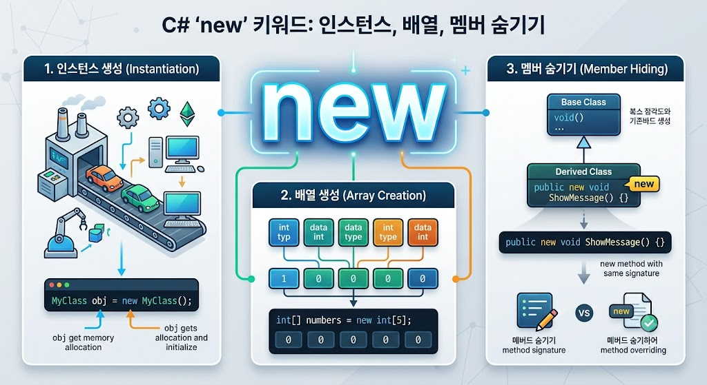

# [New](../KeywordsList.md)

</img>

| **구분** | **주요 기능 및 역할** | **특징** |
| --- | --- | --- |
| **객체 생성** | 클래스/구조체 인스턴스 생성 및 생성자 호출 | 힙(Heap) 메모리에 공간을 할당하고 참조 반환 |
| **제네릭 제약** | `new()`를 통해 매개변수 없는 생성자 강제 | 제네릭 타입 내부에서 객체 생성(`new T()`) 가능하게 함 |
| **멤버 숨기기** | 상속 관계에서 부모 클래스의 멤버를 새 멤버로 은닉 | `new` 한정자 사용, 업캐스팅 시 부모 멤버가 호출됨 (정적 바인딩) |

## 정의

- 문맥(Context)에 따라 완전히 다른 의미로 동작하는 예약어(Keyword)
- ① 객체 생성 연산자, ② 메모리 할당 제어, ③ 멤버 숨기기(Hiding)의 세 가지 용도로 나뉨

## 기능

- 객체 생성 (Instantiation) : 클래스나 구조체의 인스턴스를 메모리(힙 영역)에 생성하고, 생성자(`Constructor`)를 호출하여 초기화하는 역할.
    - **예시:** `Person p = new Person();`
- 제약 조건 (New Constraint) : 제네릭(Generic) 프로그래밍에서 타입 매개변수가 매개변수가 없는 기본 생성자를 반드시 가지고 있어야 함을 보장할 때 사용.
    - **예시:** `public class Manager<T> where T : new()`
- 멤버 숨기기 (Hiding) - `new` 연산자 / 한정자 (Modifier) : 파생 클래스(자식 클래스)가 기반 클래스(부모 클래스)의 멤버(메서드, 프로퍼티, 필드 등)와 동일한 이름의 멤버를 새롭게 정의하여 부모의 멤버를 가리고 싶을 때 사용.

## 특징

- **다목적성 :** 문맥에 따라 객체 생성, 제네릭 제약, 상속 시 멤버 은닉 등 전혀 다른 기능을 수행.
- **컴파일러 경고 (멤버 숨김 시) :** 상속 관계에서 부모 멤버와 같은 이름의 멤버를 `new` 키워드 없이 선언하면 컴파일러가 경고(Warning)를 발생. `new` 키워드를 명시하면 "의도적으로 부모의 멤버를 숨긴 것"임을 컴파일러와 다른 개발자에게 명확히 알릴 수 있음.
- **다형성(Polymorphism)과의 차이 :** `override`는 부모의 메서드를 재정의(동적 바인딩)하여 다형성을 유지하지만, `new`는 단순히 이름을 가릴 뿐(정적 바인딩)이므로 참조하는 타입(부모 또는 자식)에 따라 호출되는 메서드가 달라짐.

## 부모 가리기 - Hiding

- 객체 지향 프로그래밍에서 자식 클래스가 부모 클래스의 메서드나 프로퍼티를 같은 이름으로 다시 선언하는 것을 메서드 Hiding(숨기기)라고 함.
- **동작 방식 :** 자식 클래스에서 `new` 한정자를 사용하여 부모의 멤버를 숨기면, 자식 객체를 자식 타입으로 참조할 때는 자식의 멤버가 호출되지만, 부모 타입으로 업캐스팅(Upcasting)하여 참조할 때는 부모의 멤버가 호출됨.

```CSHARP
public class Parent
{
    public void Show() => Console.WriteLine("부모 메서드");
}

public class Child : Parent
{
    // 부모의 Show 메서드를 가림
    public new void Show() => Console.WriteLine("자식 메서드");
}

// 사용 시:
Child c = new Child();
c.Show(); // 출력: "자식 메서드"

Parent p = new Child();
p.Show(); // 출력: "부모 메서드" (부모 타입이기 때문에 부모 것이 호출됨)
```