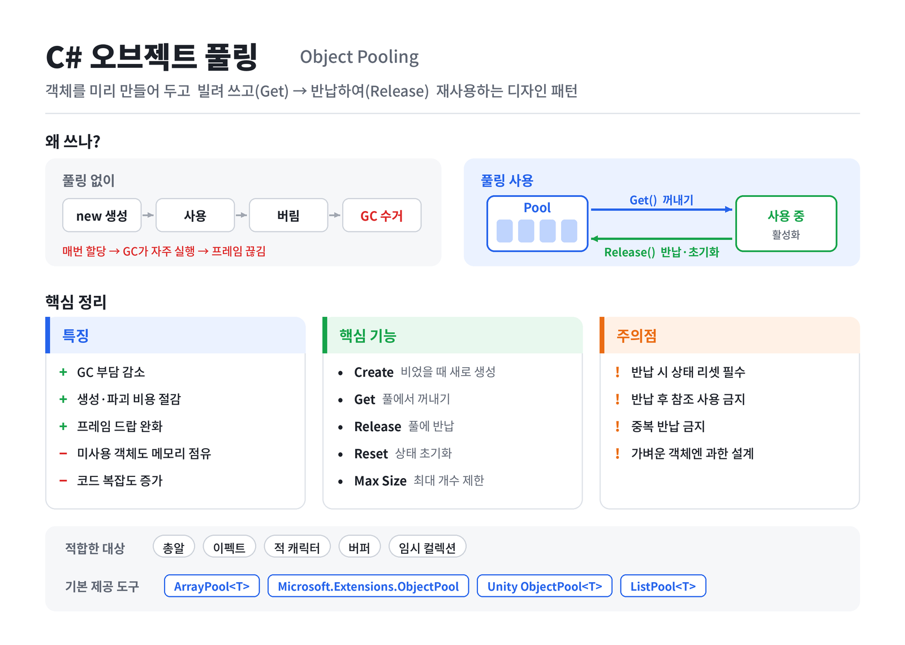

# [Object Pooling](../KeywordsList.md)

</img>

| **항목** | **핵심 내용** |
| --- | --- |
| **정의** | 객체를 미리 만들어 두고 빌려 쓰고 반납해 재사용하는 디자인 패턴 |
| **목적** | 잦은 생성·파괴로 인한 GC 스파이크와 생성 비용 감소 |
| **장점** | 성능 안정화(프레임 드랍 감소), 할당 횟수 감소 |
| **단점** | 미사용 객체가 메모리 점유, 코드 복잡도 증가 |
| **핵심 기능** | 생성, 대여(Get), 반납(Release), 상태 초기화, 최대 크기 제한, 사전 로딩 |
| **주의점** | 반납 시 상태 리셋 필수, 반납 후 참조 사용·중복 반납 금지 |
| **적합한 대상** | 총알, 이펙트, 적, 버퍼, 임시 컬렉션 등 자주 생겼다 사라지는 객체 |
| **기본 제공 도구** | `ArrayPool<T>`, `Microsoft.Extensions.ObjectPool`, Unity `ObjectPool<T>` / `ListPool<T>` |

## 정의

- 자주 생성되고 버려지는 객체를 미리 만들어 두고(풀), 필요할 때 꺼내 쓰고 다 쓰면 파괴하지 않고 다시 풀에 돌려놓아 재사용하는 디자인 패턴
- `new`로 객체를 만들고 참조를 놓아 GC가 수거하게 두는 대신, "빌리고(Get) → 반납하는(Release)" 흐름으로 바꿈.
- 총알, 이펙트, 적 캐릭터, 네트워크 버퍼, `StringBuilder`처럼 짧은 시간에 대량으로 생겼다 사라지는 객체에 주로 사용.

## 특징

- **GC 부담 감소 :** C#은 관리 힙에 객체를 할당하고 가비지 컬렉터가 회수함. 할당이 잦으면 GC가 자주 돌고, 그 순간 프레임이 끊기는 스파이크가 생기지만 풀링은 할당 자체를 줄여 이 문제를 완화.
- **생성 비용 절감 :** 생성자 로직이 무겁거나 Unity의 `Instantiate`/`Destroy`처럼 비용이 큰 작업을 한 번만 하고 이후에는 재사용.
- **메모리를 미리 점유함 (트레이드오프) :** 쓰지 않는 객체도 풀에 남아 메모리를 차지함. 속도와 안정성을 얻고 메모리를 내주는 구조.
- **상태 초기화 책임 :** 재사용된 객체에는 이전 사용 때의 값이 남아 있음. 반납이나 대여 시점에 상태를 반드시 리셋해야 하며, 이를 놓치면 찾기 어려운 버그가 생김.
- **수명 관리의 주의점 :** 반납한 객체를 계속 참조해서 쓰거나 같은 객체를 두 번 반납하면 오류가 남. 소유권을 명확히 해야 함.
- **모든 경우에 이득은 아님 :** 가볍고 드물게 생성되는 객체에 풀링을 적용하면 오히려 코드만 복잡해짐. 프로파일링으로 할당이 실제 병목인지 확인한 뒤 적용하는 것이 좋음.

## 기능

| 기능 | 설명 |
| --- | --- |
| 생성 (Create) | 풀이 비었을 때 새 객체를 만드는 방법 |
| 대여 (Get / Rent) | 풀에서 객체를 꺼내 줌, 없으면 새로 생성 |
| 반납 (Release / Return) | 다 쓴 객체를 풀에 돌려놓음 |
| 초기화 (Reset) | 대여·반납 시 상태를 정리 (활성화/비활성화 등) |
| 용량 제한 (Max Size) | 풀 크기를 넘는 반납 객체는 파괴해 메모리 폭증 방지 |
| 사전 로딩 (Prewarm) | 시작 시 일정 개수를 미리 만들어 런타임 생성 회피 |

#### 기본 제공 풀

직접 만들지 않아도 이미 준비된 풀이 있습니다.

- **`System.Buffers.ArrayPool<T>.Shared`**: 배열 재사용. `Rent(size)`로 빌리고 `Return(array)`로 반납. 빌린 배열은 요청 크기보다 클 수 있다는 점에 주의.
- **`Microsoft.Extensions.ObjectPool`**: `ObjectPool<T>`와 `IPooledObjectPolicy<T>`로 생성·반납 정책을 정의. ASP.NET Core 등에서 사용.
- **Unity `UnityEngine.Pool.ObjectPool<T>`** (Unity 2021 이상): 게임 오브젝트 풀링에 바로 쓸 수 있음.

```csharp
using UnityEngine;
using UnityEngine.Pool;

public class BulletSpawner : MonoBehaviour
{
    [SerializeField] private Bullet bulletPrefab;
    private ObjectPool<Bullet> _pool;

    void Awake()
    {
        _pool = new ObjectPool<Bullet>(
            createFunc:      () => Instantiate(bulletPrefab),
            actionOnGet:     b => b.gameObject.SetActive(true),
            actionOnRelease: b => b.gameObject.SetActive(false),
            actionOnDestroy: b => Destroy(b.gameObject),
            collectionCheck: true,   // 중복 반납 감지 (에디터에서 유용)
            defaultCapacity: 20,
            maxSize: 100);
    }

    public void Fire()
    {
        Bullet b = _pool.Get();
        b.Init(transform.position, () => _pool.Release(b)); // 수명이 끝나면 반납
    }
}
```

- Unity에는 이 외에도 `ListPool<T>`, `DictionaryPool<K,V>`, `HashSetPool<T>` 같은 컬렉션 전용 풀이 있어서 임시 리스트를 매 프레임 만드는 코드를 쉽게 고칠 수 있음.